Bucheigenschaften
=================

The Buch properties view öffnet sich im rechten Fenster when you
select "Buch" in the tree, or when you click on the |ico01|
toolbar icon. It is the initial view after opening a *novelibre* project.

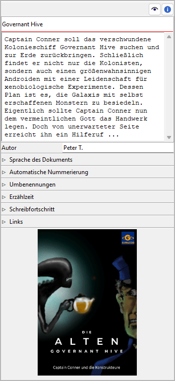

Titel, Beschreibung und Autor
-----------------------------

Titel und Beschreibung are displayed in an editable "Karteikarte".

The editing of book Titel and author can be completed by pressing the Eingabetaste.
Changes to the description are applied when the mouse is clicked
anywhere outside the text input field.

After exporting the book to an *ODT* document, Titel and description
appear in the document properties.

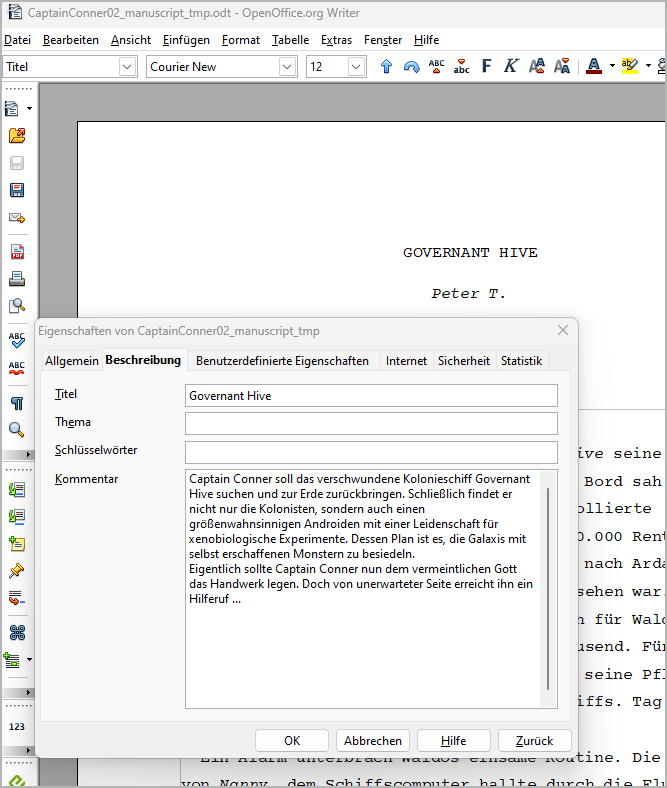

   LibreOffice Writer screenshot

These properties are visible, for example, when the mouse pointer is over
the document in the Windows Explorer.

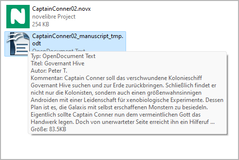
   
   Windows 10 Explorer screenshot
   

Sprache des Dokuments
---------------------

Dieses Fenster mit Klick auf den Titel öffnen oder schließen.

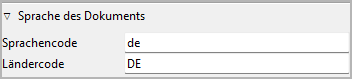

- Sprachencode acc. to ISO 639-1
- Ländercode acc. to ISO 3166-2

This information controls the spelling checker for export documents.

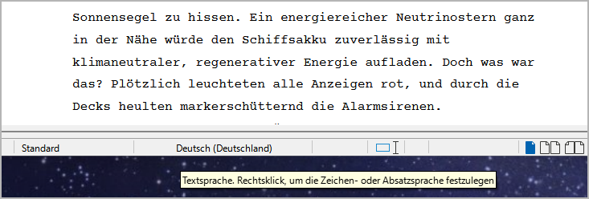

   LibreOffice Writer screenshot

If not set, the System locale setting will be used as default.

.. hint::
   You can also set or change the document language with *Writer*, then it will be applied on import. 

	.. figure:: _images/book_view11.png
	   :alt: LibreOffice Writer screenshot
	   
	   LibreOffice Writer screenshot

Automatische Nummerierung
-------------------------

Dieses Fenster mit Klick auf den Titel öffnen oder schließen.

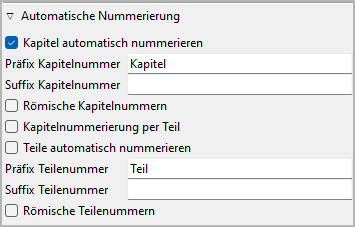

Auto number chapters/parts when refreshing the tree
   If this Auswahlfeld is ticked, all chapters/parts are automatically numbered
   each time `the tree is refreshed <file_menu.html#baum-aktualisieren>`__.
   The chapter Titels are replaced with a ``prefix-number-suffix``
   pattern (without the dashes).

   .. hint::   
      You can optionally exclude individual chapters/parts from auto-numbering 
      in the `Kapitel/part properties 
      <chapter_view.html#dieses-kapitel-nicht-automatisch-nummerieren-part>`__.

Prefix and suffix entries can be completed by pressing the Eingabetaste.

.. note::
   Make sure to add a space character to separate the prefix or
   suffix from the chapter or part number.

Römische Kapitelnummern
   By default, arabic numbers, like "1", "2", "3" ... are used for auto-numbering.
   If this Auswahlfeld is ticked, Roman numbers, like "I", "II", "III", "IV" ...
   are used instead.

Reset chapter numbers when starting a new part
   By default, the chapters are numbered consistently across the parts.
   If this Auswahlfeld is ticked, the chapter numbering starts again with "1"
   in each part.

Umbenennungen
-------------

Dieses Fenster mit Klick auf den Titel öffnen oder schließen.

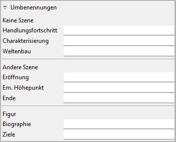

*novelibre* provides some ready-made fields for sections and characters
to store information that should be at hand when writing.
If the default categories do not fit into your individual story planning
concept kann man rename these fields.
Editing the categories can be completed by pressing the Eingabetaste.

Abschnitt fields
   The heading replacements for *Ziel*, *Konflikt*, and *Ausgang* are
   used when you set the `Aktion/Reaktion frame
   <section_view.html#aktion-reaction>`__ to **Benutzerdefiniert**.
   You can do this individually for each section.

Figur fields
   If you want other categories than `Biographie <character_view.html#biographie>`__
   and `Ziele <character_view.html#ziele>`__ for your characters, you
   can enter them here. They will then apply to all characters.

   .. note::
      If you rename the *Biographie* frame, it will keep the Birth/death date
      entries anyway.      

Erzählzeit
----------

Dieses Fenster mit Klick auf den Titel öffnen oder schließen.

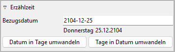

To get an overview of the course of the narrative time kann man enter
date/time information `for each section <section_view.html#datum-time>`__.
The date can be specific *(YYYY-MM-DD)* or unspecific (number of days,
e.g. from the beginning of the story).

Bezugsdatum
   The reference date is optional. It can be used to convert relative dates
   into absolute dates, or vice versa. The timeline software plugins may
   use the reference date for creating events from sections that have no
   date or an unspecific one.

   Format: *YYYY-MM-DD*, according to ISO 8601.

   .. hint::
      Even if you don't need specific dates for your story, specifying
      a reference date might be helpful. Thus, a day of the week
      can be displayed along with the `unspecific date 
      <section_view.html#beginn>`__, and ages can be calculated for 
      `related characters <section_view.html#beziehungen>`__.  

Datum in Tage umwandeln
   This transforms specific section dates into days, related to the
   reference date.

Tage in Datum umwandeln
   This transforms unspecific section dates into specific ones, using
   the reference date.

.. note::
   For large novels, the conversion may take some time, depending on 
   your system. During the conversion time, the clicked Schaltfläche will 
   display *"Bitte warten ..."*.  

.. hint::
   The commands above convert all dated sections at once. If you want to 
   do the conversion for single sections, just go to the 
   `Abschnitt properties view <section_view.html#beginn>`__.
   

Schreibfortschritt
------------------

Dieses Fenster mit Klick auf den Titel öffnen oder schließen.

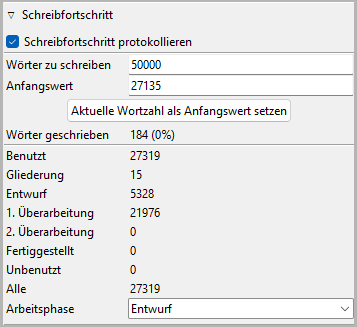

Mit *novelibre* kann man set a word count target and track your
writing progress.

.. note::
   Regardless of the entries made here kann man see the word count 
   in the status bar at any time. 

Schreibfortschritt protokollieren
   By default, *novelibre* stores a log entry with the word counts
   for each day on which you edit the project. You can prevent
   this by unticking the **Schreibfortschritt protokollieren** Auswahlfeld.

   .. hint::
      For viewing the daily progress log, you may want to 
      install the `nv_progress plugin 
      <https://github.com/peter88213/nv_progress/>`__.

Wörter zu schreiben
   Hier kann man enter a number (without decimal points or separators)
   indicating your writing goal in words.
   The entry can be completed by pressing the Eingabetaste.

Anfangswert
   Hier kann man enter a number (without decimal points or separators)
   indicating the word count you want to start from.
   The entry can be completed by pressing the Eingabetaste.

Aktuelle Wortzahl als Anfangswert setzen
   Click this Schaltfläche to enter your current word count in the **Beginning
   count** field.

Wörter geschrieben
   Here the difference between your actual word count and the starting
   count is displayed. The percentage refers to the words to write.

Arbeitsphase
   This setting is for the Baumansicht `"Arbeitsphase" coloring mode
   <view_menu.html#farbgebungsmodus>`__.

   - Abschnitte with the same completion status as the selected work
     phase are black.
   - Abschnitte that are ahead of the selected work phase are green.
   - Abschnitte that are behind the selected work phase are magenta.

Buchumschlag-Miniaturbild
-------------------------

A cover thumbnail is displayed with the book properties if you
provide a PNG image file with the project name along with the *.novx*
file. The recommended image width is 100 to 200 pixels.

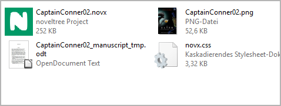
   
   Windows 10 Explorer screenshot
   
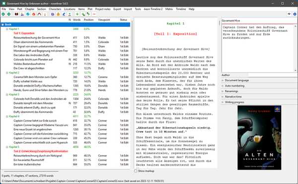

   novelibre screenshot

