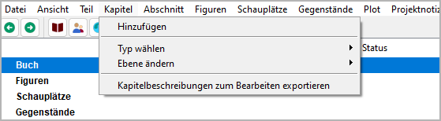
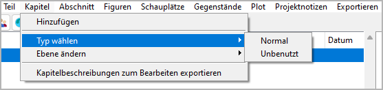
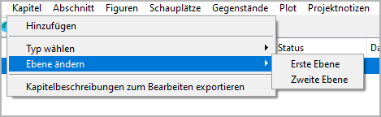

Kapitel-Menü
============

**Kapitel-Funktionen**

Hinzufügen
----------

**Ein neues Kapitel hinzufügen**

Mit **Kapitel > Hinzufügen**,
kann man ein `Kapitel <basic_concepts.html#kapitel>`__
in den Baum einfügen.

- Das neue Kapitel wird an die nächste freie Stelle nach der Auswahl gesetzt,
  falls möglich.
- Andernfalls wird das neue Kapitel ans Ende des "Buch"-Zweigs gesetzt.
- Das neue Kapitel hat einen automatisch erzeugten Titel.
  Man kann ihn im rechten Bereich der Arbeitsfläche ändern.

Typ wählen
----------

**Den Typ der ausgewählten Kapitel einstellen**

Mit **Kapitel > Typ wählen**,
kann man den `Typ <basic_concepts.html#teil-kapitel-abschnittstypen>`__
der ausgewählten Kapitel zu *Normal* oder *Unbenutzt* ändern.

.. note::
   Wenn man den Typ eines Kapitels zu *Unbenutzt* ändert, 
   werden auch seine Abschnitte *Unbenutzt*.

Ebene ändern
------------

**Change the level of the selected chapters**

With **Kapitel > Ebene ändern**,
you can turn chapters into parts and vice versa.

-  **Erste Ebene** converts the selected parts into chapters.
-  **Zweite Ebene** converts the selected chapters into parts.

Kapitelbeschreibungen zum Bearbeiten exportieren
------------------------------------------------

**Exportieren an ODT document that can be imported again after editing**

With **Kapitel > Kapitelbeschreibungen zum Bearbeiten exportieren**,
you can create a text document that contains
a **brief synopsis** with part/chapter headings and chapter descriptions
that can be edited and reimported.
Der Dateinamenszusatz lautet ``_chapters_tmp``.

