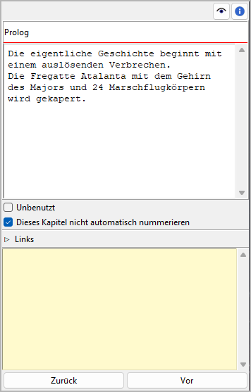

Kapitel/Teil-Eigenschaften
==========================

The Kapitel/part properties view öffnet sich im rechten Fenster
when you select a chapter or a part in the tree.
You can edit the properties of the selected chapter or part.

.. hint::
   You can change any chapter into a part or vice versa via the **Change
   Level** entry in the Kontextmenü, the **Teil**-Menü, or the 
   **Kapitel**-Menü.

Titel und Beschreibung
----------------------

Titel und Beschreibung are displayed in an editable "Karteikarte".

The editing of the Titel can be completed by pressing the Eingabetaste.
Changes to the description are applied when the mouse is clicked
anywhere outside the text input field.

.. note::
   Depending on your `Buch settings <book_view.html#automatische-nummerierung>`_, 
   *novelibre* might overwrite the Titel the next time the tree is refreshed.
   Thus, you don't need to edit the capter/part Titel, if auto numbering is
   activated and the selected chapter or part is not excluded from 
   auto numbering (see below).

Unbenutzt
---------

Mit te **Unbenutzt** Auswahlfeld kann man change the `chapter type
<basic_concepts.html#teil-kapitel-abschnittstypen>`__.

Dieses Kapitel/diesen Teil nicht automatisch nummerieren
--------------------------------------------------------

If this Auswahlfeld is ticked, the selected chapter or part will be excluded
from `auto numbering <book_view.html#automatische-nummerierung>`_, and the Titel
you enter manually will persist.

Navigationsschaltflächen
------------------------

Kapitelansicht
	- **Zurück** moves the selection to the previous chapter in the tree.
	- **Vor** moves the selection to the next chapter in the tree.

Teileansicht
	- **Zurück** moves the selection to the previous part in the tree.
	- **Vor** moves the selection to the next part in the tree.
