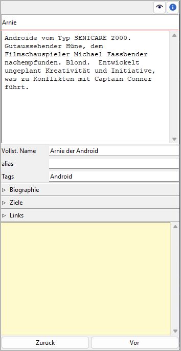
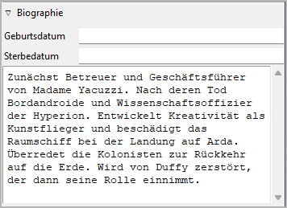
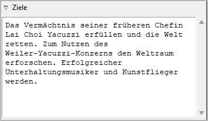
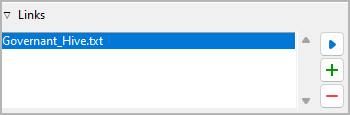

Figureneigenschaften
====================

The Figur properties view öffnet sich im rechten Fenster when you
select a character in the tree.

Titel und Beschreibung
----------------------

Titel und Beschreibung werden als beschreibbare "Karteikarte" dargestellt.

Die Bearbeitung des Titels kann mit der Eingabetaste beendet werden.
Änderungen an der Beschreibung werden übernommen, sobald mit der Maus
irgendwo außerhalb des Texteingabefelds geklickt wird.

Vollst. Name
------------

The character's Titel as shown on the Karteikarte is used as
a short name at several places. The full name can be entered
separately. Die Bearbeitung kann mit der Eingabetaste beendet werden.

alias
-----

This entry field is for alias names. Editing can be completed
by pressing the Eingabetaste.

Tags
----

Tags are a very freely usable tool for labeling characters in the
Baumansicht. Tags do not have to be defined elsewhere, but simply
entered in the input field separated by semicolons.
Die Bearbeitung kann mit der Eingabetaste beendet werden.

.. caution::
   If you want to use a tag more than once, make sure you use 
   the same spelling in the different places. 

Biographie
----------

Dieses Fenster mit Klick auf den Titel öffnen oder schließen.

Birth/death date
   Format: *YYYY-MM-DD*, according to ISO 8601.

Die Bearbeitung von the birth and death dates can be completed by pressing the
Eingabetaste. Changes to the bio are applied when the mouse is
clicked irgendwo außerhalb des Texteingabefelds geklickt wird.

Ziele
-----

Dieses Fenster mit Klick auf den Titel öffnen oder schließen.

Changes to the goals are applied when the mouse is clicked anywhere outside
the text input field.

.. hint::
   This text box can hold any character data that seem important to you.
   If "Ziele" is not the right category for you kann man change the label
   in the `book settings <book_view.html#umbenennungen>`__. 

Links
-----

Dieses Fenster mit Klick auf den Titel öffnen oder schließen.

Das ist eine Liste für Links zu Bildern und Recherche-Dokumenten.

Obwohl *novelibre* Daten zu Figuren, Schauplätzen und Gegenständen
verwalten kann, ist es nicht die richtige Anwendung für
umfangreichen Weltenbau.
Dafür sollte man leistungsfähigere Softwareprogramme verwenden,
zum Beispiel `Zim Desktop Wiki
<https://zim-wiki.org/>`__.
Dazu kann *novelibre* Hyperlinks zu den Textdateien erzeugen,
welche Sie schnell zu den richtigen Stellen im Wiki führen.

Oder Sie haben einige Bilder gesammelt, die Sie beim Schreiben inspirieren.
Dann erzeugen Sie einfach Links zu diesen Bildern und lassen Sie
*novelibre* diese mit Ihrem System-Bildbetrachter öffnen.

.. tip::
   Wenn sie mehrere Bilder z.B. zu einer Figur in einem Ordner
   gesammelt haben, den Ihr Standard-Bildbetrachter durchsuchen kann,
   ist ein einziger Link auf eines dieser Bilder ausreichend.
   
Die Links werden in einer Liste angezeigt, und zwar in der Reihenfolge
der Eingabe.

Link hinzufügen
   Wenn Sie auf |Hinzufügen| klicken, öffnet sich ein Dateiauswahldialog.
   Die ausgewählte Datei wird der Linkliste hinzugefügt.

   .. hint::
      Der Dialog zeigt zunächst nur Bilddateien.
      Für andere Dateitypen ändern Sie die Auswahl in der unteren 
      rechten Ecke. 
      
      .. figure:: _images/filePicker01.png
         :alt: Screenshot
         
         Windows 10 Explorer Screenshot

Link entfernen
   Wenn Sie auf |Entfernen| klicken oder die ``Entf``-Taste drücken,
   wird der ausgewählte Link von der Liste entfernt.

Link öffnen
   Wenn sie auf einen Link doppelklicken, oder auf |Goto| klicken,
   Wird die Datei, auf die der Link verweist, mit der Standardanwendung
   für ihren Typ geöffnet.

   .. hint::
      Falls Sie bestimmte verlinkte Dateien mit einer anderen Anwendung
      als der System-Standardanwendung öffnen wollen, 
      können Sie eine "Programmstarter"-Einstellung vornehmen. 
      Dafür erzeugen Sie einfach eine Textdatei namens **launchers.ini**
      im Verzeichnis ``.novx/config`` (wo alle Konfigurationsdateien liegen).
      Hier in können Sie Erweiterungen Anwendungsprogramme zuordnen.  

      Zim Desktop-Wiki-Seiten sind ein Sonderfall.
      Dafür ordnen Sie die `.zim`-Erweiterung dem Zim-Programm zu.

      Dieses Beispiel zeigt eine Einstellung, die *novelibre* Textdateien
      mit der *Zim Desktop Wiki*-anwendung öffnen lässt, 
      statt mit dem Standard-Texteditor:    
      
      ::
     
         [SETTINGS]
         .zim = C:/Program Dateis (x86)/Zim Desktop Wiki/zim.exe 
         
      .. figure:: _images/launchers.png
         :alt: Screenshot
         
         Windows 10 Explorer Screenshot

.. |Hinzufügen| image:: _images/add.png
.. |Goto| image:: _images/goto.png

"Haftmerker"
------------

Der gelbe Texteingabebereich ist für Notizen.
Änderungen werden übernommen, wenn mit der Maus
irgendwo außerhalb des Texteingabefelds geklickt wird.

Wenn der "Haftmerker" einer Figur Text enthält,
erscheint in the Baumansicht ein "N" als Merker.

.. note::
   Die "Haftmerker" sind nur für die Arbeit mit *novelibre* gedacht.
   Sie werden nicht beim Dokumentenexport berücksichtigt.
   Allerdings erscheinen sie in der `Figurenliste`_.

.. _Figurenliste: characters_menu.html#exportieren-character-list-spreadsheet

Navigationsschaltflächen
------------------------

- **Zurück** moves the selection to the previous character in the tree.
- **Vor** moves the selection to the next character in the tree.
