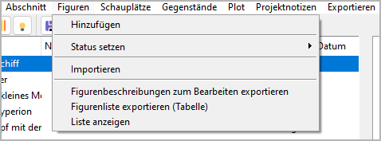
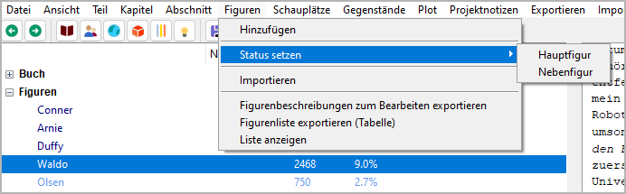

Figuren-Menü
============

**Figurenfunktionen**

Hinzufügen
----------

**Eine neue Figur erzeugen**

Mit **Figuren > Hinzufügen**
können Sie eine `Figur <basic_concepts.html#figuren-und-erzahlwelt>`__
in den Baum einfügen.

- Wenn eine Figur ausgewählt ist, wird die neue Figur dahinter platziert.
- Andernfalls wird die neue Figur an den Schluss gesetzt.
- Die neue Figur hat einen automatisch erzeugten Titel.
  Sie können ihn im rechten Bereich der Arbeitsfläche ändern.
- Der Status der neuen Figur ist *Nebenfigur*.

Status setzen
-------------

**Den Figurenstatus ändern**

Mit **Figuren > Status setzen**
können Sie die Figur als *Hauptfigur* oder *Nebenfigur* kennzeichnen.
Hauptfiguren sind in der Baumansicht farblich hervorgehoben.

.. note::
   Der Figurenstatus dient nur zur visuellen Unterscheidung.
   Er hat keine Auswirkung auf die Programmfunktion.
   Sie können ihn einsetzen, um Perspektivfiguren 
   oder Figuren mit eigener Plotlinie zu kennzeichnen.

Importieren
-----------

**Figuren aus einem anderen Projekt importieren**

Mit **Figuren > Importieren**
können Sie eine Auswahl von Figuren aus einem anderen Projekt übernehmen.
Zuerst wählen Sie eine XML-Datei aus, welche die Figurendaten enthält.
Dann wählen Sie die Figuren aus, die Sie zum aktuellen Projekt hinzufügen wollen.

.. hint::
   Um für das aktuelle Projekt eine XML-Figurendatei zu erzeugen, 
   rufen Sie **Exportieren > Figuren/Schauplätze/Gegenstände-Datendateien** auf.

Figurenbeschreibungen zum Bearbeiten exportieren
------------------------------------------------

**Ein ODT-Dokument exportieren, das bearbeitet und zurückgelesen werden kann**

Mit **Figuren > Figurenbeschreibungen zum Bearbeiten exportieren**
können Sie ein Textdokument erzeugen, das
Figurenbeschreibungen mit Biographie, Zielen und Notizen enthält.
Dieses Dokument kann mit *Writer* bearbeitet und zu *novelibre*
zurückgespielt werden.
Der Dateinamenszusatz lautet ``_characters_tmp``.

Figurenliste exportieren (Tabelle)
----------------------------------

**Ein ODS-Dokument exportieren, das bearbeitet und zurückgelesen werden kann**

Mit **Figuren > Figurenliste exportieren (Tabelle)**
können Sie ein Tabellenkalkulationsdokument mit einer Figurenliste erzeugen.
Dieses Dokument kann mit *Calc* bearbeitet und zu *novelibre*
zurückgespielt werden.
Der Dateinamenszusatz lautet ``_charlist_tmp``.

.. note::
   Sie können Zeilen und Spalten umordnen, verbergen oder löschen, 
   ohne dass es Auswirkungen auf den Re-Import hat. 
   Nur die erste Zeile und die erste Spalte, die standardmäßig verborgen 
   sind, dürfen nicht verändert werden, weil sie die Strukturinformationen 
   für den Import enthalten. 

Liste anzeigen
--------------

**Einen HTML-Report mit Figurendaten anzeigen**

Mit **Figuren > Liste anzeigen**
erzeugen Sie eine als Tabelle formatierte HTML-Seite
mit einer Figurenliste
und starten Ihren System-Webbrowser zur Anzeige.

.. note::
   Der Report ist eine temporäre Datei, die bei 
   Programmbeendigung automatisch gelöscht wird.
   Lassen Sie sie bei Bedarf von Ihrem Browser 
   sichern oder ausdrucken.
