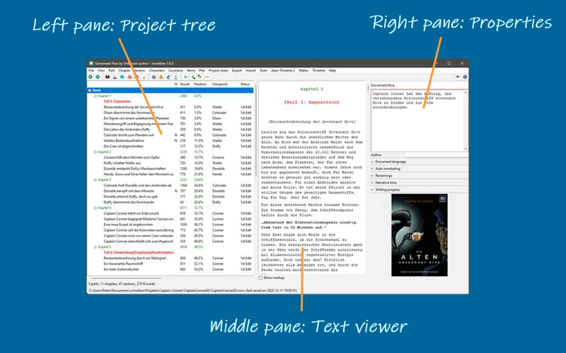

Der Arbeitsbereich
==================

The *novelibre* desktop is divided into three panes:

   Desktop

Projektbaum
-----------

The project tree in the left pane shows the organization of the project.

-  The tree elements are color-coded according to the section type (see
   `Basic concepts <basic_concepts.html#part-chapter-section-types>`__).
   *Normal* type sections are highlighted according to the selected coloring
   mode (see *Optionens* in the `Ansicht-Menü <view_menu.html#coloring-mode>`__).
-  The order of the columns can be changed (see *Optionen* in
   the `Ansicht-Menü <view_menu.html#columns>`__).
-  Right-clicking on a tree element opens a `context
  -Menü <tree_context_menu.html>`__ with several options.
-  The type of chapters and sections, as well as the completion status
   of the sections are color coded and can be changed via Kontextmenü.

Projektbaumstruktur
~~~~~~~~~~~~~~~~~~~

-  The **Buch** branch contains the parts, chapters, and sections that
   belong to the novel Manuskript.
-  The **Figuren/Schauplätze/Gegenstände** branches contain descriptions of
   the story world’s elements that can be associated with the book’s
   sections.
-  The **Plotlinien** branch contains the plot lines and plot points.
-  The **Projektnotizen** branch contains all project notes.

Arbeiten im Projektbaum
~~~~~~~~~~~~~~~~~~~~~~~

Browsing the tree
   *novelibre* has a browsing history for the selected tree elements.
   This allows you to go back and forth e.g. between a section and its
   related characters.

   -  |Go back| selects a node back in the tree browsing history.
   -  |Go forward| selects a node forward in the tree browsing history.

   .. hint::
      On Windows, the “Vor” and “Zurück” mouse buttons (if any) 
      may also work.

Baumelemente verschieben
^^^^^^^^^^^^^^^^^^^^^^^^

Drag and drop while pressing the ``Alt`` key.

.. caution::
   Be aware, there is no “Undo” feature.

Baumelemente löschen
^^^^^^^^^^^^^^^^^^^^

Select the element to delete and hit the ``Del`` key.

-  Teils and chapters are gelöscht.
-  Abschnitts are marked “unused” and moved to the “Papierkorb” chapter.
-  Deleting a part has no effect on its subordinate chapters.
-  Deleting a chapter moves its sections to the “Papierkorb” chapter.
-  The “Papierkorb” chapter is created automatically, if needed.
-  When deleting the “Papierkorb” chapter, all its sections are gelöscht.

Textbetrachter
--------------

The **Textbetrachter** in the middle pane shows the part/chapter/section
contents with their titles as headings.

-  You can open or close the Textbetrachter with **Ansicht > Toggle Text
   viewer**, or ``Ctrl``-``T``, or clicking on |Textbetrachter anzeigen/verbergen|.
-  On opening, the windows shows the text, where the tree is selected.
-  When changing the tree selection, the text moves along.
-  However, the text can be scrolled independently with the verical
   scrollbar, or the mousewheel.
-  You can select text with the mouse, and copy it to the clipboard with
   ``Ctrl``-``C``.
-  You cannot edit the text. For this, you might want to install an
   editor plugin, such as
   `nv_editor <https://github.com/peter88213/nv_editor/>`__.
-  Abschnitt text is color-coded according to the section type (see `Basic
   concepts <basic_concepts.html#part-chapter-section-types>`__).
-  With the **Markup anzeigen** checkbox, XML markup can be shown/hidden.

Eigenschaften
-------------

The `Eigenschaften <properties.html>`__ in the right pane show properties
and metadata of the element selected in the project tree.

-  The project settings can be made in the *Buch* properties view.
-  You can open or close the element properties window with **Ansicht >
   Eigenschaften anzeigen/verbergen** or ``Ctrl``-``Alt``-``T``, or clicking on
   |Eigenschaften anzeigen/verbergen|.
-  On opening, the windows shows the editable properties of the selected
   element.
-  You can detach or dock the element properties window with **Ansicht >
   Eigenschaften abtrennen/andocken** or ``Ctrl``-``Alt``-``D``.
-  On closing the detached window, the properties are docked again.

On large screens, you can arrange *novelibre* and *Writer* with detached
windows.

.. figure:: _images/full_desktop.png
   :alt: Writer and novelibre screen arrangement
   
   Example: Arranging LibreOffice (middle) with detached Navigator (upper left) 
   and novelibre (lower left) with detached Eigenschaften (right) 

.. |Go back| image:: _images/goZurück.png
.. |Go forward| image:: _images/goVor.png
.. |Textbetrachter anzeigen/verbergen| image:: _images/viewer.png

Menüleiste
----------

The bar at the top is the-Menü bar with the main-Menü,
which is documented in the `Befehlsreferenz <command_reference.html>`__.

Werkzeugleiste
--------------

The second bar from the top is the toolbar with
`buttons for frequently used actions <toolbar.html>`__.

Statusleiste
------------

The second bar from the bottom is the status bar. It normally displays project
statistics, such as word count. These are overwritten with program messages
when necessary.

- Messages on a green background indicate successful actions.
- Messages on a red background indicate errors or warnings.

.. tip::
   You can restore the normal view at any time by clicking on the status bar.
   

Fußzeile
--------

The footer bar at the bottom displays the project file path and the file date.

Change notification
   If there are unsaved changes, the footer bar is highlighted in goldenrod.

Project lock
   If the project is locked, the footer bar is displayed in reversed colors.

