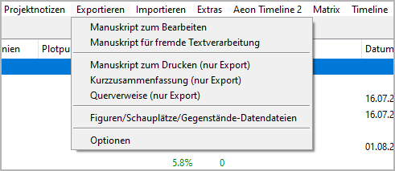
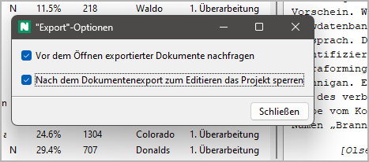

Exportieren-Menü
================

**Dateiexport**

Manuskript zum Bearbeiten
-------------------------

**Exportieren an ODT document that can be imported again after editing**

Mit **Exportieren >  Manuskript zum Bearbeiten**,
you can create a text document that is split into sections
(to be seen in the Navigator).
Der Dateinamenszusatz lautet ``_Manuskript_tmp``.

-  Only "normal" chapters and sections are exported. Kapitels and
   sections marked "unused" are not exported.
-  Abschnittstitels are invisible, but appear in the *Navigator*.
-  Kapitels and sections can neither be rearranged nor gelöscht.
-  Mit *Writer*, you can split sections by
   inserting headings or a section divider:

   -  *Heading 1* → Neu part Titel. Optionally, you can add a
      description, separated by ``|``.
   -  *Heading 2* → Neu chapter Titel. Optionally, you can add a
      description, separated by ``|``.
   -  ``###`` → Abschnitt divider. Optionally, you can append the section
      Titel to the section divider. You can also add a description,
      separated by ``|``.

   .. important:: 
      Dokuments with split sections are automatically
      discarded after the *novelibre* project is updated.

-  Text markup: Bold and italics are supported. Other highlighting such
   as underline and strikethrough are lost.

Handlungsraster (Plot grid) zum Bearbeiten
------------------------------------------

**Exportieren an ODS document that can be imported again after editing**

Mit **Exportieren > Handlungsraster (Plot grid) zum Bearbeiten**,
you can create a spreadsheet as described in the
`Plotting with novelibre <plotting.html#handlungsraster-(plot-grid)>`__ chapter,
with a row per section, containing the following data:

- The sequential section number as a hyperlink to the section in the
  Manuskript (falls vorhanden)
- Erzähldatum
- Erzählzeit
- Tag
- Abschnittstitel
- Abschnittsbeschreibung
- Perspektive
- One column per Plotlinie with the section's Plotlinie notes
- Tags
- A/R
- Ziel
- Konflikt
- Ausgang
- Abschnittsnotizen

.. note::
   Only "normal" sections appear in the plot grid. 
   Abschnitts of the "Unbenutzt" type are omitted.

Der Dateinamenszusatz lautet ``_grid_tmp``.

.. note::
   You can reorder, hide or delete columns and rows 
   without affecting the reimport. 
   Only the first column and the first row, which are hidden by default, 
   must not be changed as they contain the structural information 
   for the import. 

Manuskript für fremde Textverarbeitung
--------------------------------------

**Exportieren an ODT document that can be imported again after editing**

Mit **Exportieren >  Manuskript für fremde Textverarbeitung**,
you can create a text document with visible section markers.
Der Dateinamenszusatz lautet ``_proof_tmp``.

.. note::
   This document retains its section information even if it is 
   converted to other formats and back again. This may work with 
   popular commercial word processors and even with web-based word 
   processors such as Google Docs. 

-  Only "normal" chapters and sections are exported. Kapitels and
   sections marked "unused" are not exported.
-  The document contains chapter and section headings. However, changes
   will not be reimported.
-  The document contains section ``[scx]`` markers. **Do not touch lines
   containing the markers** if you want to be able to write the document
   back to *novelibre* format.
-  Kapitels and sections can neither be rearranged nor gelöscht.
-  When editing the document, you can split sections by inserting
   headings or a section divider:

   -  *Heading 1* → Neu part Titel. Optionally, you can add a
      description, separated by ``|``.
   -  *Heading 2* → Neu chapter Titel. Optionally, you can add a
      description, separated by ``|``.
   -  ``###`` → Abschnitt divider. Optionally, you can append the section
      Titel to the section divider. You can also add a description,
      separated by ``|``.

   .. important:: 
      Dokuments with split sections are automatically
      discarded after the *novelibre* project is updated.

-  Text markup: Bold and italics are supported. Other highlighting such
   as underline and strikethrough are lost.

Manuskript zum Drucken (nur Exportieren)
----------------------------------------

**Exportieren an ODT document**

Mit **Exportieren >  Manuskript zum Drucken (nur Exportieren)**,
you can create a text document for further use,
e.g. when you are finished with *novelibre*.

.. hint::
   In contrast to the Manuskript for editing, this document is not divided 
   internally into sections, which could facilitate further processing and 
   reformatting. 

-  The document is placed in the same folder as the project.
-  Dokument’s **filename**: ``<project name>.odt``.
-  Only "normal" chapters and sections are exported. Kapitels and
   sections marked "unused" are not exported.
-  Teil Titels appear as first level heading.
-  Kapitel Titels appear as second level heading.
-  Abschnitts are separated by ``* * *``. The first line is not indented.
-  Beginning from the second paragraph, paragraphs begin with indentation
   of the first line.
-  Abschnitts marked "attach to previous section" appear like continuous
   paragraphs.
-  Text markup: Bold and italics are supported. Other highlighting such
   as underline and strikethrough are lost.

Kurzzusammenfassung (nur Exportieren)
-------------------------------------

**Exportieren an ODT document**

Mit **Exportieren >  Kurzzusammenfassung (nur Exportieren)**,
you can create a text document containing a brief synopsis
with part, chapter, and sections Titels only.
Der Dateinamenszusatz lautet ``_brf_synopsis``.

-  Only "normal" chapters and sections are exported. Kapitels and
   sections marked "unused" are not exported.
-  Teil Titels appear as first level heading.
-  Kapitel Titels appear as second level heading.
-  Abschnittstitels appear as plain paragraphs.

Querverweise (nur Exportieren)
------------------------------

**Exportieren an ODT document**

Mit **Exportieren >  Querverweise (nur Exportieren)**,
you can create a text document containing navigable cross references.
Der Dateinamenszusatz lautet ``_xref``.

The cross references are:

-  Abschnitts per character,
-  sections per location,
-  sections per item,
-  sections per tag,
-  characters per tag,
-  locations per tag,
-  items per tag.

Figuren/Schauplätze/Gegenstände-Datendateien
--------------------------------------------

**Exportieren XML files that can be imported into other projects**

Mit **Exportieren >  Figuren/Schauplätze/Gegenstände-Datendateien**,
you can create a set of XML files containing the project’s characters,
locations, and items with all their properties. These files can be used
to transfer the characters, locations, and items to another project.

.. hint::
   To import XML-Datendateis from another project, use the **Importieren**
   command in the **Figuren**, **Schauplätze**, or **Gegenstände**-Menü.

Plot-Beschreibung (export only)
-------------------------------

**Exportieren an ODT document**

Mit **Exportieren >  Plot-Beschreibung (export only)**,
you can create a text document that contains the plot-defining elements.
Der Dateinamenszusatz lautet ``_plot``.

Contents:

-  First and second level stages (Titels and descriptions).
-  Plotlinien (Titels and descriptions).
-  Plotpunkte (Titels, descriptions, and links to the associated
   section, if any).

Plot-Liste exportieren (Tabelle)
--------------------------------

**Exportieren an ODS document**

Mit **Exportieren >  Plot-Liste exportieren (Tabelle)**,
you can create a spreadsheet that contains
sections, Plotlinien, and plot points.
Der Dateinamenszusatz lautet ``_plotlist``.

The spreadsheet is not meant to be reimported.

.. hint::
   There are hyperlinks to the sections in the Manuskript, and to the
   chapters in the plot description.

Plot-Liste anzeigen
-------------------

Mit **Exportieren >  Plot-Liste anzeigen**,
you can create a list-formatted HTML file that contains
sections, Plotlinien, and plot points,
and launch your system’s web browser for displaying it.

-  The Report is a temporary file, auto-gelöscht on program exit.
-  If needed, you can have your web browser save or print it.

Optionen
--------

**Project independent program settings**

Mit **Exportieren >  Optionen**,
You can open a dialog for settings concerning the document export.

Vor dem Öffnen exportierter Dokumente nachfragen
~~~~~~~~~~~~~~~~~~~~~~~~~~~~~~~~~~~~~~~~~~~~~~~~

This checkbox controls the behavior on document export.

- If ticked, you will be asked whether you want to
  have *novelibre* launch *Writer* or *Calc* with the newly created
  document opened.

- If unticked, *novelibre* will launch *Writer* or
  *Calc* with the newly created document opened right away.

Nach dem Dokumentenexport zum Editieren das Projekt sperren
~~~~~~~~~~~~~~~~~~~~~~~~~~~~~~~~~~~~~~~~~~~~~~~~~~~~~~~~~~~

This checkbox controls the behavior on opening documents for editing.

- If ticked, *novelibre* will `lock the project
  <basic_concepts.html#projekt-sperre>`__ when launching *Writer* or *Calc*.

- If unticked, *novelibre* won't lock the project when launching
  *Writer* or *Calc*.
