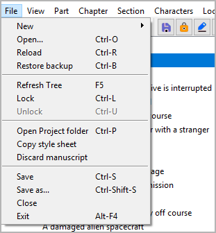
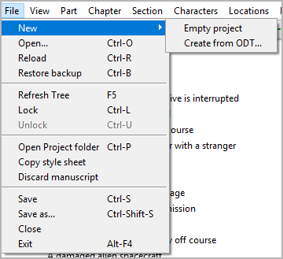

Datei-Menü
==========

**Datei operation**

Neu
---

**Create a new novel project**

With **Datei > Neu**, you can create a new project.
This will open a submenu.

.. note:: 
	The submenu can be extended by plugins to add more file types
	from which a *novelibre* project can be created.

Leeres Projekt
   -  This will close the current project and create a blank project.
   -  A file select dialog asks for the new project’s file name.
      If you cancel the dialog, you can select the file name later
      when saving the project.

Aus ODT erzeugen...
   -  This will close the current project and open a file dialog asking
      for an ODT document to create the new projec from.
   -  The newly created project is saved automatically in the same
      directory as the ODT document, using its file name and the extension
      *.novx*.
   -  If a project with the same file name as the ODT document already
      exists, no new project will be created.
   -  If you select a previously exported document belonging to an existing
      project, this project will be updated and loaded.
   -  The ODT document can either be a `work in progress
      <getting_started.html#starting-with-a-work-in-progress>`__,
      i.e. a regular novel Manuskript with chapter headings and section contents,
      r an `outline <getting_started.html#starting-with-an-outline>`__
      containing the chapter and section structure with titles and descriptions.

Öffnen...
---------

**Öffnen a novel project**

With **Datei > Öffnen** or ``Ctrl``-``O``,
you can open an existing project file.

.. note::
   When opening a project, the current project will be closed. 
   If there are unsaved changes, you will be asked for saving.

Neu laden
---------

**Neu laden the novel project**

With **Datei > Neu laden** or ``Ctrl``-``R``,
you can reload the project.

.. tip::
   This way you can undo changes made in the current session.

.. note::
   If the project has changed on disk since last opened, you will 
   get a warning.

Sicherungskopie wiederherstellen
--------------------------------

**Restore the latest backup file**

With **Datei > Sicherungskopie wiederherstellen** or ``Ctrl``-``B``,
you can restore the latest backup file.
You will get a warning, because changes may be lost.

.. hint::
   After restoring the backup, a backup copy is no longer available.
   You can create a new backup copy by saving the project.

Baum aktualisieren
------------------

**Enforce tree refresh after making changes**

With **Datei > Baum aktualisieren** or ``F5``,
you can refresh the tree.

-  “Normal” sections that have been moved to an “Unbenutzt” chapter are
   made “Unbenutzt”.
-  Teils and chapters are renumbered according to the `Automatische Nummerierung
   settings <book_view.html#auto-numbering>`__.
-  The “Papierkorb” chapter is moved to the end of the book, if necessary.

Sperren
-------

**Protect the project while edited outsides**

With **Datei > Sperren** or ``Ctrl``-``L``,
you can `lock <basic_concepts.html#project-lock>`__ the project.

.. note::
   Alle changes must be saved before locking the project.

Entsperren
----------

**Make the project editable**

With **Datei > Entsperren** or ``Ctrl``-``U``,
you can unlock the project.

Projektordner öffnen
--------------------
**Launch the file manager**

With **Datei > Projektordner öffnen** or ``Ctrl-P``,
you can launch the file manager with the current project folder .
This might come in handy, if you wish to delete files,
open your project with another application, and so on.

.. hint::
   In case you edit the project “outsides”, consider locking it before.

Style sheet kopieren
--------------------

**Provide a css style sheet in the project folder**

With **Datei > Style sheet kopieren**,
you can copy the style sheet *novx.css* into the current project folder.
This allows you to view the *.novx* project file with a web browser.

.. figure:: _images/file_menu01.jpg
   :alt: Edge browser screenshot

   Edge browser screenshot

.. hint::

   Depending on your web browser and your operating system, the
   *content type* resp. *MIME type* of *.novx* files must be registered as
   *“text/xml”*. Under Windows, yo can do this by running the
   ``<home>\.novelibre\add_novelibre.reg`` script.

Manuskript verwerfen
--------------------

**Verwerfen the current Manuskript by renaming it**

With **Datei > Manuskript verwerfen**,
you can add the *.bak* extension to the `current Manuskript
<export_menu#Manuskript-for-editing>`__.
This may help to avoid confusion about changes made with *novelibre* and
*Writer*.

.. hint::
   You can also discard any previously exported document "for editing"
   via the `Importieren dialog <import_menu.html>`__. 

Speichern
---------

**Speichern the project**

With **Datei > Speichern** or ``Ctrl``-``S``,
you can save the project.
A backup copy is then automatically created.

.. note::
   If the project has changed on disk since last opened, you will 
   get a warning.

Speichern unter...
------------------

**Speichern the project with another file name/at another place**

With **Datei > Speichern unter...** or ``Ctrl``-``Shift``-``S``,
you can save the project with another file name/at another place.
Then a file select dialog opens to specify the new path and file name.

.. note::
   Your current project remains as saved the last time. Changes since
   then apply to the new project.

Schließen
---------

**Schließen the novel project**

With **Datei > Schließen**,
you can close the project without exiting the program.
When closing the project, you will be asked for saving the project,
if it has changed.

.. note::
   If you open another project, the current project is automatically
   closed.

Beenden/Beenden
---------------

**Beenden the program**

-  Under Windows you can exit with **Datei > Beenden** or ``Alt``-``F4``.
-  Otherwise you can exit with **Datei > Beenden** or ``Ctrl``-``Q``.

.. note::
   When exiting the program, you will be asked for saving the project,
   if it has changed.

