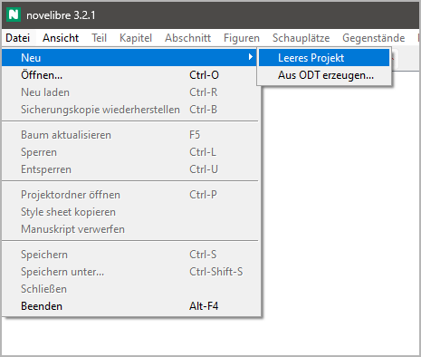
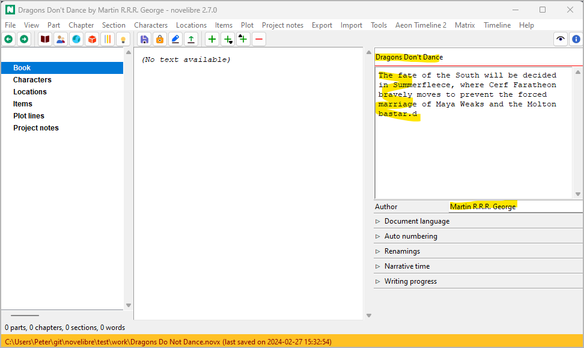
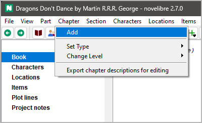
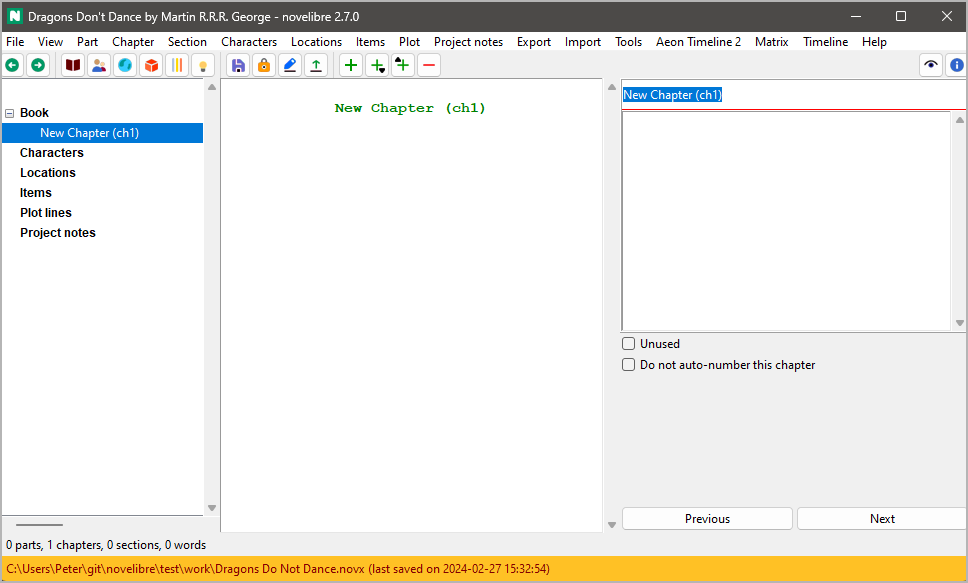
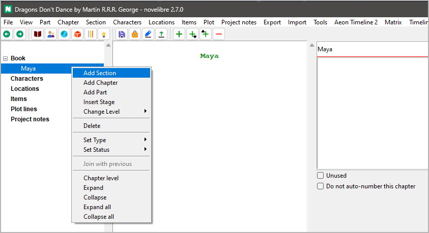
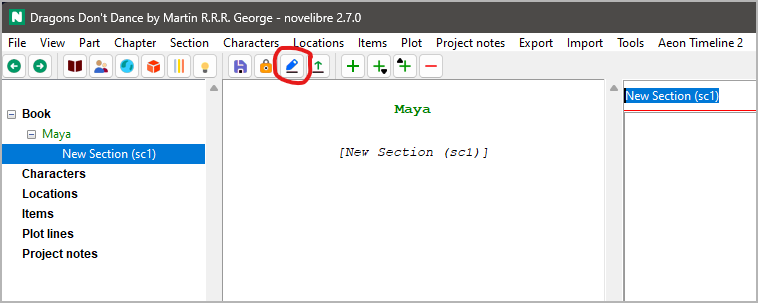
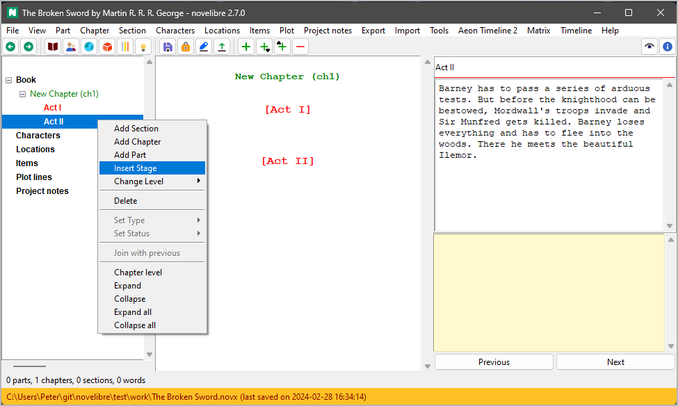
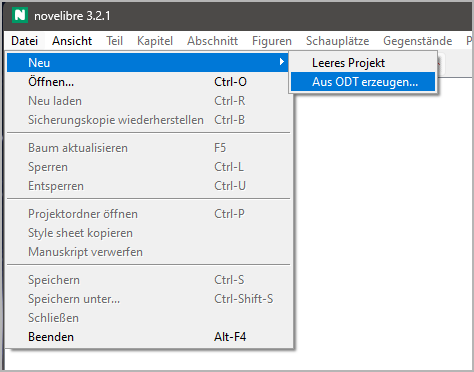

Erste Schritte
==============

Von Null beginnen
-----------------

Wenn Sie *novelibre* starten, indem Sie eine *.novx* Datei auf das Symbol ziehen,
wird dieses Projekt geöffnet. Andernfalls wird das Projekt der letzten
Sitzung automatisch wieder geöffnet, falls es eines gibt.

Nehmen wir an, dass beides nicht der Fall ist, z. B. wenn das Programm
zum allerersten Mal nach der Installation aufgerufen wird.
Nehmen wir außerdem an, dass wir noch keine Vorbereitungen getroffen haben,
d.h. wir haben weder ein angefangenes Werk noch eine Gliederung irgendeiner Art.
Zunächst legen wir mit **Datei > Neu > Leeres Projekt** ein neues leeres Projekt an.

   
Ein Dateiauswahldialog öffnet sich und fragt nach dem Dateinamen und dem Speicherort
des neuen Projekts.

.. tip::
   Es ist von Vorteil, einen eigenen Ordner für das Projekt anzulegen, 
   da alle exportierten Dokumente auch hier gespeichert werden. 
   Dazu gehören auch Hilfsdateien wie Zeitleisten oder projektbezogene 
   Konfigurationsdateien für Werkzeuge und Plugins. 

Es ist nicht obligatorisch, aber wir sollten dann einen Titel
und einen Autorennamen eingeben, vielleicht auch eine Beschreibung unserer Idee.
Um gleich loslegen zu können, verschieben wir die restlichen
Projekteinstellungen auf später.

   
Wir brauchen mindestens einen Abschnitt, um mit dem Schreiben beginnen zu können.
Und dieser muss zu einem Kapitel gehören. Also erstellen wir jetzt das erste
Kapitel mit **Kapitel > Hinzufügen**.

   
Nachdem das Kapitel erstellt wurde, setzt *novelibre* den Fokus auf den
Kapitel-Titel am oberen Rand des rechten Fensters.
Überschreiben wir den vorgegebenen Titel.

   
.. hint::
   Wenn sie sich dafür entscheiden, *novelibre* `die Kapitel automatisch 
   nummerieren zu lassen <book_view.html#automatische-nummerierung>`__,
   können Sie das überspringen und den voreingestellten Titel stehenlassen. 

Es gibt nun mehrere Möglichkeiten, einen Abschnitt hinzuzufügen.
In diesem Beispiel klicken wir mit der rechten Maustaste auf das Kapitel
und wählen **Abschnitt Hinzufügen**.

Gleich mit dem Manuskript beginnen
~~~~~~~~~~~~~~~~~~~~~~~~~~~~~~~~~~

Sobald der neue Abschnitt in der Baumansicht erscheint,
können wir ein Manuskript exportieren.
Klicken Sie einfach auf die Schaltfläche |Manuskript exportieren| in der Werkzeugleiste.

.. |Manuskript exportieren| image:: _images/Manuscript.png

   
Fertig! *Writer* sollte sich nun mit dem Manuskript öffnen.
Fangen Sie einfach an, Ihren Roman innerhalb des Textrahmens zu schreiben.

.. figure:: _images/getting_started07.png
   :alt: Libreoffice Screenshot
   
Wir können nun mit *Writer* weiterarbeiten,  `wie auf der folgenden Seite
beschrieben <writing.html>`__, und während des Schreibens neue Abschnitte
und Kapitel erzeugen.

.. tip::
   Jetzt können Sie das Manuskriptdokument "aus dem Stegreif" bearbeiten,
   bis es Ihnen sinnvoll erscheint, alles zu *novelibre* zurückzuspielen,
   um dort eine Übersicht zu erzeugen und Ihr Projekt aufzusetzen.
   
   Ich empfehle jedoch, das zumindest täglich am Ende Ihrer Schreibsitzung zu tun  
   und am nächsten Tag ein neues Manuskriptdokument zu exportieren. 
   Dann kommen Sie nicht in Verzug mit der Eingabe der Kapitelüberschriften
   und der Inhaltsbeschreibungen, und Sie bekommen Ihre Kapitel nummeriert, 
   falls gewünscht. 
   Außerdem speichert *novelibre* dann Einträge im täglichen Wortzählprotokoll.
   
   
Eine Kapitelstruktur anlegen
~~~~~~~~~~~~~~~~~~~~~~~~~~~~

Falls sie es vorziehen, vor dem eigentlichen Schreiben zuerst einmal
einen Plan zu machen, ist *novelibre* das richtige Werkzeug für Sie.
Dann rufen Sie nicht gleich *Writer* mit einem leeren Dokument auf,
sondern erzeugen zuerst ein Gerüst aus leeren Kapiteln, für die Sie
Inhaltsangaben eingeben.
Oder Sie beslassen es zunächst bei einem einzigen leeren Kapitel,
das Sie mit leeren Abschnitten füllen, die Sie dann später auf weitere
Kapitel verteilen können.
Die Ergebnisse Ihrer Vorbereitungen können als Textdokumente in Form
von Zusammenfassungen exportiert werden, beispielsweise auf der Ebene
von `Kapiteln <chapter_menu.html#kapitelbeschreibungen-zum-bearbeiten-exportieren>`__
oder `Abschnitten <section_menu.html#abschnittsbeschreibungen-zum-bearbeiten-exportieren>`__.

Eine dramaturgische Struktur aufbauen
~~~~~~~~~~~~~~~~~~~~~~~~~~~~~~~~~~~~~

Allerdings können Sie auch auf einer abstrakteren Ebene beginnen
und zuerst Stadien wie Akte oder Schritte anlegen,
um dann später die Abschnitte als Szenen einzufügen.
Dazu erstellen Sie zunächst mindestens ein Kapitel.
Dann erzeugen Sie Ihre Stadien.

Das Verfahren wird auf der Seite `Mit novelibre plotten <plotting.html>`__
beschrieben.
Dort erfahren Sie auch, wie Sie mehrere Handlungsstränge oder
Charakterbögen anlegen.

.. tip::
   Mit dem `nv_templates-Plugin
   <https://github.com/peter88213/nv_templates/>`__ können Sie  
   *novelibre* Ihr neues Projekt mit einer vorgefertigten 
   Struktur wie dem "Drei-Akt-Modell" oder "Save The Cat"
   aufsetzen lassen. 

Ein Handlungsraster anlegen
~~~~~~~~~~~~~~~~~~~~~~~~~~~

Falls Sie Ihren Roman mit einem `"Plot grid"-Handlungsraster
<plotting.html#handlungsraster-plot-grid>`__ ausarbeiten
wollen, können Sie das mit *novelibre* tun:

1. Erstellen Sie ein neues leeres Projekt, wie oben beschrieben.
2. Fügen Sie ein einzelnes Kapitel hinzu.
3. Wählen Sie dieses Kapitel aus, und `fügen Sie dann mehrere
   Abschnitte hinzu.
   <section_menu.html#mehrere-abschnitte-hinzufugen>`__.
4. Falls Sie mehr als die zulässige Anzahl Abschnitte brauchen,
   wiederholen Sie Schritt 3.
   Es ist jedoch sinnvoll, zuerst einmal mit weniger Abschnitten zu
   beginnen, die sich leichter auf die später zu erzeugenden Kapitel
   verteilen lassen.
   Sie können das Handlungsraster mit der Zeit erweitern.
5. Legen Sie die benötigten `Plotlinien <plot_menu.html#plotlinie-hinzufugen>`__ an.
6. `Exportieren
   <plot_menu.html#handlungsraster-plot-grid-zum-bearbeiten-exportieren>`__
   Sie ein Handlungsraster und füllen Sie die Tabellenzellen aus.
7. `Importieren <import_menu.html>`__ Sie das Handlungsraster.
8. `Erzeugen Sie mehr Kapitel <chapter_menu.html#hinzufugen>`__,
   und
   `verteilen Sie die Abschnitte <desktop.html#baumelemente-verschieben>`__
   darauf.

-----------------

Mit einem angefangenen Werk beginnen
------------------------------------

Nehmen wir an, Sie haben bereits ein umfangreiches Romanmanuskript
mit *Writer* begonnen und wollen nun mit *novelibre* weiterarbeiten.
In diesem Fall stellen Sie zunächst sicher, dass es so gestaltet ist,
dass *novelibre* seine Teile, Kapitel und Abschnitte erkennen kann.

.. important::
   Einen Text für den Import vorbereiten
      Im bestehenden Manuskript darf es keine Überschrift dritter Ordnung geben.
      
      -  *Überschrift 1* → Teile-Titel.
      -  *Überschrift 2* → Kapitel-Titel.
      -  ``* * *`` → Abschnittstrenner (nicht vor dem ersten Abschnitt im Kapitel).
      -  Der ganze restliche Text wird als Inhalt von Abschnitten behandelt.

.. caution::
   Textauszeichnungen, die nicht `durch novelibre unterstützt werden 
   <basic_concepts.html#text-formatieren>`__, gehen verloren.
   Dasselbe gilt für Bilder. 
   Wenn also Ihr Werk ein ausgefeiltes Layout braucht, 
   das jenseits von *novelibres* Möglichkeiten liegt,
   erwägen Sie, beim Schreiben Kommentare als Gedächtnisstützen einzufügen.
   Das kann später helfen, die speziellen Formate anzuwenden, wenn Sie 
   Ihren fertigen Roman für die Veröffentlichung vorbereiten. 
   Falls das nicht genügt, ist *novelibre* vielleicht nicht das 
   richtige Werkzeug für Sie. 
     
Wenn Ihr Manuskript vorbereitet ist, erzeugen Sie Ihr neues Projekt
mit **Datei > Neu > Aus ODT erzeugen...**.

Es öffnet sich ein Dateiauswahldialog und fragt nach dem *ODT*-Dokument.
Das neue Projekt wird im selben Verzeichnis angelegt und nach der
Manuskriptdatei benannt, aber mit der *.novx*-Erweiterung.

.. caution::
   Sobald Ihr Roman in *novelibre* importiert ist, wird das ursprüngliche
   *ODT*-Dokument nicht mehr gebraucht. 
   Wenn sie es aber behalten wollen, verschieben Sie es am besten anderswohin, 
   so dass es später nicht durch ein `exportiertes Dokument 
   <export_menu.html#manuskript-zum-drucken-nur-exportieren>`__ überschrieben wird. 

.. tip::
   Nachdem Sie ein umfangreiches Werk importiert haben, 
   könnten Sie eine ganze Menge Abschnitte zu betiteln und zu beschreiben haben.
   Ein `Handlungsraster <plotting.html#handlungsraster-plot-grid>`__ 
   könnte Ihnen dabei eine große Hilfe sein.

Mit einer Gliederung beginnen
-----------------------------

Statt eines angefangenen Werks können Sie auch eine mit *Writer* geschriebene
Gliederung nach *novelibre* importieren. Dann erhalten Sie ein Romanprojekt
mit leeren, aber betitelten und beschriebenen Kapiteln und Abschnitten.
Auf den ersten Blick sieht eine Gliederung einem angefangenen Werk sehr ähnlich,
doch sie hat Überschriften dritter Ordnung für die Abschnittstitel.
Wenn *novelibre* Überschriften dritter Ordnung findet, betrachtet es
den gesamten Textkörper als Beschreibung.
In diesem Fall werden Textauszeichnungen nicht berücksichtigt.

.. important::
   Eine Gliederung für den Import vorbereiten
      Eine Gliederung hat mindestens eine Überschrift dritter Ordnung.
      
      -  *Überschrift 1* → Teile-Titel.
      -  *Überschrift 2* → Kapitel-Titel.
      -  *Überschrift 3* → Abschnittstitel.
      -  Der ganze restliche Text wird als Beschreibung von Kapiteln und 
         Abschnitten behandelt.

Wenn Ihre Gliederung vorbereitet ist, erzeugen Sie Ihr neues Projekt
mit **Datei > Neu > Aus ODT erzeugen...**.

Es öffnet sich ein Dateiauswahldialog und fragt nach dem *ODT*-Dokument.
Das neue Projekt wird im selben Verzeichnis angelegt und nach der
Gliederungsdatei benannt, aber mit der *.novx*-Erweiterung.

.. caution::
   Sobald Ihre Gliederung in *novelibre* importiert ist, wird das ursprüngliche
   *ODT*-Dokument nicht mehr gebraucht. 
   Wenn sie es aber behalten wollen, verschieben Sie es am besten anderswohin, 
   so dass es später nicht durch ein `exportiertes Dokument 
   <export_menu.html#manuskript-zum-drucken-nur-exportieren>`__ überschrieben wird.
   
   Die aktuelle Gliederung können Sie jederzeit als "Beschreibungen" 
   (getrennt nach Teilen, Kapiteln und Abschnitten) exportieren, 
   bearbeiten und importieren. 
   
   
   
   
   
      