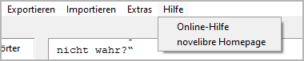

Hilfe-Menü
==========

**Schneller Zugriff auf die Hilfeseiten für novelibre und seine Plugins**

.. note:: 
   Das *Hilfe*-Menü kann durch Plugins erweitert werden, wenn sie 
   Links zu ihren speziellen Hilfeseiten hinzufügen. 

.. hint::
   Mit ``F1`` können Sie eine zum Kontext passende Hilfeseite aufrufen.

Online-Hilfe
------------

Mit **Hilfe > Online-Hilfe**
können Sie Ihren System-Webbrowser mit der URL der *novelibre*-Onlinehilfe aufrufen.

novelibre Homepage
------------------

Mit **Hilfe > novelibre Homepage**
können Sie Ihren System-Webbrowser mit der URL der *novelibre*-Homepage aufrufen.

.. hint::
   Damit gelangen Sie schnell zum Download-Link der aktuellen 
   *novelibre*-Version.

