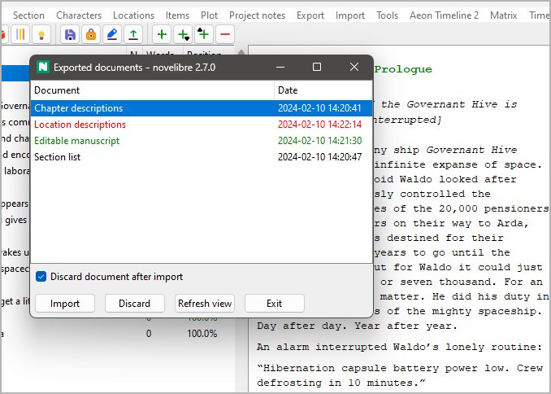

Importieren-Menü
================

**Das Projekt aus einem zuvor exportierten ODF-Dokument aktualisieren**

Mit the **Importieren**-Eintrag im Hauptmenü
können Sie eine Liste von zuvor exportierten ODF-Dokumenten aufrufen.
Sie können diese Dokumente importieren, um das Projekt zu aktualisieren.

- Dokumenttyp und Datum werden angezeigt.
- Dokumente, die neuer als die Projektdatei sind,
  sind in grüner Schrift eingetragen.
- Dokumente, die nicht importiert sind, weil sie in *Writer* offen sind,
  sind in roter Schrift eingetragen.
- Sie können das Projekt aus einem Dokument aktualisieren,
  indem Sie entweder auf den Listeneintrag doppelklicken,
  oder indem Sie das Dokument in der Liste auswählen und
  auf die **Importieren**-Schaltfläche klicken.
- Sie können Dokumente entfernen,
  indem Sie sie in der Liste auswählen und
  auf die **Verwerfen**-Schaltfläche klicken.

   .. hint::
      Verwerfen heißt umbenennen, indem die Erweiterung *.bak*
      an den Dateinamen angehängt wird.
   
   
-  Nachdem Sie in *Writer* ein Dokument geschlossen haben,
   während das Fenster *Exportierte Dokumente* noch offen ist,
   können Sie auf die Schaltfläche **Ansicht aktualisieren**
   klicken.

Dokumente verwerfen, nachdem das Projekt aktualisiert wurde
-----------------------------------------------------------

Dokumente mit aufgeteilten Abschnitten werden nach dem Reimport
automatisch verworfen, um Verwirrung durch die geänderte
Kapitel- oder Abschnittsstruktur zu vermeiden.
Was Dokumente angeht, die keine Änderung der Projektstruktur
erfordern, haben Sie drei Möglichkeiten zur Wahl:

Dokumente nur verwerfen, falls Abschnitte geteilt wurden
   Das ist das standardmäßige Verhalten.
   Die ODF-Dokumente werden zum späteren Gebrauch aufbewahrt.

Dokumente nach dem Import immer verwerfen
   Nachdem das *novelibre*-Projekt aus einem reimportierten
   ODF-Dokument aktualisiert worden ist,
   wird dieses Dokument automatisch verworfen.

Auch gesperrte Dokumente importieren; nicht verwerfen
   Das ermöglicht häufige schnelle Projektaktualisierungen,
   während die ODF-Dokumente in *Writer* oder *Calc*
   zur Bearbeitung geöffnet bleiben.

   .. important::
      Falls Sie in Ihrem ODT-Dokument Abschnitte aufgeteilt
      haben, 
      können Sie es nicht reimportieren, solange es in 
      *Writer* offen ist. 
      Das ist so, weil *novelibre* es nicht verwerfen kann, 
      solange es durch *Writer* gesperrt ist.
      
