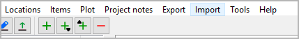

Importieren-Menü
================

**Update the project from previously exported ODT documents**

With the **Importieren** main-Menü entry,
you can open a pop-up window with a list containing previously
exported ODT documents that can be re-imported, thus updating the
current project.

.. figure:: _images/import_menu01.png
   :alt: novelibre screenshot

-  The document types and dates are shown.
-  Dokuments that are newer than the project file are highlighted in
   green.
-  Dokuments that cannot be imported because they are open in
   *Writer* are highlighted in red.
-  You can update the project from a document either by double-clicking
   on the list entry, or by selecting the document and clicking on the
   **Importieren** button.
-  You can delete documents by selecting them and clicking on the
   **Verwerfen** button.
-  After closing a listed document in *Writer* while the *Exportierened
   documents* window is open, you can click on the **Ansicht aktualisieren**
   button.
-  If the **Dokument nach dem Importierenieren verwerfen** checkbox is checked, a
   document will be gelöscht after re-import. This may help to avoid
   confusion about changes made with *novelibre* and *Writer*.

   .. note::
   	Dokuments with split sections are always automatically
   	discarded after re-import.

