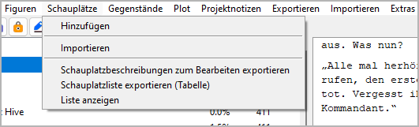

Gegenstände-Menü
================

**Gegenstand operation**

Hinzufügen
----------

**Hinzufügen a new item**

Mit **Gegenstände > Hinzufügen**,
you can add an `item <basic_concepts.html#figuren-und-erzählwelt>`__
to the tree.

-  If an item is selected, the new item is placed after the selected
   one.
-  Otherwise, the new item is placed at the last position.
-  The new item has an auto-generated Titel. You can change it in the
   right pane.

Importieren
-----------

**Importieren items from another project**

Mit **Gegenstände > Importieren**,
you can import a selection of items from another project.
First you select an XML file containing the item data.
Then you select the items you want to add to the current project.

.. hint::
   To create an XML-Gegenstandsdatei for the current project, 
   use **Exportieren > Figuren/Schauplätze/Gegenstände-Datendateien**.

Gegenstandsbeschreibungen zum Bearbeiten exportieren
----------------------------------------------------

**Exportieren an ODT document that can be imported again after editing**

Mit **Gegenstände > Gegenstandsbeschreibungen zum Bearbeiten exportieren**,
you can create a text document that contains
item descriptions that can be edited with *Writer* and reimported.
Der Dateinamenszusatz lautet ``_items_tmp``.

Gegenstandsliste exportieren (Tabelle)
--------------------------------------

**Exportieren an ODS document that can be imported again after editing**

Mit **Gegenstände > Gegenstandsliste exportieren (Tabelle)**,
you can create a spreadsheet that contains
an item list that can be edited with *Calc* and reimported.
Der Dateinamenszusatz lautet ``_itemlist_tmp``.

.. note::
   You can reorder, hide or delete columns and rows 
   without affecting the reimport. 
   Only the first column and the first row, which are hidden by default, 
   must not be changed as they contain the structural information 
   for the import. 

Liste anzeigen
--------------

**Show an HTML report with items data**

Mit **Gegenstände > Liste anzeigen**,
you can create a list-formatted HTML file that contains
an item list,
and launch your system’s web browser for displaying it.

.. note::
   The report is a temporary file, auto-gelöscht on program exit.
   If needed, you can have your web browser save or print it.
