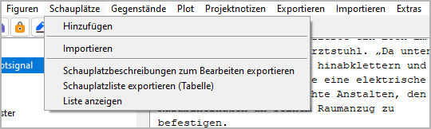

Schauplätze-Menü
================

**Schauplatz-Operationen**

Hinzufügen
----------

**Hinzufügen a new location**

Mit **Schauplätze > Hinzufügen**
können Sie add a `location <basic_concepts.html#figuren-und-erzahlwelt>`__
to the tree.

-  If a location is selected, the new location is placed after the
   selected one.
-  Otherwise, the new location is placed at the last position.
-  The new location has an auto-generated Titel. You can change it in
   the right pane.

Importieren
-----------

**Importieren locations from another project**

Mit **Schauplätze > Importieren**
können Sie import a selection of locations from another project.
First you select an XML file containing the location data.
Then you select the locations you want to add to the current project.

.. hint::
   To create an XML-Schauplatzdatei for the current project, 
   use **Exportieren > Figuren/Schauplätze/Gegenstände-Datendateien**.

Schauplatzbeschreibungen zum Bearbeiten exportieren
---------------------------------------------------

**Ein ODT-Dokument exportieren, das bearbeitet und zurückgelesen werden kann**

Mit **Gegenstände > Schauplatzbeschreibungen zum Bearbeiten exportieren**
können Sie create a text document that contains
location descriptions that can be edited with *Writer* and reimported.
Der Dateinamenszusatz lautet ``_locations_tmp``.

Schauplatzliste exportieren (Tabelle)
-------------------------------------

**Ein ODS-Dokument exportieren, das bearbeitet und zurückgelesen werden kann**

Mit **Gegenstände > Schauplatzliste exportieren (Tabelle)**
können Sie create a spreadsheet that contains
a location list that can be edited with *Calc* and reimported.
Der Dateinamenszusatz lautet ``_loclist_tmp``.

.. note::
   You can reorder, hide or delete columns and rows 
   without affecting the reimport. 
   Only the first column and the first row, which are hidden by default, 
   must not be changed as they contain the structural information 
   for the import. 

Liste anzeigen
--------------

**Einen HTML-Report mit Schaupatzdaten anzeigen**

Mit **Schauplätze > Liste anzeigen**
können Sie create a list-formatted HTML file that contains
a location list,
and launch your system’s web browser for displaying it.

.. note::
   The report is a temporary file, auto-gelöscht on program exit.
   If needed können Sie have your web browser save or print it.

