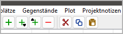

|external-link| `English <https://peter88213.github.io/nvhelp-en/nv_clipboard/>`_

.. |external-link| image:: ../_images/external-link.png

-----------------

============
nv_clipboard
============

**Benutzerhandbuch**

Diese Seite gilt für die neueste Ausgabe von `nv_clipboard
<https://github.com/peter88213/nv_clipboard/>`__.
Sie können sie mit **Hilfe > Zwischenablage Online-Hilfe** öffnen.

Das Plugin fügt der *novelibre*-`Werkzeugleiste <../toolbar.html>`__ zwei neue
Schaltflächen hinzu,
Außerdem den Eintrag **Zwischenablage Online-Hilfe** im **Hilfe**-Menü.

Vom Zwischenablage-Plugin hinzugefügte Werkzeugleisten-Schaltflächen
--------------------------------------------------------------------

|Cut| Das ausgewählte Element aus dem Baum in die Zwischenablage verschieben.
Dasselbe wie ``Strg``-``X``.

|Copy| Das ausgewählte Element in die Zwischenablage kopieren.
Dasselbe wie ``Strg``-``C``.

|Paste| Das Element aus der Zwischenablage in den Baum einfügen.
Dasselbe wie ``Strg``-``V``.

Sie können die folgenden Baumelemente über die Zwischenablage kopieren und einfügen:

- Teile und Kapitel,
- Abschnitte,
- Stadien,
- Plotlinien,
- Plotpunkte,
- Figuren,
- Schauplätze,
- Gegenstände,
- Projektnotizen.

.. hint::
   Falls mehrere Elemente markiert sind, wird nur das erste kopiert.
   Hat das Element jedoch "Kinder", werden diese auch kopiert und eingefügt. 

.. attention::
   Beziehungen werden beim Kopieren oder Verschieben in die Zwischenablage nicht mitgenommen.
   Das gilt auch für die Abschnitts-Perspektive und für Plotlinien/Plotpunkte.

.. |Cut| image:: _images/cut.png
.. |Copy| image:: _images/copy.png
.. |Paste| image:: _images/paste.png
