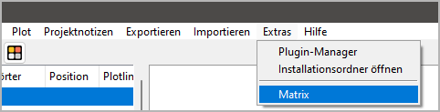

|external-link| `English <https://peter88213.github.io/nvhelp-en/nv_matrix/>`__

.. |external-link| image:: ../_images/external-link.png

-----------------

=========
nv_matrix
=========

**Benutzerhandbuch**

Diese Seite gilt für die neueste Ausgabe von `nv_matrix
<https://github.com/peter88213/nv_matrix/>`__.
Sie können sie mit **Hilfe > Matrix-Plugin Online-Hilfe** öffnen.

Das Plugin fügt dem *novelibre* **Extras**-Menü den Eintrag **Matrix** hinzu,
und dem **Hilfe**-Menü den Eintrag **Matrix-Plugin Online-Hilfe**.
Die Werkzeugleiste erhält eine |Matrix| Schaltfläche.

Den Matrix-Manager aufrufen
---------------------------

- Öffnen Sie den Matrix-Manager entweder über das Hauptmenü: **Extras > Matrix**,
- oder über die |Matrix| Schaltfläche in der Werkzeugleiste.

Beziehungen hinzufügen/entfernen
--------------------------------

- Sie können Beziehungen hinzufügen oder entfernen, indem Sie die
  entsprechenden Knotenpunkte mit gedrückter ``Strg``-Taste
  anklicken.

Scrollen mit dem Mausrad
------------------------

- Benutzen Sie das Mausrad für senkrechtes Scrollen.
- Benutzen Sie das Mausrad mit gedrückter Umschalttaste für waagerechtes Scrollen.

Beenden
-------

-  Schließen Sie das Fenster.
