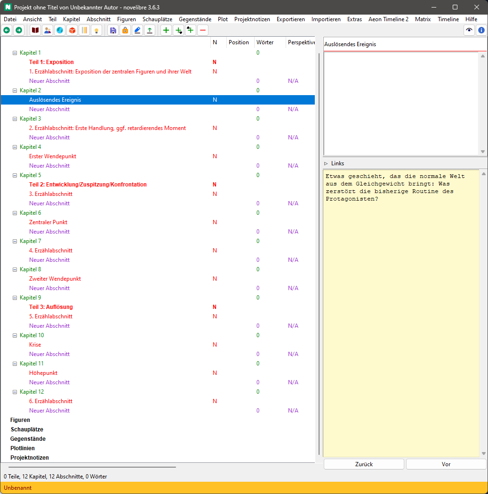

|external-link| `English <https://peter88213.github.io/nvhelp-en/nv_templates/>`__

.. |external-link| image:: ../_images/external-link.png

-----------------

============
nv_templates
============

**Benutzerhandbuch**

Diese Seite gilt für die neueste Ausgabe von `nv_templates
<https://github.com/peter88213/nv_templates/>`__.
Sie können sie mit **Hilfe > Vorlagen-Plugin Online-Hilfe** öffnen.

Mit *novelibre* können Sie eine Erzählstruktur mit Stadien definieren
(siehe `Plotten mit novelibre <../plotting.html>`__).
*nv_templates* vereinfacht die Wiederverwendung von Erzählstrukturen.

Das Plugin installieren
-----------------------

- Entpacken Sie die heruntergeladene Zip-Datei in einen neuen Ordner.
- Gehen Sie in diesen Ordner und führen Sie **setup.pyw** aus. Damit installieren Sie das Plugin.

Das Plugin fügt dem *novelibre*-**Extras**-Menü
den Eintrag **Erzählstruktur-Vorlagen** hinzu,
außerdem dem **Datei > Neu**-Untermenü den Eintrag **Aus Vorlage erzeugen...**,
und dem **Hilfe**-Menü den Eintrag **Vorlagen-Plugin Online-Hilfe**.

Befehlsreferenz
---------------

Datei > Neu
~~~~~~~~~~~

Aus Vorlage erzeugen...
^^^^^^^^^^^^^^^^^^^^^^^

Damit schließen Sie das laufende Projekt und erzeugen ein
neues Projekt mit der Erzählstruktur aus einer
Markdown-formatierten Vorlagendatei.

- Ein Dateiauswahldialog fragt nach Speicherort und Dateinamen
  des neuen Projekts.
  Falls Sie diesen Dialog abbrechen, können Sie den Dateinamen
  auch später beim Abspeichern vergeben.
- Dann fragt ein zweiter Dateiauswahldialog nach der Vorlagendatei,
  die angewandt werden soll.

Extras > Erzählstruktur-Vorlagen
~~~~~~~~~~~~~~~~~~~~~~~~~~~~~~~~

Laden
^^^^^

Damit laden Sie eine Erzählstruktur aus einer Markdown-formatierten
Vorlagendatei in Ihr aktuelles Projekt.

- Ein Dateiauswahldialog fragt nach der Vorlagendatei,
  die angewandt werden soll.

Speichern
^^^^^^^^^

Damit speichern Sie die Erzählstruktur Ihres aktuellen Projekts
in eine Markdown-formatierte Vorlagendatei.

- Ein Dateiauswahldialog fragt nach dem Dateinamen
  der neuen Vorlagedatei.

Ordner öffnen
^^^^^^^^^^^^^

Damit können Sie den Vorlagenordner im Dateimanager öffnen, um zum
Beispiel die Vorlagendateien zu verwalten und zu bearbeiten.

Konventionen
------------

Markdown-Dateistruktur
~~~~~~~~~~~~~~~~~~~~~~

Die  *Erzählstruktur-Vorlagendatei* definiert eine Erzählstruktur
mit Hilfe von Markdown-Überschriften und normalem Text.

Überschrift erster Ordnung für die Hauptstadien, z.B. Akte
^^^^^^^^^^^^^^^^^^^^^^^^^^^^^^^^^^^^^^^^^^^^^^^^^^^^^^^^^^

Die Überschrift erster Ordnung beginnt mit ``#``,
gefolgt von einem Leerzeichen und dem Titel des Stadiums.

Überschrift zweiter Ordnung für untergeordnete Stadien oder Wendepunkte
^^^^^^^^^^^^^^^^^^^^^^^^^^^^^^^^^^^^^^^^^^^^^^^^^^^^^^^^^^^^^^^^^^^^^^^

Die Überschrift erster Ordnung beginnt mit ``##``,
gefolgt von einem Leerzeichen und dem Titel des Stadiums.

Gewöhnlicher Text
^^^^^^^^^^^^^^^^^

Der Text unterhalb einer Überschrift besteht aus Notizen für das Element,
das aus der Überschrift erstellt wurde.

Beispiel
^^^^^^^^
.. highlight:: markdown

:: 

    # Teil 1: Exposition

    Die Exposition dient der Einführung in die Welt der Geschichte. Ziel ist es, der Leserschaft genügend Information zu geben, um sich in der Welt der Geschichte zurechtzufinden.

    ## 1. Erzählabschnitt: Exposition der zentralen Figuren und ihrer Welt

    Die normale Welt: Wie sieht die Routine des Protagonisten aus? Wie lautet die zentrale Frage?

    ## Auslösendes Ereignis

    Etwas geschieht, das die normale Welt aus dem Gleichgewicht bringt: Was zerstört die bisherige Routine des Protagonisten?

    ## 2. Erzählabschnitt: Erste Handlung, ggf. retardierendes Moment

    Die Reaktion des Protagonisten auf das auslösende Ereignis: Wie reagiert der Protagonist auf das auslösende Ereignis?

    ## Erster Wendepunkt

    Der Protagonist nimmt den Kampf um sein Ziel auf. Er verlässt die alte Welt und begibt sich in eine unbekannte Welt: Was ist das Ziel des Protagonisten? Warum muss er es unbedingt erreichen? Wie lautet die dramatische Frage?

    # Teil 2: Entwicklung/Zuspitzung/Konfrontation

    Im ersten Wendepunkt tritt der Protagonist aus seiner gewohnten, aber gestörten Welt in eine neue, unbekannte Welt. Er muss in dieser neuen Welt bestehen, wenn er sein Ziel erreichen will. Im zweiten Akt geht es um die Versuche, mit denen er dieses Ziel realisieren will. Er wird scheitern und er wird kleine Erfolge haben, wird sich seinem Ziel annähern und wieder von ihm weggeschleudert. Es gelingt ihm jedoch nicht, sein Ziel endgültig zu erreichen, weil die antagonistische Kraft es immer wieder aufs Neue vermag, ihn daran zu hindern. Entscheidend ist, dass es -- trotz kleiner Zwischenerfolge -- tendenziell immer schwerer für ihn wird, sein Ziel zu erreichen, dass er immer mehr Risiken eingehen muss, weil die antagonistische Kraft ihm immer größere Steine in den Weg legt. Der Konflikt spitzt sich immer mehr zu.

    ## 3. Erzählabschnitt

    a) Alles läuft bestens: Welche Erfolge erzielt der Protagonist? Wie schafft er es, die Hindernisse der antagonistischen Kraft zu überwinden?

    b) Es geht immer weiter bergab: Welche Niederlagen muss der Protagonist einstecken? Wie hindert die antagonistische Kraft ihn daran, sein Ziel zu erreichen?

    ## Zentraler Punkt

    a) Im Moment größter Hoffnung muss der Protagonist einen Rückschlag einstecken, der ihn dazu führen kann, ein neues Ziel zu verfolgen.

    b) Der Protagonist kommt an seinem Tiefpunkt an, erlebt Tod und Wiedergeburt, schöpft jedoch neue Hoffnung und rappelt sich wieder auf.

    ## 4. Erzählabschnitt

    a) Der Protagonist erholt sich nicht von dem Rückschlag: Es geht weiter bergab.

    b) Mit neuem Mut und noch größerer Entschlossenheit verfolgt der Protagonist sein altes oder neues Ziel. alles läuft bestens.

    ## Zweiter Wendepunkt

    a) Der Protagonist ist kurz davor, alles zu verlieren, durchlebt Tod und Wiedergeburt und schöpft neuen Mut.

    b) Der Protagonist ist kurz davor, sein Ziel zu erreichen, wird dann jedoch zurückgeworfen.

    # Teil 3: Auflösung

    Im dritten Akt nimmt das Tempo zu. Der Protagonist und die antagonistische Kraft stehen sich zum großen Finale gegenüber, die antagonistische Kraft rüstet zum letzten und größten Gegenschlag. Der Protagonist gerät in eine Krisenentscheidung, und im Höhepunkt wird der Konflikt endgültig und unwiderruflich gelöst. Die antagonistische Kraft wird vernichtend geschlagen, und der Protagonist erreicht sein Ziel -- oder er verliert es für immer.

    ## 5. Erzählabschnitt

    Vorbereitung auf die alles entscheidende "letzte Schlacht".

    ## Krise

    Der Protagonist befindet sich in einem Dilemma und muss sich endgültig entscheiden, was er will.

    ## Höhepunkt

    Die "letzte Schlacht". Der Konflikt wird entschieden. Der Protagonist erreicht sein Ziel, oder verliert es für immer.

    ## 6. Erzählabschnitt

    Der Konflikt ist gelöst, der Protagonist ein neuer Mensch geworden: Was hat sich durch den Konflikt verändert? Wie geht es mit dem Protagonisten weiter?
    
Diese Datei erzeugt die folgende Struktur in einem leeren Projekt:

