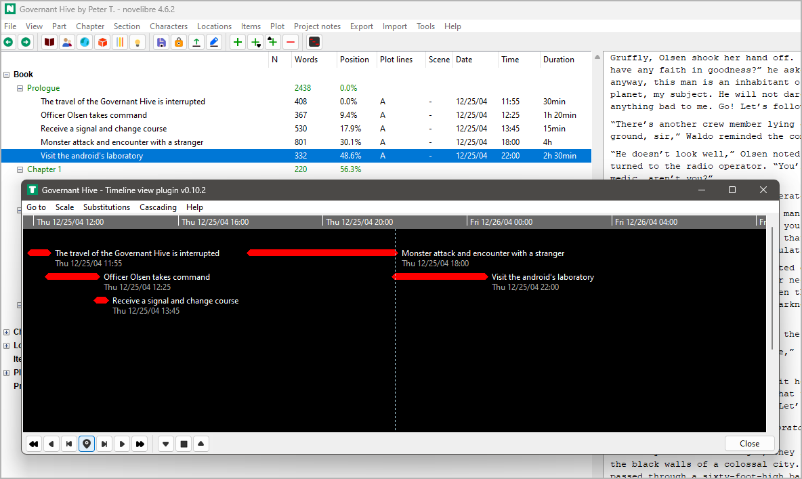

|external-link| `English <https://peter88213.github.io/nvhelp-de/nv_tlview/>`_

.. |external-link| image:: ../_images/external-link.png

-----------------

=========
nv_tlview
=========

**Benutzerhandbuch**

Diese Seite gilt für die neueste Ausgabe von `nv_tlview
<https://github.com/peter88213/nv_tlview/>`__.
Sie können sie mit **Hilfe > Zeitleistenansicht Online-Hilfe** öffnen.

*nv_tlview* ist ein Plugin, das Abschnitte mit Datums- und Zeitangaben
in einer Zeitleiste anzeigt.

Das Plugin fügt dem *novelibre*-**Extras**-Menü
den Eintrag **Zeitleistenansicht** hinzu,
und dem **Hilfe**-Menü den Eintrag **Zeitleistenansicht Online-Hilfe**.
Die Werkzeugleiste erhält eine |Zeitline| Schaltfläche.

Bedienung
---------

Die Zeitleistenansicht öffnen
~~~~~~~~~~~~~~~~~~~~~~~~~~~~~

- Öffnen Sie die Zeitleistenansicht entweder über das Hauptmenü: **Extras > Zeitleistenansicht**,
- oder über die |Zeitline|-Schaltfläche in der Werkzeugleiste.

Scrollen mit der Maus
~~~~~~~~~~~~~~~~~~~~~

- Scrollen Sie die Zeitleiste horizontal mit dem Mausrad bei gedrückter Umschalttaste.
- Scrollen Sie die Zeitleiste vertikal mit dem Mausrad.
- Scrollen Sie die Zeitleiste in alle Richtungen, indem Sie die Maus mit gedrückter rechter Taste ziehen.
- Den Zeitmaßstab vergrößern oder verkleinern Sie mit dem Mausrad bei gedrückter ``Strg``-Taste.
- Die Abstandsgrenzen für das Stapeln verändern Sie mit dem Mausrad bei gleichzeitig
  gedrückter ``Strg``- und Umschalttaste.

Einen Abschnitt im *novelibre*-Projektbaum auswählen
~~~~~~~~~~~~~~~~~~~~~~~~~~~~~~~~~~~~~~~~~~~~~~~~~~~~

- Wählen Sie einen Abschnitt, indem sie auf einen Eintrag in der Zeitleiste doppelklicken.
  Das bringt das Anwendungsfenster von *novelibre* in den Vordergrund.

Einen Abschnitt in der Zeit verschieben
~~~~~~~~~~~~~~~~~~~~~~~~~~~~~~~~~~~~~~~

- Halten Sie die Umschalttaste gedrückt und klicken Sie auf den Zeitleisteneintrag,
  dann ziehen Sie ihn mit der Maus.
  Damit bewegen Sie den Abschnitt in der Zeit vor oder zurück,
  während die Dauer erhalten bleibt.

Das Abschnittsende verschieben
~~~~~~~~~~~~~~~~~~~~~~~~~~~~~~

- Halten Sie die ``Strg``- und die Umschalttaste gedrückt und klicken Sie auf den Zeitleisteneintrag,
  dann ziehen Sie ihn mit der Maus.
  Damit erhöhen oder verringern Sie die Zeitdauer des Abschnitts,
  während Beginndatum und -zeit erhalten bleiben.

.. hint::
   - Verschiebe-Operationen mit der Maus lassen sich
     durch Drücken der ``Esc``-Taste vor dem Loslassen
     der Maustaste abbrechen.
   - Verschiebe-Operationen mit der Maus lassen sich
     mit ``Strg``-``Z`` oder |undo| rückgängig machen. 

Befehlsreferenz
---------------

"Gehe zu"-Menü
~~~~~~~~~~~~~~

Erstes Ereignis
   Damit verschieben Sie die Zeitleiste so, dass
   das früheste Ereignis in der Nähe des linken Rands erscheint.

Letztes Ereignis
   Damit verschieben Sie die Zeitleiste so, dass
   das späteste Ereignis in der Nähe des rechten Rands erscheint.

Ausgewählter Abschnitt
   Damit verschieben Sie die Zeitleiste so, dass
   der im *novelibre*-Projektbaum ausgewählte Abschnitt
   in der Mitte des Fensters erscheint.

"Maßstab"-Menü
~~~~~~~~~~~~~~

Stunden
   Damit stellen Sie den Maßstab auf eine Stunde pro Skalenstrich ein.

Tage
   Damit stellen Sie den Maßstab auf einen Tag pro Skalenstrich ein.

Jahre
   Damit stellen Sie den Maßstab auf ein Jahr pro Skalenstrich ein.

Ans Fenster anpassen
   Damit stellen Sie den Maßstab und die Position so ein,
   dass alle Abschnitte mit gültiger Datum/Zeitinformation ins Fenster passen.

"Ersetzungen"-Menü
~~~~~~~~~~~~~~~~~~

Benutze 00:00 für fehlende Zeiten
   - Wenn dieses Feld angekreuzt ist,
     wird "00:00" für Abschnitte ohne Zeitangaben verwendet.
     Dies hat keinen Einfluss auf die Eigenschaften des Abschnitts.
   - Wenn dieses Feld nicht angekreuzt ist,
     werden Abschnitte ohne Zeitangabe nicht angezeigt.

"Kaskadieren"-Menü
~~~~~~~~~~~~~~~~~~

Die Abschnitte werden in der Ereignisdarstellung gestapelt,
damit sie sich nicht überlappen oder den Titel des
vorhergehenden Abschnitts verdecken.
Sollte Ihnen der Stapelagorithmus nicht gut genug erscheinen,
können Sie die Abstandsgrenzen für das Stapeln anders einstellen.

Dicht
   Aufeinander folgende Ereignisse auch dann hintereinander anordnen,
   wenn sie etwas dichter beieinander liegen.

Aufgelockert
   Aufeinander folgende Ereignisse auch dann untereinander anordnen,
   wenn sie etwas weiter auseinander liegen.

Normal
   Das Kaskadieren auf die Normaleinstellung zurücksetzen.

.. hint::
   Sie können die Grenzen für das Stapeln mit dem Mausrad fein einstellen,
   wenn Sie gleichzeitig die ``Strg``- und die Umschalttaste drücken.

"Hilfe"-Menü
~~~~~~~~~~~~

Online-Hilfe
   Diese Hilfeseite im Webbrowser öffnen.
   Dasselbe wie ``F1``.

Schaltflächen in der Werkzeugleiste am unteren Rand
~~~~~~~~~~~~~~~~~~~~~~~~~~~~~~~~~~~~~~~~~~~~~~~~~~~

|rewindLeft| Eine Bildschirmseite zurück
   Damit verschieben Sie die Zeitleiste,
   um etwa eine Bildschirmbreite in die Vergangenheit zu gehen.
   Dasselbe bewirkt die "Zurück"-Maustaste (Windows).

|arrowLeft| Zurückscrollen
   Damit verschieben Sie die Zeitleiste,
   um etwa 1/5 Bildschirmbreite in die Vergangenheit zu gehen.
   Mit dem Mausrad können Sie sie genauer verschieben.

|goToFirst| Gehe zum ersten Ereignis
   Damit verschieben Sie die Zeitleiste so, dass
   das früheste Ereignis in der Nähe des linken Rands erscheint.

|goToSelected| Gehe zum ausgewählten Abschnitt
   Damit verschieben Sie die Zeitleiste so, dass
   der im *novelibre*-Projektbaum ausgewählte Abschnitt
   in der Mitte des Fensters erscheint.

|goToLast| Gehe zum letzten Ereignis
   Damit verschieben Sie die Zeitleiste so, dass
   das späteste Ereignis in der Nähe des rechten Rands erscheint.

|arrowRight| Vorscrollen
   Damit verschieben Sie die Zeitleiste,
   um etwa 1/5 Bildschirmbreite in die Zukunft zu gehen.
   Mit dem Mausrad können Sie sie genauer verschieben.

|rewindRight| Eine Bildschirmseite nach vorne
   Damit verschieben Sie die Zeitleiste,
   um etwa eine Bildschirmbreite in die Zukunft zu gehen.
   Dasselbe bewirkt die "Vorwärts"-Maustaste (Windows).

|arrowDown| Den Zeitmaßstab verkleinern
   Damit verkleinern Sie den Zeitmaßstab in groben Schritten.
   Für die Feineinstellung ist das Mausrad vorgesehen.

|fitToWindow| Ans Fenster anpassen
   Damit stellen Sie den Maßstab und die Position so ein,
   dass alle Abschnitte mit gültiger Datum/Zeitinformation ins Fenster passen.

|arrowUp| Den Zeitmaßstab vergrößern
   Damit vergrößern Sie den Zeitmaßstab in groben Schritten.
   Für die Feineinstellung ist das Mausrad vorgesehen.

|undo| Die letzte Änderung rückgängig machen
   Damit stellen Sie Datum/Uhrzeit/Dauer
   vor der letzten Mausoperation an einem Abschnitt wieder her.
   Dasselbe wie ``Strg``-``Z``

   .. caution::   
      Zwischenzeitliche Änderungen von Datum/Zeit/Dauer am selben Abschnitt 
      über  die Abschnittseigenschaften in *novelibre* 
      können dabei verlorengehen. 
      
Schließen
   Das Zeitleistenfenster schließen.
   Dasselbe wie ``Strg``-``Q`` (Linux)
   oder ``Alt``-``F4`` (Windows).

.. |rewindLeft| image:: _images/rewindLeft.png

.. |goToFirst| image:: _images/goToFirst.png

.. |rewindRight| image:: _images/rewindRight.png
.. |goToSelected| image:: _images/goToSelected.png
.. |arrowDown| image:: _images/arrowDown.png

