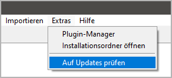
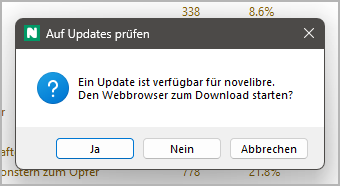
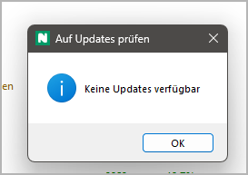

|external-link| `English <https://peter88213.github.io/nvhelp-en/nv_update/>`__

.. |external-link| image:: ../_images/external-link.png

-----------------

==========
nv_updater
==========

**Benutzerhandbuch**

Diese Seite gilt für die neueste Ausgabe von `nv_updater
<https://github.com/peter88213/nv_updater/>`__.
Sie können sie mit **Hilfe > Update-Prüfer Online-Hilfe** öffnen.

Das Plugin fügt dem *novelibre*-**Extras**-Menü
den Eintrag **Auf Updates prüfen** hinzu,
und dem **Hilfe**-Menü den Eintrag **Update-Prüfer Online-Hilfe**.




Das Plugin installieren
-----------------------

- Starten Sie entweder die heruntergeladene Datei
  **nv_updater_vx.x.x.pyzw** durch Doppelklick (Windows/Linux-Desktop),
- oder führen Sie ```python nv_updater_vx.x.x.pyzw``` (Windows),
  bzw. ```python3 nv_updater_vx.x.x.pyzw``` (Linux) auf der Kommandozeile aus.

*"x.x.x"* ist dabei die Versionsnummer.

.. important::
   Viele Webbrowser erkennen den Download als ausführbare Datei
   und bieten an, sie direkt zu öffnen. 
   Damit wird die Installation gestartet.
   
   Abhängig von Ihren Sicherheitseinstellungen kann es allerdings 
   auch passieren, dass Ihr Browser den Download der ausführbaren 
   Datei zunächst verweigert. 
   In diesem Fall ist Ihre Bestätigung oder eine zusätzliche Handlung 
   erforderlich. 
   Falls das nicht geht, können Sie auf den Download der zip-Datei
   ausweichen. 
 
 
Die Update-Prüfung starten
--------------------------

Starten Sie die Update-Prüfung über das Hauptmenü: **Extras > Auf Updates prüfen**.

Wenn ein Update gefunden wird, erscheint eine Meldung.



Sie haben die Wahl:

- **Ja** öffnet Ihren Webbrowser mit der Download-Adresse.
- **Nein** überspringt dieses Update.
- **Abbrechen** bricht die Update-Prüfung ab.

.. important::
   Das *nv_updater*-Plugin stößt nur den Download durch den 
   System-Webbrowser an. 
   Wenn ein Downloadverzeichnis vorgegeben ist, werden alle Zip-Dateien
   mit den Programmupdates dort abgelegt.
   Dann führen Sie die Installation wie gewohnt aus. 

Falls kein Update gefunden wird, erscheint am Ende eine Meldung.



.. important::
   Update-Installationen werden erst nach einem Neustart 
   von *novelibre* wirksam. 
   

 