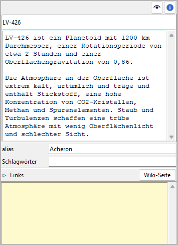

|external-link| `English <https://peter88213.github.io/nvhelp-en/nv_zim/>`_

.. |external-link| image:: ../_images/external-link.png

-----------------

======
nv_zim
======

**Benutzerhandbuch**

Diese Seite gilt für die neueste Ausgabe von `nv_zim
<https://github.com/peter88213/nv_zim/>`__.
Sie können sie mit **Hilfe > Zim-Anbindung Online-Hilfe** öffnen.

*nv_zim* ist ein Plugin, das *novelibre*-Projekte mit einem
*Zim Desktop Wiki* verbindet.
Das ist hauptsächlich für die Dokumentation des Weltenbaus gedacht.

Das Plugin fügt dem *novelibre*-**Extras**-Menü
den Eintrag **Zim Desktop Wiki** hinzu,
und dem **Hilfe**-Menü den Eintrag **Zim-Anbindung Online-Hilfe**.
Die Eigenschaftsansicht von Figuren, Schauplätzen, Gegenständen und Buch
erhalten eine **Wiki-Seite**-Schaltfläche.
Die Werkzeugleiste erhält eine |Zim| Schaltfläche.

.. |Zim| image:: _images/zim.png

Zim Desktop Wiki einrichten
---------------------------

Damit *nv_zim* das `Zim Desktop Wiki <https://zim-wiki.org/>`__-Anwendungsprogramm
starten kann, muss es den Speicherort der Installation kennen.
Beim Programmhochlauf prüft es die *launchers.ini*-Datei im *novelibre*-Konfigurationsverzeichnis.
Hier ein Beispiel mit einem Eintrag unter Windows:

::

   [SETTINGS]
   .zim = C:/Program Files (x86)/Zim Desktop Wiki/zim.exe

Falls diese Datei nicht existiert, oder der eingetragene Dateipfad nicht passt,
durchsucht das Programm die Standard-Installationspfade für die 32-Bit und die
64-Bit-Versionen unter Windows.
Wenn das missglückt, öffnet es einen Dateiauswahldialog und fragt nach dem Speicherort.

Der korrekte Speicherort wird dann automatisch in die *launchers.ini*-Datei eingetragen.
Unter Windows gibt es für die Benutzer üblicherweise nichts zu tun.

Linux-Benutzer sollten herausfinden, wo sich die Zim-Applikation auf ihrem System befindet,
und diesen Pfad entweder in eine selbst erzeugte **~/.novx/launchers.ini**-Datei eintragen,
oder ihn im Dateidialog auswählen, sobald danach gefragt wird.

Zim-Notizbücher als Projekt-Wikis
---------------------------------

Das *nv_zim*-Plugin erweitert die *novelibre*-Benutzeroberfläche, damit Sie bequem
die *Zim Desktop Wiki*-Anwendung mit einem projektbezogenen Notizbuch oder mit einer
kontextbezogenen Wiki-Seite öffnen können. Das funktioniert grundsätzlich mit
jedem Zim-Notizbuch, auch mit Seiten in unterschiedlichen Notizbüchern.
Es wird jedoch empfohlen, ein *Projekt-Wiki* genanntes Notizbuch anzulegen,
das mit dem aktuellen *novelibre*-Projekt, oder auch mit mehreren Projekten einer
Serie verlinkt wird.
Dann kann das Programm fehlende Seiten automatisch in diesem Notizbuch anlegen.

Dateispeicherorte
~~~~~~~~~~~~~~~~~

Projekt-Wikis können an beliebigen Speicherorten liegen; wird eines jedoch automatisch
erzeugt, liegt es im *novelibre*-Projektverzeichnis in einem Unterverzeichnis namens
``<Projektbezeichnung>_zim``.

- Wenn Sie das Projekt-Wiki nachträglich an einen anderen Ort verschieben, können Sie
  es beim nächsten Öffnen aus *novelibre* heraus mit einem Dateiauswahldialog
  auswählen und somit neu verlinken.
- Wenn Sie das Projekt-Wiki zusammen mit dem *novelibre*-Projekt an einen anderen Ort verschieben,
  kann das Programm die Wiki-Links automatisch korrigieren.
- Auch wenn Sie das Projekt-Wiki an seinem Ort lassen, aber das *novelibre*-Projekt woandershin
  verschieben, kann das Programm die Wiki-Links automatisch korrigieren.

Notizbuchstruktur
~~~~~~~~~~~~~~~~~

Automatisch angelegte Projekt-Wikis haben eine "flache" Struktur, das heißt:
alle Wiki-Seiten liegen im *Home*-Ordner des Zim-Notizbuchs.
Gruppierungen und Baumstrukturen kann man dabei mit Hilfe von Links auf entsprechend
strukturierten Übersichtsseiten anlegen. Gegenüber einer Ordnerstruktur hat das den Vorteil,
dass sich jede Seite unter mehreren unterschiedlichen Gesichtspunkten einordnen lässt.
Wenn Sie stattdessen eine hierarchiesche Struktur bevorzugen, können Sie automatisch
erzeuge Wiki-Seiten nachträglich in *Zim* verschieben, müssen aber unter Umständen
den Link in *novelibre* per Auswahldialog erneuern.

Schlagwörter
~~~~~~~~~~~~

*novelibre* bietet die Möglichkeit, Figuren, Schauplätze und Gegenstände mit Schlagwörtern
zu versehen. Wenn *nv_zim* automatisch eine Wiki-Seite erzeugt, fügt es vorhandene Schlagwörter
in der geeigneten Notation für *Zim* ein. Daturch ist es der Anwendung möglich, solche
Seiten nach den Kategorien zu gruppieren und zu verlinken, die durch die Schlagwörter
repräsentiert werden.

Wiki-Links in novelibre
~~~~~~~~~~~~~~~~~~~~~~~

*novelibre* speichert die Dateipfade des Pojekt-Wikis und der Wiki-Seiten in der *.novx*-Datei ab,
wenn das Projekt zum Zeitpunkt der Verlinkung nicht gesperrt ist.
Andernfalls merkt sich das Programm diese Dateipfade nur für die aktuelle Sitzung,
um das gesperrte Projekt nicht zu verändern.
Wenn Sie aber das Pojekt nchträglich entsperren, und das Wiki oder eine Seite erneut öffnen,
wird *novelibre* die Dateipfade automatisch speichern und eine entsprechende Meldung
in der Statuszeile anzeigen.

.. tip::
   Falls Sie mehr als nur eine Wiki-Seite mit einer Figur, einem Schauplatz, einem Gegenstand 
   oder dem Buch verlinken wollen, können Sie dafür reguläre 
   `Links <../world_view.html#links>`__ verwenden. 
   Wenn das *nv_zim*-Plugin installiert ist, wird *novelibre* Wiki-Seiten unter den 
   Links erkennen und mit der *Zim*-Anwendung öffnen. 

Zim Desktop Wiki-Menü
---------------------

Projekt-Wiki öffnen
~~~~~~~~~~~~~~~~~~~

Mit **Extras > Zim Desktop Wiki > Projekt-Wiki öffnen**
oder mit der Schaltfläche |Zim| in der Werkzeugleiste können Sie das mit dem Projekt
verlinkte Zim-Notizbuch öffnen.

Falls noch keines verlinkt ist, oder wenn die gespeicherte Link-Adresse nicht gültig ist,
werden Sie gefragt, ob Sie ein bestehendes Wiki öffnen, oder ob Sie ein neues erzeugen wollen:

Durchsuchen
    öffnet einen Dateiauswahldialog, mit den Sie nach einer Zim-Wiki-Datei mit der
    Dateiendung *.zim* suchen können.
    Zim wird mit dem ausgewählten Projekt-Notizbuch gstartet.

    .. note::
       Die ausgewählte Datei wird als Projekt-Wiki verlinkt, falls das Projekt nicht gesperrt ist.
       Ist das Projekt gesperrt, können Sie das Projekt-Wiki im Verlauf der Sitzung aus *novelibre* heraus
       öffnen, müssen es aber unter Umständen bei der nächsten Sitzung erneut auswählen.

Erzeugen
    legt ein neues leeres Zim-Notizbuch in einem Unterverzeichnis des Projektverzeichnisses an
    und öffnet es mit Zim.

    .. note::
       Die neue *.zim*-Datei wird als Projekt-Wiki verlinkt, falls das Projekt nicht gesperrt ist.
       Ist das Projekt gesperrt, können Sie das Projekt-Wiki im Verlauf der Sitzung aus *novelibre* heraus
       öffnen, müssen es aber unter Umständen bei der nächsten Sitzung erneut auswählen.

Abbrechen
    bricht die Aktion ab, ohne Zim zu starten.

.. hint::
   Wenn Sie das Projekt-Wiki oder eine Wiki-Seite aus *novelibre* heraus öffnen wollen, 
   aber keine Reaktion sehen, schauen Sie bitte in der Taskleiste nach, ob die 
   *Zim Desktop Wiki*-Anwendung bereits offen ist, 
   aber von anderen Fenstern wie z.B. von *novelibre* verdeckt wird. 
   In diesem Fall wird das *Zim*-Fenster nicht automatisch in den Vordergrund gehoben. 

Projekt-Wiki erzeugen
~~~~~~~~~~~~~~~~~~~~~

Mit **Extras > Zim Desktop Wiki > Projekt-Wiki erzeugen** legen Sie ein neues Zim-Notizbuch
in einem Unterverzeichnis des Projektverzeichnisses an und öffnen es mit Zim.
Das erzeugte Projekt-Wiki umfasst Seiten für das Buch und für alle Figuren, Schauplätze und Gegenstände.
Gibt es bereits ein Zim-Notizbuch im Zielverzeichnis, so wird dieses Verzeichnis
automatisch umbenannt und bleibt als Sicherungskopie erhalten.

.. note::
   Die neue *.zim*-Datei wird als Projekt-Wiki verlinkt, falls das Projekt nicht gesperrt ist.
   Ist das Projekt gesperrt, können Sie das Projekt-Wiki im Verlauf der Sitzung aus *novelibre* heraus
   öffnen, müssen es aber unter Umständen bei der nächsten Sitzung erneut auswählen.

Wiki-Links entfernen
~~~~~~~~~~~~~~~~~~~~

Mit **Extras > Zim Desktop Wiki > Wiki-Links entfernen** können Sie gespeicherte Wiki-Links
aus der Projektdatei entfernen. Das wird beim nächsten Speichern wirksam.

Ein Untermenü bietet zwei Möglichkeiten an:

Ausgewählte Seiten
   Damit werden die Zim Wiki-Links der ausgewählten Elemente entfernt.
   Dieses Kommando bezieht sich nur auf verlinkte Seiten, nicht aber auf das Projekt-Wiki.

Alle
   Damit werden alle Zim Wiki-Links entfernt.
   Dieses Kommando bezieht sich sowohl auf verlinkte Seiten, als auch auf das Projekt-Wiki.

Buch/Figuren/Schauplätze/Gegenstände-Eigenschaften
--------------------------------------------------

"Wiki-Seite"-Schaltfläche
~~~~~~~~~~~~~~~~~~~~~~~~~

Mit Klick auf diese Schaltfläche öffnen Sie eine verlinkte Wiki-Seite mit Zim.

Ist noch keine Wiki-Seite verlinkt, versucht das Programm zunächst, im Projekt-Wiki eine
Seite zu finden, deren Name zum Titel des Buchs, des Schauplatzes oder des Gegenstands,
zutrifft, oder auf den vollständigen Namen der Figur, sofern bekannt, ansonsten den Kurznamen.

Ist noch kein Projekt-Wiki definiert, fragt das Programm zunächst nach dem Projekt-Wiki
und gibt Ihnen die Möglichkeit es auszuwählen oder zu erzeugen (siehe oben).
Anschließend werden Sie gefragt, ob Sie eine bestehende Wiki-Seite öffnen oder eine neue erzeugen wollen:

Durchsuchen
    öffnet einen Dateiauswahldialog, mit den Sie nach einer Zim-Seite mit der
    Dateiendung *.txt* suchen können.
    Zim wird mit der gewählten Seite gestartet.

    .. note::
       Die ausgewählte Datei wird mit dem in *novelibre* aktuell gewählten Element verlinkt,
       falls das Projekt nicht gesperrt ist.
       Ist das Projekt gesperrt, können Sie die Wiki-Seite im Verlauf der Sitzung aus *novelibre* heraus
       öffnen, müssen sie aber unter Umständen bei der nächsten Sitzung erneut auswählen.

Erzeugen
    legt eine neue Wiki-Seite als Bestandteil des Projekt-Wikis an und öffnet es mit Zim.

    .. note::
       Die neue *.txt*-Datei wird als Wiki-Seite mit dem in *novelibre* aktuell gewählten Element verlinkt,
       falls das Projekt nicht gesperrt ist.
       Ist das Projekt gesperrt, können Sie die Wiki-Seite im Verlauf der Sitzung aus *novelibre* heraus
       öffnen, müssen sie aber unter Umständen bei der nächsten Sitzung auswählen.

Abbrechen
    bricht die Aktion ab, ohne Zim zu starten.

