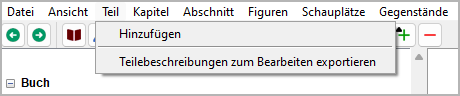

Teil-Menü
=========

**Teil operation**

Hinzufügen
----------

**Hinzufügen a new part**

With **Teil > Hinzufügen**,
you can add a `part <basic_concepts.html#parts>`__ to the tree.

- The new part is placed at the next free position on the
  chapter level after the selection, if possible.
- Otherwise, the new part is placed at the last position
  on the chapter level.
- The new part has an auto-generated Titel.
  You can change it in the right pane.

Teilebeschreibungen zum Bearbeiten exportieren
----------------------------------------------

**Exportieren an ODT document that can be imported again after editing**

With **Teil > Teilebeschreibungen zum Bearbeiten exportieren**,
you can create a text document that contains
a **very brief synopsis** with part headings and part descriptions.
Der Dateinamenszusatz lautet ``_parts_tmp``.

