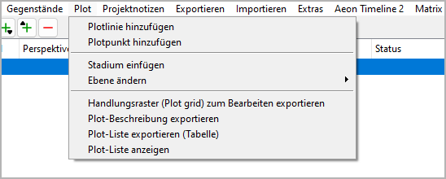
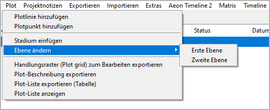

Plot-Menü
=========

**Plotelementfunktionen**

Plotlinie hinzufügen
--------------------

**Eine neue Plotlinie erzeugen**

Mit **Plot > Plotlinie hinzufügen**
können eine Plotlinie
in den Baum einfügen.

- Wenn eine Plotlinie ausgewählt ist, wird die neue Plotlinie dahinter platziert.
- Andernfalls wird die neue Plotlinie an den Schluss gesetzt.
- Die neue Plotlinie hat einen automatisch erzeugten Titel.
  Sie können ihn im rechten Bereich der Arbeitsfläche ändern.

Plotpunkt hinzufügen
--------------------

**Einen neuen Plotpunkt erzeugen**

Mit **Plot > Plotpunkt hinzufügen**
können Sie einer Plotlinie einen Plotpunkt hinzufügen.

- Wenn ein Plotpunkt ausgewählt ist, wird der neue Plotpunkt dahinter platziert.
- Wenn eine Plotlinie ausgewählt ist, wird der neue Plotpunkt an letzter Stelle platziert.
- Andernfalls wird kein neuer Plotpunkt erzeugt.
- Der neue Plotpunkt hat einen automatisch erzeugten Titel.
  Sie können ihn im rechten Bereich der Arbeitsfläche ändern.

Stadium einfügen
----------------

**Ein neues Stadium zwischen den Abschnitten einfügen**

Mit **Plot > Stadium einfügen**
können Sie ein Stadium hinter dem ausgewählten Kapitel oder Abschnitt einfügen.

.. hint::
   Standardmäßig ist das neue Stadium auf der zweiten Ebene.
   Sie können die Ebene ändern (siehe unten).

Ebene ändern
------------

**Die Ebene der ausgewählten Stadien ändern**

Mit **Plot > Ebene ändern**
können Sie die Ebene der ausgewählten Stadien ändern.

-  **Erste Ebene** wird in fetter Schrift dargestellt.
-  **Zweite Ebene** wird in normaler Schrift dargestellt.

.. note::
   Die Ebene eines Stadiums dient nur zur visuellen Unterscheidung.
   Sie hat keine Auswirkung auf die Programmfunktion.

Plotlinien importieren
----------------------

**Plotlinien mit Plotpunkten aus einem anderen Projekt importieren**

Mit **Plot > Plotlinien importieren**
können Sie eine Auswahl von Plotlinien aus einem anderen Projekt importieren.
Zuerst wählen Sie eine XML-Datei aus, welche die Plotlinien enthält.
Dann wählen Sie die Plotlinien aus, die Sie zum aktuellen Projekt hinzufügen wollen.

.. hint::
   Um für das aktuelle Projekt eine XML-Plotliniendatei zu erzeugen, 
   rufen Sie **Exportieren > XML-Datendateien** auf.

Handlungsraster (Plot grid) zum Bearbeiten exportieren
------------------------------------------------------

**Ein ODS-Dokument exportieren, das bearbeitet und zurückgelesen werden kann**

Mit **Plot > Handlungsraster (Plot grid) zum Bearbeiten exportieren**
können Sie ein Tabellenkalkulationsdokument erzeugen, wie im Kapitel
`Mit novelibre plotten <plotting.html#handlungsraster-plot-grid>`__ beschrieben,
mit einer Zeile pro Abschnitt und den folgenden Spalten:

- Abschnitts-ID (eingeklappt)
- Abschnittsnummer (Hyperlink zum Manuskript)
- Erzähldatum
- Erzählzeit
- Tag
- Abschnittstitel
- Abschnittsbeschreibung
- Perspektivfigur (Kurzname)
- eine Spalte pro Plotlinie mit den Plotliniennotizen des Abschnitts
- Tags
- Szene
- Ziel/Reaktion/(benutzerdefiniert)
- Konflikt/Dilemma/(benutzerdefiniert)
- Ausgang/Entscheidung/(benutzerdefiniert)
- Abschnittsnotizen

.. note::
   Nur "normale" Abschnitte erscheinen im Handlungsraster. 
   Abschnitte vom Typ "unbenutzt" werden ausgelassen.

Der Dateinamenszusatz lautet ``_grid_tmp``.

.. note::
   Sie können Zeilen und Spalten umordnen, verbergen oder löschen, 
   ohne dass es Auswirkungen auf den Reimport hat. 
   Nur die erste Zeile und die erste Spalte, die standardmäßig verborgen 
   sind, dürfen nicht verändert werden, weil sie die Strukturinformationen 
   für den Import enthalten. 

Erzählstruktur-Beschreibung zum Bearbeiten exportieren
------------------------------------------------------

**Ein ODT-Dokument exportieren, das bearbeitet und zurückgelesen werden kann**

Mit **Plot > Erzählstruktur-Beschreibung zum Bearbeiten exportieren**,
können Sie ein Textdokument erzeugen, das
alle Stadien mit Beschreibung enthält.
Dieses Dokument kann mit *Writer* bearbeitet und zu *novelibre*
zurückgespielt werden.
Der Dateinamenszusatz lautet ``_structure_tmp``.

.. hint::
   Dies kann auch eine vollständige Inhaltsangabe darstellen, 
   wobei der Schwerpunkt auf dem dramaturgischen Aufbau liegt. 

Plotlinienbeschreibungen zum Bearbeiten exportieren
---------------------------------------------------

**Ein ODT-Dokument exportieren, das bearbeitet und zurückgelesen werden kann**

Mit **Plot > Plotlinienbeschreibungen zum Bearbeiten exportieren**,
können Sie ein Textdokument erzeugen, das
Stadien, Plotlinien und Plotpunkte enthält, jeweils mit Beschreibung.
Die Plotpunkte sind mit dem Manuskript und mit den Abschnittsbeschreibungen velinkt.
Dieses Dokument kann mit *Writer* bearbeitet und zu *novelibre*
zurückgespielt werden.
Der Dateinamenszusatz lautet ``_plotlines_tmp``.

Plot-Liste exportieren (Tabelle)
--------------------------------

**Ein ODS-Dokument exportieren**

Mit **Plot > Plot-Liste exportieren (Tabelle)**
können Sie ein Tabellendokument
mit einer Zeile pro Abschnitt und einer Spalte pro Plotlinie
erzeugen.
Verbindungspunkte zwischen Plotlinien und Abschnitten sind
farblich hervorgehoben.
Plotpunkttitel sind eingetragen.
Der Dateinamenszusatz lautet ``_plotlist``.

.. hint::
   Die Titel der Plotlinien und der Abschnitte sind als Querverweise
   zu den entsprechenden Stellen im Manuskript ausgeführt. 
 
.. figure:: _images/plot_menu04.png
   :alt: LibreOffice Screenshot

   LibreOffice Screenshot. Beachten Sie den Plotlinientitel in der
   Plotliste (links) zur Plotlinie in der Plotbeschreibung (rechts).

.. important::
   Hyperlinks in ODS-Tabellendokumenten sind im Dateisystem absolut,
   so dass sie eventuell nicht mehr funktionieren, nachdem Sie den 
   Speicherort Ihres Projekts zu einem anderen Ordner oder Computer
   verschoben haben. 
   In diesem Fall müssen Sie Ihr Tabellendokument erneut exportieren.  

Plot-Liste anzeigen
-------------------

**Einen HTML-Report mit Plotelementen anzeigen**

Mit **Plot > Plot-Liste anzeigen**
erzeugen Sie eine als Tabelle formatierte HTML-Seite
mit einer Plotliste wie der ODS-Plotliste (siehe oben),
doch ohne Hyperlinks,
und starten Ihren System-Webbrowser zur Anzeige.

.. figure:: _images/plot_menu03.jpg
   :alt: Edge-Browser-Screenshot

   Edge-Browser-Screenshot

.. note::
   Der Report ist eine temporäre Datei, die bei 
   Programmbeendigung automatisch gelöscht wird.
   Lassen Sie sie bei Bedarf von Ihrem Browser 
   sichern oder ausdrucken.

