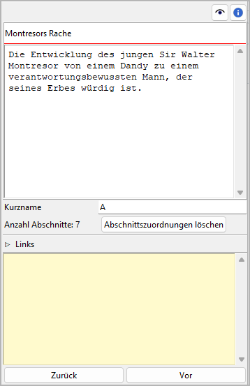
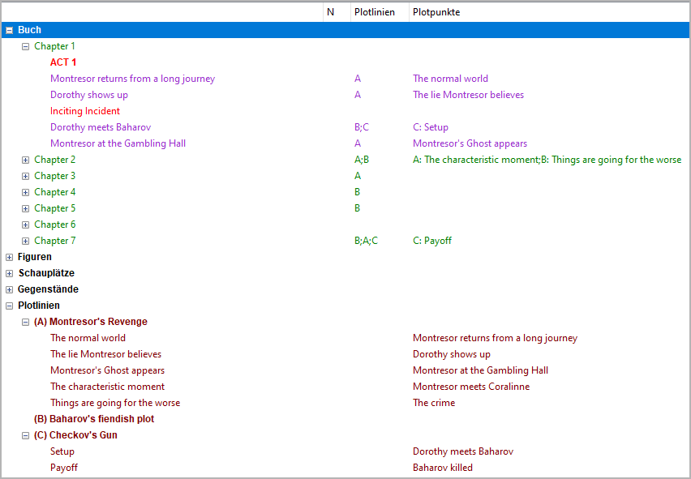

Plotlinieneigenschaften
=======================

The Plotlinie properties view öffnet sich im rechten Fenster when you
select a `Plotlinie <plotting.html#defining-plot-lines>`__ in the tree.

Titel und Beschreibung
----------------------

Titel und Beschreibung werden als beschreibbare "Karteikarte" dargestellt.

Die Bearbeitung des Titels kann mit der Eingabetaste beendet werden.
Änderungen an der Beschreibung werden übernommen, sobald mit der Maus
irgendwo außerhalb des Texteingabefelds geklickt wird.

Kurzname
--------

Be sure to enter a short name to be displayed as a reference in the tree.
A single character like "A", "B", "C" is recommended.

   Example: Plotlinie short names as displayed in the tree
   
Abschnittszuordnungen
---------------------

The number of sections that belong to the selected Plotlinie is shown
below the "Kurzname" entry. The assignments can be made in the
`section properties view <section_view.html#plot>`__.
You can unlink all sections from the selected Plotlinie at once by
clicking on the **Abschnittszuordnungen löschen** Schaltfläche.

.. hint::
   A convenient way to manage and keep track of section assignments is 
   offered by the `nv_matrix plugin 
   <https://github.com/peter88213/nv_matrix/>`__. 

Navigationsschaltflächen
------------------------

- **Zurück** moves the selection to the previous Plotlinie in the tree.
- **Vor** moves the selection to the next Plotlinie in the tree.

