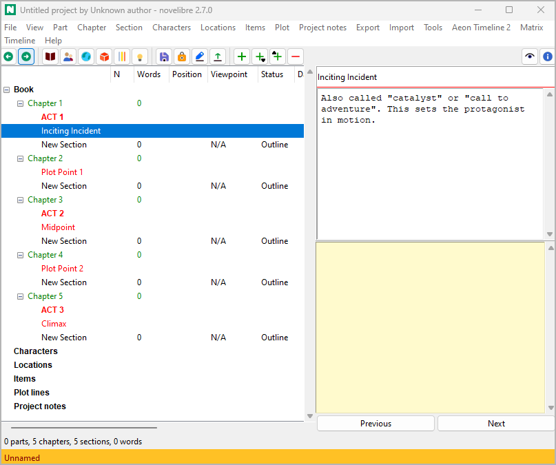
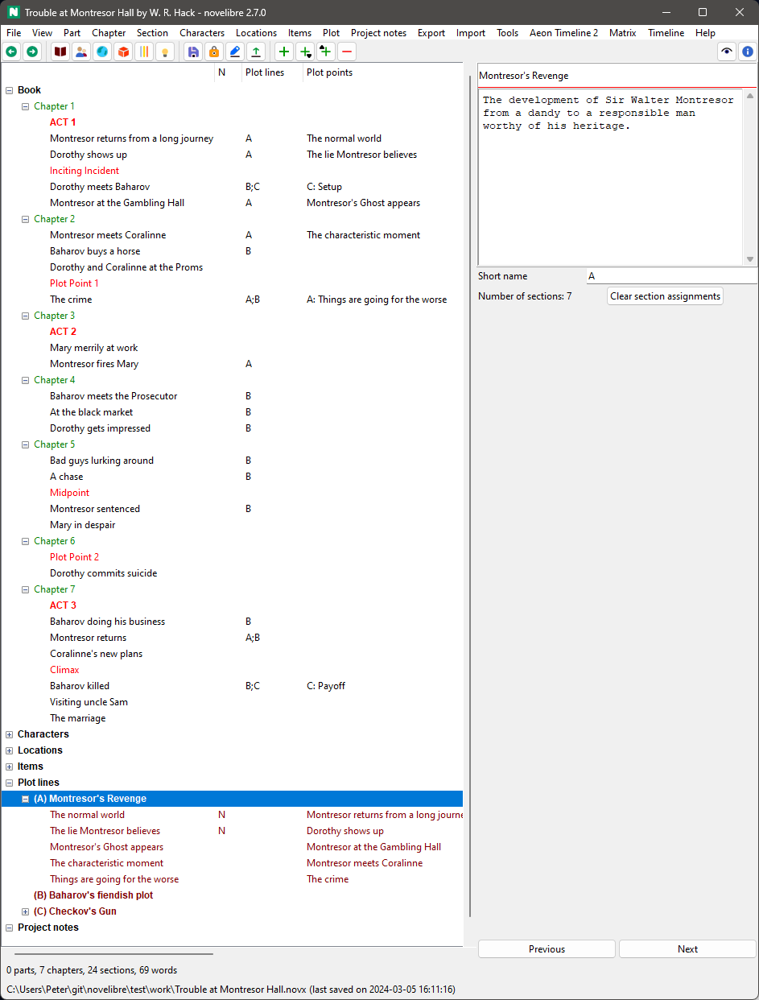
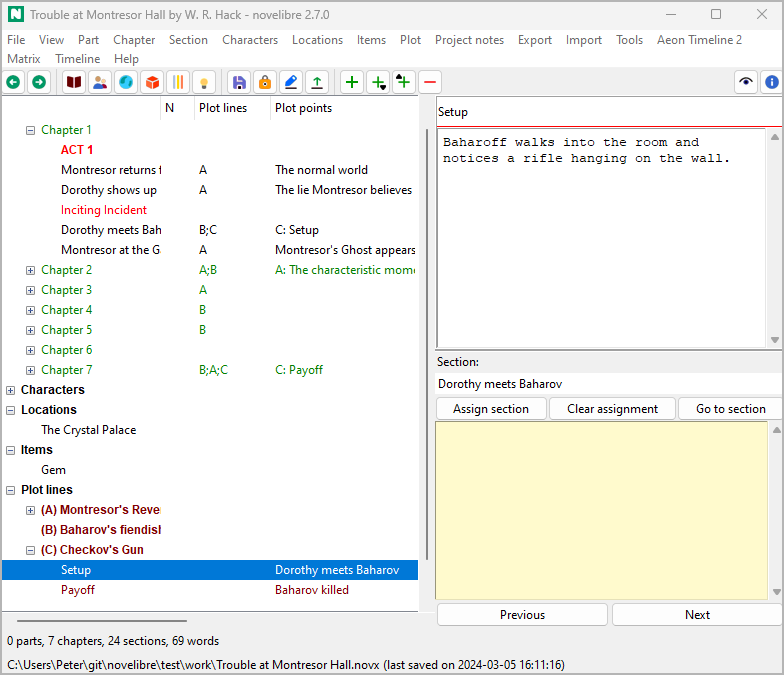

Plotten mit novelibre
=====================

Anwenden a story structure model
--------------------------------

If you want to divide a story into stages according to a structure model
(e.g. the *Three Act Model*, or the *Speichern The Cat* beatsheet), just
insert the stages between the regular scenes at the beginning of each
phase. This gives you color-coded subheadings in the Baumansicht.

   Acts

With the `nv_templates plugin
<https://github.com/peter88213/nv_templates/>`__ you can
load pre-made story structure models from Markdown template files, and
you can save the story structure of your project for reuse.

-----------------

Defining Plotlinien
-------------------

*novelibre* provides *Plotlinien* as a powerful and flexible concept for
plotting.

   Plotlinien

"Plotlinie" can mean a variety of things: narrative strand,
thread, character arc, storyline, subplot, sequence of cause and effect,
sequence of setup and payoff, and so on.
You can think of a Plotlinie as a line on which plot points are arranged
that characterize the progression of the story.
These plot points can be assigned to scenes to indicate the scene’s
relevance to the plot.

-  *novelibre* lets you define any number of Plotlinien.
-  Any number of scenes can be assigned to each Plotlinie.
-  Any number of Plotlinien can be assigned to each scene.
-  Each Plotlinie can contain any number of plot points.
-  Each plot point can be assigned to exactly one scene.
-  Any number of plot points can be assigned to each scene.

The association of scenes and plot points is shown in the "Plot"
column of the Baumansicht.

You can use Plotlinien to establish named connections between scenes, such as
*setup -> payoff*, so you can keep track of this relationship even if
the scenes are far away from each other.

   Setup/payoff example

Handlungsraster (Plot grid)
---------------------------

The *novelibre* `plot grid
<export_menu.html#handlungsraster-(plot-grid)-zum-bearbeiten>`__ is a spreadsheet with a row for
each section, and a set of plot-relevant section metadata in the columns.
The first visible column contains links to the sections in the
`Manuskript <export_menu.html#Manuskript-for-editing>`__.
Each Plotlinie has its own column in the plot grid,
Where the `Plotlinie notes <section_view.html#plotlinien>`__ are shown.
The plot grid offers you a convenient way to enter the Plotlinie notes by
seeing the big pictures of your plot construction.

.. hint::
   You can assign a section to a Plotlinie by entering text
   in the corresponding *Plotlinie notes* cell of the plot grid. 

