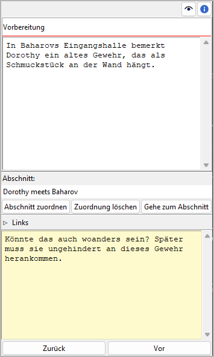

Plotpunkt-Eigenschaften
=======================

The Plotpunkt properties view öffnet sich im rechten Fenster when you
select a plot point in the tree.

Titel und Beschreibung
----------------------

Titel und Beschreibung werden als beschreibbare "Karteikarte" dargestellt.

Die Bearbeitung von Die Bearbeitung des Titels können Sie mit der Eingabetaste beenden.
Änderungen an der Beschreibung werden übernommen, sobald mit der Maus
irgendwo außerhalb des Texteingabefelds geklickt wird.

Zugeordneter Abschnitt
----------------------

You can connect the plot point to a section in the book.
The label below "Abschnitt" displays the section Titel.

Abschnitt zuordnen
   When clicking on the **Abschnitt zuordnen** Schaltfläche, the "Auswahlmodus"
   is activated, and the cursor changes to a "plus" shape. By clicking
   on a section, this section will be assigned to the plot point.

   .. hint::
      You can exit the "Auswahlmodus" without selecting a section by
      clicking on the highlighted status bar, or by pressing the ``Esc``
      key. 

Zuordnung löschen
   If a sectin is assigned to the plot point können Sie disconnect it
   by clicking on the **Zuordnung löschen** Schaltfläche.

Gehe zum Abschnitt
   Clicking on the **Gehe zum Abschnitt** Schaltfläche changes the selection and opens
   the properties view of the assigned section.

Links
-----

Dieses Fenster öffnen oder schließen Sie mit Klick auf den Titel.

.. figure:: _images/book_view13.png
   :alt: Screenshot

Das ist eine Liste für Links zu Bildern und Recherche-Dokumenten.

Obwohl *novelibre* Daten zu Figuren, Schauplätzen und Gegenständen
verwalten kann, ist es nicht die richtige Anwendung für
umfangreichen Weltenbau.
Dafür sollte man leistungsfähigere Softwareprogramme verwenden,
zum Beispiel `Zim Desktop Wiki
<https://zim-wiki.org/>`__.
Dazu kann *novelibre* Hyperlinks zu den Textdateien erzeugen,
welche Sie schnell zu den richtigen Stellen im Wiki führen.

Oder Sie haben einige Bilder gesammelt, die Sie beim Schreiben inspirieren.
Dann erzeugen Sie einfach Links zu diesen Bildern und lassen Sie
*novelibre* diese mit Ihrem System-Bildbetrachter öffnen.

.. tip::
   Wenn sie mehrere Bilder z.B. zu einer Figur in einem Ordner
   gesammelt haben, den Ihr Standard-Bildbetrachter durchsuchen kann,
   ist ein einziger Link auf eines dieser Bilder ausreichend.
   
Die Links werden in einer Liste angezeigt, und zwar in der Reihenfolge
der Eingabe.

Link hinzufügen
   Wenn Sie auf |Hinzufügen| klicken, öffnet sich ein Dateiauswahldialog.
   Die ausgewählte Datei wird der Linkliste hinzugefügt.

   .. hint::
      Der Dialog zeigt zunächst nur Bilddateien.
      Für andere Dateitypen ändern Sie die Auswahl in der unteren 
      rechten Ecke. 
      
      .. figure:: _images/filePicker01.png
         :alt: Screenshot
         
         Windows 10 Explorer Screenshot

Link entfernen
   Wenn Sie auf |Entfernen| klicken oder die ``Entf``-Taste drücken,
   wird der ausgewählte Link von der Liste entfernt.

Link öffnen
   Wenn sie auf einen Link doppelklicken, oder auf |Goto| klicken,
   Wird die Datei, auf die der Link verweist, mit der Standardanwendung
   für ihren Typ geöffnet.

   .. hint::
      Falls Sie bestimmte verlinkte Dateien mit einer anderen Anwendung
      als der System-Standardanwendung öffnen wollen, 
      können Sie eine "Programmstarter"-Einstellung vornehmen. 
      Dafür erzeugen Sie einfach eine Textdatei namens **launchers.ini**
      im Verzeichnis ``.novx/config`` (wo alle Konfigurationsdateien liegen).
      Hier in können Sie Erweiterungen Anwendungsprogramme zuordnen.  

      Zim Desktop-Wiki-Seiten sind ein Sonderfall.
      Dafür ordnen Sie die `.zim`-Erweiterung dem Zim-Programm zu.

      Dieses Beispiel zeigt eine Einstellung, die *novelibre* Textdateien
      mit der *Zim Desktop Wiki*-anwendung öffnen lässt, 
      statt mit dem Standard-Texteditor:    
      
      ::
     
         [SETTINGS]
         .zim = C:/Program Dateis (x86)/Zim Desktop Wiki/zim.exe 
         
      .. figure:: _images/launchers.png
         :alt: Screenshot
         
         Windows 10 Explorer Screenshot

.. |Hinzufügen| image:: _images/add.png
.. |Goto| image:: _images/goto.png
.. |Entfernen| image:: _images/remove.png

"Haftmerker"
------------

Der gelbe Texteingabebereich ist für Notizen.
Änderungen werden übernommen, wenn mit der Maus
irgendwo außerhalb des Texteingabefelds geklickt wird.

Wenn der "Haftmerker" eines Plotpunkts Text enthält,
erscheint in the Baumansicht ein "N" als Merker.

.. note::
   Die "Haftmerker" sind nur für die Arbeit mit *novelibre* gedacht.
   Sie werden nicht beim Dokumentenexport berücksichtigt.

Navigationsschaltflächen
------------------------

- **Zurück** moves the selection to the previous plot point in the tree.
- **Vor** moves the selection to the next plot point in the tree.

