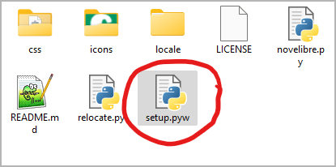
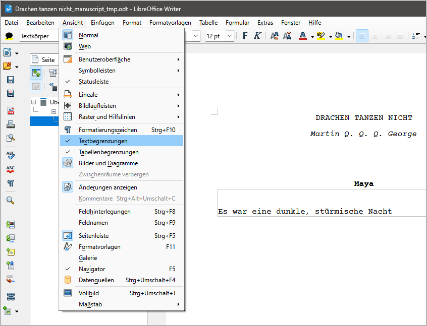
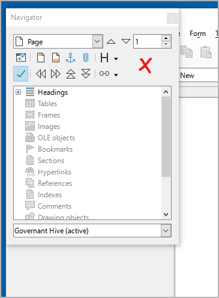

Vorbereitungen
==============

novelibre einrichten
--------------------

Wäre *novelibre* ein käufliches Anwendungsprogramm, 
würden alle im folgenden beschriebenen Schritte 
automatisch durch ein Installationsprogramm ausgeführt werden.
Unter Windows wäre das beispielsweise eine *.exe* 
oder *.msi*-Datei, die mit besonderen Rechten ausgeführt 
werden müsste und vielleicht sogar ein teures Zertifikat
benötigte, um zum Herunterladen und zur Installation
zugelassen zu werden. 

Dann gibt es noch das Problem, dass für jedes Betriebssystem
ein eigenes Installationsprogramm erstellt und gepflegt 
werden müsste. 
Für Linux müssten Installationspakete oder Images bereitgestellt 
werden, wofür es eine Vielzahl unterschiedlicher Standards gibt.

Weil ich keine Softwarefirma betreibe, sondern nur ein 
Hobbyprogrammierer bin, der seine Zeit eigentlich lieber 
mit Romanschreiben verbrächte, habe ich beschlossen, einen 
anderen Weg zu gehen: 
Ich stelle ein Python-Einrichtungsskript bereit, 
das unter allen Betriebssystemen gleich funktioniert. 
Die allerletzten Schritte, die vom verwendeten
Betriebssystem abhängen und eventuell auch besondere
Benutzerrechte erfordern, müssen die unerschrockenen
Benutzer selbst ausführen. 
Ich tue mein Bestes, um diese Schritte zu erleichtern, 
und gebe im weiteren eine detaillierte Anleitung für Windows.
Viel Vergnügen!

Das Programm installieren
~~~~~~~~~~~~~~~~~~~~~~~~~

1. Entpacken Sie die heruntergeladene Zip-Datei.
2. Gehen Sie in den entpackten Ordner und starten Sie **setup.pyw**.
   Das installiert die Anwendung für den angemeldeten Benutzer.

novelibre auf den Desktop bringen
~~~~~~~~~~~~~~~~~~~~~~~~~~~~~~~~~

.. admonition:: Anmerkung für Linux-Benutzer

   In den folgenden Kapiteln wird das Vorgehen unter 
   Windows beschrieben.

   Wenn Sie Linux benutzen, erwarte ich, dass Sie einen 
   Programmstarter auf Ihrem spezifischen Desktop einrichten können.
   Grob gesagt geht es darum, **python3** mit **~/.novx/novelibre.py** 
   und einer optional angegebenen Datei als Parameter zu starten.
   Wahrscheinlich werden Sie die *novelibre*-Icons in ein 
   spezielles Bilderverzeichnis kopieren müssen, wo der 
   Programmstarter die Programmsysmbole sucht.
   Sie sollten außerdem *novelibre* als Standardanwendungsprogramm
   für Dateien mit der Endung *.novx* angeben, und diesen Dateien 
   das *novelibre*-Symbol zuweisen. 
   Auf dem XFCE-Desktop war das alles für mich nicht allzu schwierig.
   Schauen Sie im Zweifelsfall in Ihre Desktop-Dokumentation. 
   
   Es ist eine gute Idee, die *novx*-Erweiterung in den mimetypes 
   als **text/xml** zu registrieren, dann kann Ihr Webbrowser sie 
   mit Hilfe des `novx.css-Stylesheets 
   <file_menu.html#style-sheet-kopieren>`__ darstellen. 

3. Öffnen Sie das Installationsverzeichnis.

   .. figure:: _images/preparations05.png
      :alt: novelibre Screenshot

4. Ziehen Sie **run.pyw** bei gedrückter ``Alt``-Taste auf den 
   Desktop. Das erzeugt eine Progrmmverknüpfung, um 
   *novelibre* vom Windows-Desktop aufzurufen. 
   Nun können Sie *.novx*-Dateien auch auf diese Verknüpfung ziehen.

   .. figure:: _images/preparations06.png
      :alt: novelibre Screenshot

5. Wahlweise können Sie das "Python"-Programmsymbol durch das
   *novelibre*-Logo ersetzen, das Sie im Unterverzeichnis
   *icons* des Installationsordners finden.

   Dazu klicken Sie mit der rechten Maustaste auf die Programmverknüpfung
   und öffnen den **Eigenschaften**-Dialog. Wählen Sie den 
   **Verknüpfung**-Karteireiter und klicken Sie auf **Anderes Symbol...** (1). 
   Im Symbolauswahldialog klicken Sie auf **Durchsuchen...** (2). 
   Das öffnet einen Dateiauswahldialog. Gehen Sie auf
   ``<home>\.novx\icons`` und doppelklicken Sie das "N"-Logo (3).

   .. figure:: _images/preparations07.png
      :alt: novelibre Screenshot

6. Um die Programmverknüpfung zu *novelibre* umzubenennen, 
   klicken Sie mit der rechten Maustaste darauf und öffnen
   den **Eigenschaften**-Dialog. 
   Im ersten Karteireiter ersetzen Sie "Verknüpfung mit run.pyw"
   durch "novelibre".

   .. figure:: _images/preparations08.png
      :alt: novelibre Screenshot

.novx-Dateien novelibre zuweisen
~~~~~~~~~~~~~~~~~~~~~~~~~~~~~~~~

7. Wahlweise können Sie die Dateinamenserweiterung **.novx** 
   der *novelibre*-Anwendung zuweisen. 
   Dann werden Projektdateien im Explorer mit dem *novelibre*-Symbol
   angezeigt und können durch Doppelklick mit *novelibre* geöffnet werden.
   Außerdem können Sie *.novx*-Dateien mit Ihrem Webbrowser betrachten,
   wenn Sie ein `novx.css Stylesheet <file_menu.html#style-sheet-kopieren>`__
   im selben Verzeichnis haben.

   Doppelklicken Sie auf das Skript **add_novelibre.reg**. 
   Windows wird eine Warnung ausgeben und sie um Bestätigung bitten.
   Falls Ihnen Zweifel kommen, können Sie sich die Datei 
   *add_novelibre.reg* in einem Texteditor ansehen, 
   oder einen Experten Ihres Vertrauens hinzuziehen. 

   .. figure:: _images/preparations09.png
      :alt: novelibre Screenshot

   .. hint::
      Sie können das rückgängig machen, indem Sie das Skript
      **remove_novelibre.reg** ausführen.
      Das entfernt alle Einträge zu *novelibre* aus der 
      Windows-Registry, wobei die Anwendung erhalten bleibt. 
      
      Um die Applikation mitsamt ihren Werkzeugen, Plugins 
      und Konfigurationsdaten zu deinstallieren, 
      löschen Sie einfach das Verzeichnis ``<home>\.novx``,
      nachdem Sie das Skript **remove_novelibre.reg** 
      ausgeführt haben.

.. important::
   Wenn Sie *novelibre* unter Windows mit Doppelklick auf 
   die *.novx*-Datei starten, ruft das unter der
   Motorhaube die aktuell installierte Version des
   Python-Interpreters auf. 
   
   
   Falls sie zu einem späteren Zeitpunkt Python auf eine 
   andere Version updaten, müssen Sie das Skript **setup.pyw** 
   erneut aufrufen und danach **add_novelibre.reg** ausführen.
   Andernfalls wird Windows die neue Python-Version nicht 
   finden, und Sie können *.novx*-Dateien nicht per Doppelklick
   öffnen. 
   
   Bitte behalten Sie das im Hinterkopf, auch wenn es 
   reichlich unwahrscheinlich ist, dass  *novelibre* 
   in naher Zukunft ein Python-Update benötigt.
   

Das Programm oder ein Plugin aktualisieren
~~~~~~~~~~~~~~~~~~~~~~~~~~~~~~~~~~~~~~~~~~

Führen Sie einfach die Schritte 1 und 2 wie oben beschrieben aus.
Sollten weitere Handlungen nötig sein, erhalten Sie eine Meldung
vom Installationsskript.

-----------------

Writer einrichten
-----------------

Ich gehe davon aus, dass *novelibre*-Benutzer schon mit LibreOffice
oder OpenOffice *Writer* vertraut sind. 
Daher will ich nur einige kurze Tipps geben, die sich speziell
auf das Zusammenspiel mit *novelibre* beziehen. 

Die Abschnitte im Manuskript sichtbar machen
~~~~~~~~~~~~~~~~~~~~~~~~~~~~~~~~~~~~~~~~~~~~

Ein wesentlicher Teil des Arbeitsablaufs ist das Schreiben mit dem 
Textverarbeitungsprogramm *Writer*. 
Dazu erstellt *novelibre* bearbeitbare Manuskriptdateien im Format 
*Open Document Text*, die als temporäre Dokumente gedacht sind.
Diese Dokumente enthalten Strukturinformationen, die es *novelibre* 
ermöglichen, die Abschnitte beim Zurücklesen zu erkennen und richtig 
einzusortieren.

Damit das alles funktioniert, ist es äußerst wichtig, dass Sie nur
innerhalb der Abschnitte schreiben. 
Dazu sollten Sie die Textbegrenzungen in den Einstellungen 
von *Writer* sichtbar machen. 

   LibreOffice Writer Screenshot: Stellen Sie sicher, dass
   der Menüeintrag **Ansicht > Textbegrenzungen** angekreuzt ist.
   Texteingaben außerhalb der Textbegrenzungen haben keinen 
   Einfluss auf Ihr *novelibre*-Projekt.

Den Navigator andocken
~~~~~~~~~~~~~~~~~~~~~~

Um in *Writer* schnell zu den Kapiteln und Abschnitten ihres 
Romans zu finden, bringen Sie am besten den Navigator ins Sichtfeld.
Ich ziehe es vor, ihn links vom Arbeitsbereich anzudocken. 
Dazu drücken Sie zuerst ``F5``, um den Navigator zu öffnen.
Per Voreinstellung erscheint er als Pop-up-Fenster, das 
überall auf dem Bildschirm platziert werden kann. 
Um ihn anzudocken, halten Sie die ``Strg``-Taste gedrückt und
doppelklicken Sie in einen freien grauen Fensterbereich, 
wie im folgenden Bild gezeigt.

   LibreOffice Writer Screenshot: Das rote "X" zeigt an, 
   wo Sie zum Andocken doppelklicken müssen.

.. tip::
   Der Navigator zeigt eine verwirrende Informationsvielfalt.
   Am besten, Sie reduzieren sie zunächst auf die Überschriften. 
   Dazu wählen Sie "Überschriften" ganz oben im Baum aus
   und klicken dann auf die Schaltfläche "Inhalt der Navigationsansicht".
   Das geht, wenn ein Dokument mit Überschriften geöffnet ist. 
   
   .. figure:: _images/preparations03.png
      :alt: LibreOffice Writer Screenshot
   
      LibreOffice Writer Screenshot: Das rote "O" zeigt da Symbol,
      das angeklickt werden soll.

Das Aussehen des Manuskripts anpassen
~~~~~~~~~~~~~~~~~~~~~~~~~~~~~~~~~~~~~

Das von *novelibre* erzeugte Manuskript entspricht einer Normseite 
mit 30 Zeilen zu 60 Anschlägen, wie sie üblicherweise benutzt wird, um die 
Anzahl der Druckseiten für die Veröffentlichung abzuschätzen. 

Allerdings ist die eingesetzte Schriftart "Courier New" nur in 
Windows verfügbar, und sie sieht im Druck auch nicht besonders gut aus 
(ich für meinen Teil habe die freie Schriftart
`Courier Prime <https://quoteunquoteapps.com/courierprime/>`__
unter Windows und Linux installiert, die mir ein angenehmes
Schreibmaschinengefühl vermittelt).

Außerdem ist die Silbentrennung abgeschaltet, 
und die Seitengröße ist auf DIN A4 gesetzt, was nicht weltweit Standard ist.

Nichts für Sie? Kein Problem. Dazu gibt es die **Dokumentvorlagen** in Writer.
Wenn Ihnen das Aussehen des generierten Manuskripts nicht gefällt, 
wenden Sie einfach eine Vorlage an, die Ihrem Geschmack und 
Ihren Anforderungen entspricht.
Vielleicht müssen Sie dafür zuerst einmal Ihre eigene Vorlage erstellen, 
doch die Kenntnis dieser Technik wird sich auszahlen, 
spätestens wenn es um die Gestaltung von Druckseiten 
für das self publishing geht.

Um den Umstand zu minimieren, empfehle ich meine `Style switcher-Erweiterung
<https://peter88213.github.io/StyleSwitcher/>`__, mit der Sie Ihr Manuskript
mit einem einzigen Mausklick anpassen können. 

.. note::
   Eine Vorlage laden und die voreingestellte Schriftart oder 
   Seitengröße zu ändern hat keinen Einfluss auf das Zurückspielen 
   zu *novelibre*.
   
.. tip::
   Falls Sie nur die Schriftart ändern wollen, ohne gleich 
   Dokumentvorlagen anzuwenden, können Sie *LibreOffice* 
   die Schriftart auch automatisch ersetzen lassen. 
   Dazu öffnen Sie den Dialog **Optionen** und gehen zu
   **Schriftarten**. 
   Kreuzen Sie das Feld **Ersetzungstabelle anwenden** an. 
   Dann tragen Sie die Schriftarten Ihrer Wahl ein. 
   
   *novelibre* benutzt "Courier New" für Textdokumente, 
   und "Calibri" für Tabellendokumente.
   
   .. figure:: _images/preparations10.png
      :alt: LibreOffice Screenshot
   
      Screenshot: LibreOffice Optionen-Dialog.
      
      
      
   