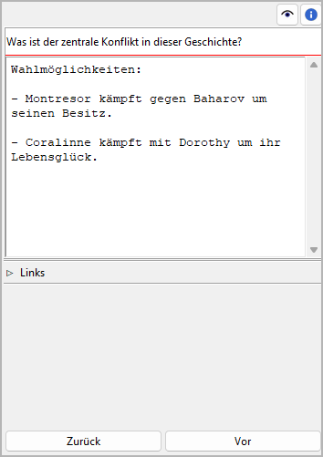

Projektnotiz-Eigenschaften
==========================

The Projektnotiz properties view öffnet sich im rechten Fenster when you
select a Projektnotiz in the tree.
You can edit the Titel und Inhalt of the selected Projektnotiz.

Titel und Inhalt
----------------

Titel und Inhalt are displayed in an editable "Karteikarte".

The editing of the Titel can be completed by pressing the Eingabetaste.
Changes to the content are applied when the mouse is clicked
anywhere outside the text input field.

Navigationsschaltflächen
------------------------

- **Zurück** moves the selection to the previous Projektnotiz in the tree.
- **Vor** moves the selection to the next Projektnotiz in the tree.
