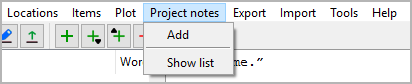

Projektnotizen-Menü
===================

**Projektnotizen operation**

Hinzufügen
----------

**Hinzufügen a new Projektnotiz**

With **Projektnotizen > Hinzufügen**,
you can add a `Projektnotiz <projectnote_view.html>`__
to the tree.

-  If a Projektnotiz is selected, the new Projektnotiz is placed
   after the selected one.
-  Otherwise, the new Projektnotiz is placed at the last position.
-  The new Projektnotiz has an auto-generated Titel. You can change it
   in the right pane.

Liste anzeigen
--------------

**Show an HTML report with Projektnotizs**

With **Projektnotizen > Liste anzeigen**,
you can create a list-formatted HTML file that contains
Titel und Inhalt of all Projektnotizs,
and launch your system’s web browser for displaying it.

.. note::
   The report is a temporary file, auto-gelöscht on program exit.
   If needed, you can have your web browser save or print it.

