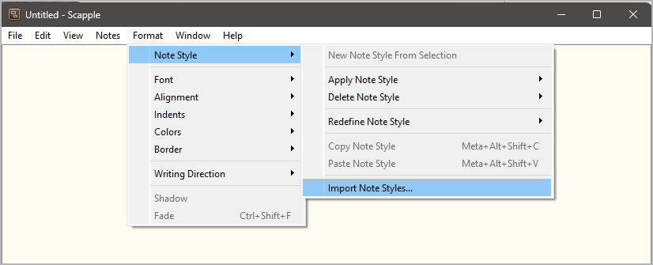
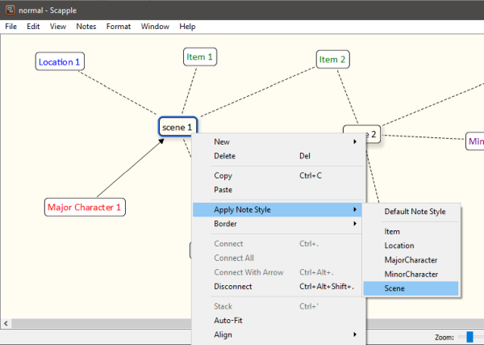
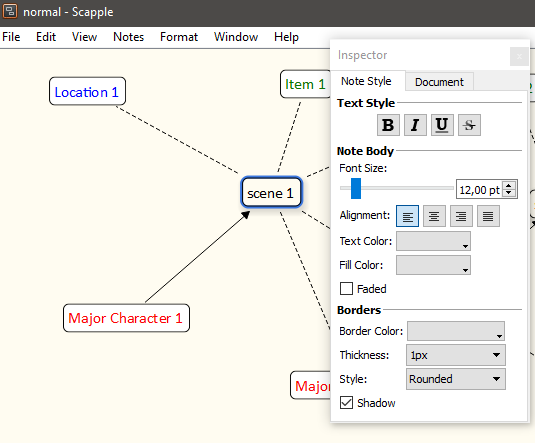
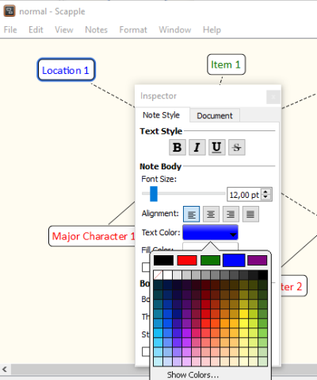

|external-link| `English <https://peter88213.github.io/nvhelp-en/scap_novx/>`__

.. |external-link| image:: ../_images/external-link.png

-----------------

=========
scap_novx
=========

**Benutzerhandbuch**

Diese Seite gilt für die neueste Ausgabe von `scap_novx
<https://github.com/peter88213/scap_novx/>`__.

Das Python-Skript *scap_novx.py* erzeugt ein *novelibre*-Projekt aus einer
*Scapple*-Gliederung.

Gebrauchsanweisung
------------------

Vorgesehene Benutzung
~~~~~~~~~~~~~~~~~~~~~

Das Installationsprogramm fordert Sie auf, eine Verknüpfung
auf dem Desktop anzulegen.
Die können das Programm dann aufrufen, indem Sie mit der Maus eine
*.scap*-Datei auf das Symbol ziehen.

Auf der Kommandozeile
~~~~~~~~~~~~~~~~~~~~~

Wahlweise können Sie auch

- das Programm von der Kommandozeile aus aufrufen und die *Scapple*-Datei als
  Parameter übergeben, oder
- das Programm aus einer Batchdatei heraus aufrufen.

Aufruf: ``scap_novx.py [--silent] Quelldatei``

Positionsbezogene Parameter:
^^^^^^^^^^^^^^^^^^^^^^^^^^^^

``Quelldatei``

Der Dateipfad der *Scapple*-Gliederungsdatei.

Optionale Parameter:
^^^^^^^^^^^^^^^^^^^^

``--silent``  Fehlermeldungen und Nachfragen unterdrücken.

Funktionsweise
--------------

*scap_novx* erzeugt eine neue *novelibre*-Projektdatei im selben Verzeichnis und
mit dem selben Namen wie die Scapple-Quelldatei, doch mit der Erweiterung `.novx``.

.. note::
   Falls das *novelibre*-Projekt bereits existiert, wird es nicht überschrieben. 
   Stattdessen werden XML-Figuren-, Schauplatz- und Gegenstandsdateien erzeugt, 
   die in jedes *novelibre*-Projekt importiert werden können. 

Konvertierungsregeln
--------------------

- Notizen mit einem Schatten werden zu Abschnitten konvertiert.
- Abschnitte werden nach ihrer Anordnung im Scapple-Diagramm sortiert (von oben links nach unten rechts).
- Notizen mit einem "Wolken"-Rand ohne Schatten werden zu Abschnitts- und Figurennotizen konvertiert.
- Notizen mit einem eckigen Rand werden zu Schlagworten konvertiert.
- Notizen mit rotem Text werden zu Hauptfiguren konvertiert.
- Notizen mit violettem Text werden zu Nebenfiguren konvertiert.
- Notizen mit blauem Text werden zu Schauplätzen konvertiert.
- Notizen mit grünem Text werden zu Gegenständen konvertiert.
- Weisen Sie Figuren, Schauplätze und Gegenstände einem Abschnitt zu, indem Sie die entsprechenden Notizen verbinden.
- Weisen Sie Schlagworte Abschnitten, Figuren, Schauplätzen und Gegenständen zu, indem Sie die entsprechenden Notizen verbinden.
- Weisen Sie Perspektivfiguren Abschnitten zu, indem Sie Pfeile von der Figur zum Abschnitt erzeugen.

Wie man Einträge für den Export kennzeichnet
--------------------------------------------

Stile importieren (optional)
~~~~~~~~~~~~~~~~~~~~~~~~~~~~

Zusammen mit der *scap_novx*-Distribution wird ein *Scapple*-Beispielprojekt
namens *styles.scap* geliefert, das alle erforderlichen Formate enthält.
Sie finden dieses Beispielprojekt im
*novelibre*-Installationsverzeichnis unter

``c:\Users\<Benutzername>\.novx\scap_novx\sample\``

Sie können entweder dieses Diagramm als Vorlage verwenden,
oder dessen Formate in Ihr eigenes Diagramm importieren.

   Screenshot: Formatimport-Dialog
   
Wählen Sie im Dateiauswahldialog
``<entpackter Ordner mit der scap_novx-Version>\sample\styles.scap``.
Dann können Sie die Formate per Kontextmenü zuweisen.

   
   Screenshot: Das Formatmenü anwenden

Abschnitte kennzeichnen
~~~~~~~~~~~~~~~~~~~~~~~

Wenden Sie entweder das "Section"-Format per Kontextmenü an,
oder kreuzen Sie im Inspector "Shadow" an.

   
   Screenshot: Eine Notiz mit einem Schatten versehen
   

novelibre-Notizen kennzeichnen
~~~~~~~~~~~~~~~~~~~~~~~~~~~~~~

Wenden Sie entweder das "Note"-Format per Kontextmenü an,
oder weisen Sie der Notiz im Inspector den "Cloud"-Rahmen zu.

Schlagworte kennzeichnen
~~~~~~~~~~~~~~~~~~~~~~~~

Wenden Sie entweder das "Tag"-Format per Kontextmenü an,
oder weisen Sie der Notiz im Inspector den "Square"-Rahmen zu.

Schauplätze kennzeichnen
~~~~~~~~~~~~~~~~~~~~~~~~

Wenden Sie entweder das "Location"-Format per Kontextmenü an,
oder wählen Sie im Inspector das große blaue Farbauswahlfeld aus.

   
   Screenshot: Textfarbe einstellen

Hauptfiguren kennzeichnen
~~~~~~~~~~~~~~~~~~~~~~~~~

Wenden Sie entweder das "MajorCharacter"-Format per Kontextmenü an,
oder wählen Sie im Inspector das große rote Farbauswahlfeld aus.

Nebenfiguren kennzeichnen
~~~~~~~~~~~~~~~~~~~~~~~~~

Wenden Sie entweder das "MinorCharacter"-Format per Kontextmenü an,
oder wählen Sie im Inspector das große violette Farbauswahlfeld aus.

Gegenstände kennzeichnen
~~~~~~~~~~~~~~~~~~~~~~~~

Wenden Sie entweder das "Item"-Format per Kontextmenü an,
oder wählen Sie im Inspector das große grüne Farbauswahlfeld aus.

Benutzerdefinierte Konfiguration
--------------------------------

Sie können die Voreinstellungen mit Hilfe einer Konfigurationsdatei überschreiben.
Denken Sie aber immer daran, dass fehlerhafte Einträge den Programmablauf stören können.

Globale Konfiguration
~~~~~~~~~~~~~~~~~~~~~

Sie können eine optionale globale Konfigurationsdatei
namens ``scap_novx.ini``
im Konfigurationsverzeichnis der Installation ablegen.
Sie wird auf jedes Projekt angewendet.
Ihre Einträge überschreiben die Voreinstellungen von *nv_aeon2*.
Dies ist der Pfad unter Windows:
``c:\Users\<Benutzername>\.novx\scap_novx\scap_novx.ini``

Lokale Projektkonfiguration
~~~~~~~~~~~~~~~~~~~~~~~~~~~

Sie können eine optionale Projekt-Konfigurationsdatei namens
``scap_novx.ini`` in Ihrem Projektverzeichnis ablegen,
d.h. in dem Ordner, der Ihre *novelibre*- und
*Scapple*-Projektdateien enthält.
Sie gilt dann nur für das Projekt.
Ihre Einträge überschreiben sowohl die Voreinstellungen von
*scap_novx* als auch die globale Konfiguration, falls vorhanden.

Wie man eine Konfigurationsdatei erstellt oder anpasst
~~~~~~~~~~~~~~~~~~~~~~~~~~~~~~~~~~~~~~~~~~~~~~~~~~~~~~

Sie finden eine Musterkonfigurationsdatei
mit den voreingestellten Werten von *scap_novx* im
*novelibre*-Installationsverzeichnis unter

``c:\Users\<Benutzername>\.novx\scap_novx\sample\``

Am besten erstellen Sie eine Kopie und bearbeiten sie.

- Der Abschnitt SETTINGS bezieht sich hauptsächlich auf die Farben,
  d.h. auf die Textfarben, mit denen die Figuren, Schauplätze und
  Gegenstände in Scapple markieren.
  Wenn Sie sie ändern, kann sich das Programm anders verhalten anders verhalten
  als in der Beschreibung der Konvertierungsregeln weiter unten beschrieben.
- Der Abschnitt OPTIONS umfasst Optionen für die reguläre Programmausführung.
- Kommentarzeilen beginnen mit einem Rautenzeichen ``#``.
  Im Beispiel beziehen sie sich auf die unmittelbar darüberliegende
  Codezeile.

Das ist die Konfigurationsdatei mit Erklärungen:

::

   [SETTINGS]

   location_color = 0.0 0.0 1.0

   # RGB Textfarbe für Schauplätze in Scapple..

   item_color = 0.0 0.5 0.0

   # RGB Textfarbe für Gegenstände in Scapple..

   major_chara_color = 1.0 0.0 0.0

   # RGB Textfarbe für Hauptfiguren in Scapple..

   minor_chara_color = 0.5 0.0 0.5

   # RGB Textfarbe für Nebenfiguren in Scapple..

   [OPTIONS]

   export_sections = Yes

   # Yes: Aus Scapple-Notizen Abschnitte erzeugen.

   export_characters = Yes

   # Yes: Aus Scapple-Notizen Figuren erzeugen.

   export_locations = Yes

   # Yes: Aus Scapple-Notizen Schauplätze erzeugen.

   export_items = Yes

   # Yes: Aus Scapple-Notizen Gegenstände erzeugen.

Installationspfad
-----------------

Das Setup-Skript kopiert  *scap_novx.py* an einen definierten Ort.
Unter Windows ist das der folgende Ordner:

``c:\Users\<Benutzername>\.novx\scap_novx``

