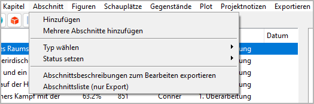
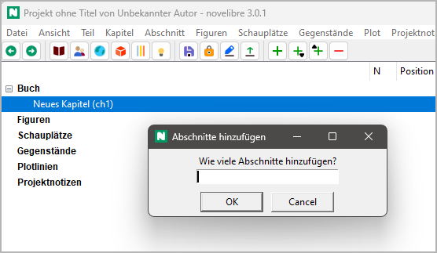
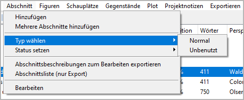
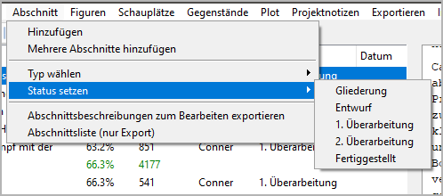

Abschnitt-Menü
==============

**Abschnittsfunktionen**

Hinzufügen
----------

**Einen neuen Abschnitt erzeugen**

Mit **Abschnitt > Hinzufügen**
können Sie einen `Abschnitt <basic_concepts.html#abschnitte>`__
in den Baum einfügen.

- Der neue Abschnitt wird an die nächste freie Stelle nach der Auswahl gesetzt,
  falls möglich.
- Andernfalls wird kein Abschnitt erzeugt.
- Der neue Abschnitt hat einen automatisch erzeugten Titel.
  Sie können ihn im rechten Bereich der Arbeitsfläche ändern.

Eigenschaften eines neuen Abschnitts:
   -  Typ: *Normal*
   -  Fertigstellungsstatus: *Gliederung*
   -  Keine Perspektivfigur zugewiesen
   -  Keine Plotlinie zugewiesen
   -  Keine Tags
   -  Keine Angaben zu Datum, Zeit und Dauer

Mehrere Abschnitte hinzufügen
-----------------------------

**Mehrere neue Abschnitte auf einmal erzeugen**

Mit **Abschnitt > Mehrere Abschnitte hinzufügen**
können Sie dem Baum bis zu 20 Abschnitte hinzufügen.

- Sie werden nach der Anzahl der neuen Abschnitte gefragt.
- Die Anzahl der neuen Abschnitte ist auf 20 begrenzt.
- Die neuen Abschnitte werden an die nächste freie Stelle nach
  der Auswahl gesetzt, falls möglich.
- Andernfalls wird kein Abschnitt erzeugt.

Typ wählen
----------

**Den Typ der ausgewählten Abschnitte ändern**

Mit **Abschnitt > Typ wählen**
können Sie den `Typ <basic_concepts.html#teil-kapitel-abschnittstypen>`__
der ausgewählten Abschnitte zu *Normal* oder *Unbenutzt* ändern.

.. hint::

   Um den Typ für mehrere Abschnitte gleichzeitig zu ändern:
      - Entweder mehrere Abschnitte auswählen, oder
      - das Kapitel auswählen.

Status setzen
-------------

**Den Fertigstellungsstatus des Abschnitts ändern**

Mit **Abschnitt > Status setzen**
können Sie den `Fertigstellungsstatus
<basic_concepts.html#abschnitts-status>`__
der ausgewählten Abschnitte zu *Gliederung*, *Entwurf*,
*1. Überarbeitung*, *2. Überarbeitung*
oder *Fertiggestellt* setzen.

.. hint::

   Um den Status für mehrere Abschnitte gleichzeitig zu ändern:
      - Entweder mehrere Abschnitte auswählen, oder
      - einen Elternknoten (Kapitel oder Buch) auswählen.

Abschnittsbeschreibungen zum Bearbeiten exportieren
---------------------------------------------------

**Ein ODT-Dokument exportieren**

Mit **Abschnitt > Abschnittsbeschreibungen zum Bearbeiten exportieren**
können Sie ein Textdokument erzeugen, das eine
**vollständige Inhaltsangabe** mit Teile-/Kapitelüberschriften
und Abschnittsbeschreibungen enthält.
Dieses Dokument kann mit *Writer* bearbeitet und zu *novelibre*
zurückgespielt werden.
Der Dateinamenszusatz lautet ``_sections_tmp``.

Abschnittsliste (nur Exportieren)
---------------------------------

**Ein ODS-Dokument exportieren**

Mit **Abschnitt > Abschnittsliste (nur Exportieren)**
können Sie ein Tabellenkalkulationsdokument
mit einer Reihe pro Abschnitt erzeugen, welche die
folgenden Daten umfasst:

- Abschnitts-ID (eingeklappt)
- Abschnittsnummer (Hyperlink zum Manuskript)
- Titel
- Beschreibung
- Perspektivfigur
- Datum
- Zeit
- Tag
- Dauer
- Tags
- Abschnittsnotizen
- Szene
- Ziel
- Konflikt
- Ausgang
- Fertigstellungsstatus
- Fortlaufende Wortzählung
- Wortzahl des Abschnitts
- Figuren
- Schauplätze
- Gegenstände

.. note::
   Nur "normale" Abschnitte erscheinen in der Abschnittsliste. 
   Abschnitte vom Typ "unbenutzt" werden ausgelassen.

Der Dateinamenszusatz lautet ``_sectionlist``.

