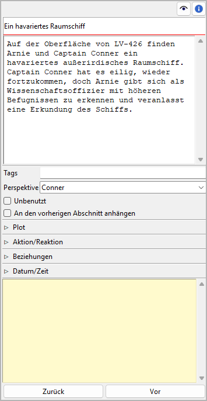
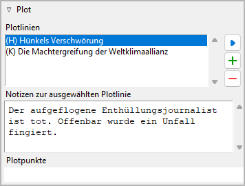
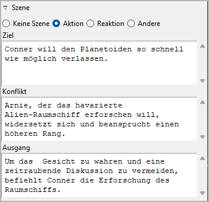
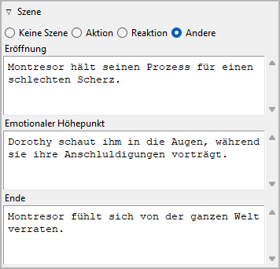
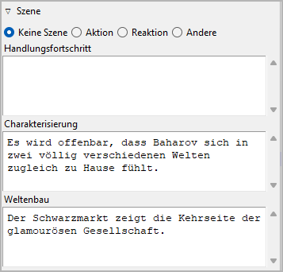
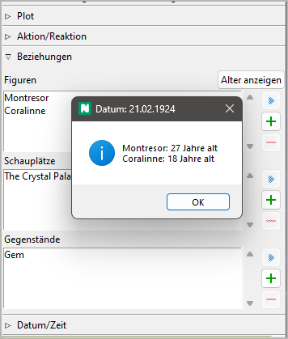
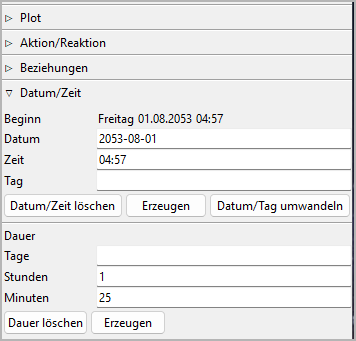

Abschnittseigenschaften
=======================

The Abschnitt properties view öffnet sich im rechten Fenster when you
select a section in the tree.

Titel und Beschreibung
----------------------

Titel und Beschreibung werden als beschreibbare "Karteikarte" dargestellt.

Die Bearbeitung des Titels kann mit der Eingabetaste beendet werden.
Änderungen an der Beschreibung werden übernommen, sobald mit der Maus
irgendwo außerhalb des Texteingabefelds geklickt wird.

Tags
----

Tags are a very freely usable tool for labeling sections in the
Baumansicht. Tags do not have to be defined elsewhere, but simply
entered in the input field separated by semicolons.
Die Bearbeitung kann mit der Eingabetaste beendet werden.

.. caution::
   If you want to use a tag more than once, make sure you use 
   the same spelling in the different places. 

Perspektive
-----------

The viewpoint character's short name is displayed in the Baumansicht.
You can select it from a drop-down list containing all characters
in the Baumansicht's sort order.

Unbenutzt
---------

Mit te **Unbenutzt** Auswahlfeld können Sie change the `section type
<basic_concepts.html#teil-kapitel-abschnittstypen>`__.

An den vorherigen Abschnitt anhängen
------------------------------------

When ticked, there will be no section divider inserted above
the selected section in exported documents. The section
just starts a new paragraph.

Plot
----

Dieses Fenster mit Klick auf den Titel öffnen oder schließen.

Plotlinien
~~~~~~~~~~

Hier können Sie assign the selected section to the Plotlinien it belongs to.
The assigned Plotlinien are displayed in a list in the order they are
assigned to the section.

.. tip::
   A more convenient way to manage and keep track of Plotlinie assignments is 
   offered by the `nv_matrix plugin 
   <https://github.com/peter88213/nv_matrix/>`__. 
   
   You can also assign a section to a Plotlinie by entering text
   in the corresponding *Plotlinie notes* cell of the 
   `plot grid <plotting.html#handlungsraster-plot-grid>`__. 

Hinzufügen Plotlinie assignment
   When clicking on |Hinzufügen|, the "Pick mode"
   is activated, and the cursor changes to a "plus" shape. By clicking
   on a Plotlinie, it will be related with the section.

   .. hint::
      You can exit the "Pick mode" without selecting an element by
      clicking on the highlighted status bar, or by pressing the ``Esc``
      key. 

Plotlinie entfernen assignment
   When clicking on |Entfernen| or pressing the ``Entf``-Taste,
   the selected Plotlinie is removed from the list.

Ansicht the related element
   When double-clicking on a Plotlinie, or clicking on |Goto|,
   the selected Plotlinie is opened and its properties are displayed.

   .. hint::
      You can go back to the initially selected section with |Go Back|. 

Plotlinie notes
   You can enter section-related notes for the Plotlinie selected
   in the list of related Plotlinien. These notes appear in the
   `plot grid <plotting.html#handlungsraster-plot-grid>`__ where you also can
   edit them.

Plotpunkte
~~~~~~~~~~

The plot points assigned with the selected section are displayed
along with their Plotlinien.

.. hint::
   To change or clear the plot point assignment, go to the
   `plot point's properties <point_view.html#assigned-section>`__.

Szene
-----

Dieses Fenster mit Klick auf den Titel öffnen oder schließen.

There is a popular theory for "selling writers" that suggests novels
are best divided into scenes, alternating between "action scenes" and
"reaction scenes", or "scenes" and "sequels". If you want to implement
something like this to ensure suspense können Sie do so here.

If this is not for you, but you would like to use a different method
to set up a dramaturgical scene micro-structure können Sie set the section
to **Andere** and get three `freely named <book_view.html#umbenennungen>`_
text fields.

   
   Example of a non-standard scene category

On the other hand, not every section is a scene to which the categories
mentioned above appliy. Sections can be characterized by mode of discourse
(e.g. Narration, Dramatic action, Dialogue, Description, Exposition).
So if a section is not staged, you can set the section to **Keine Szene**,
and get three `freely named <book_view.html#umbenennungen>`_
text fields.

   
   Example of a non-staged section category

Beziehungen
-----------

Dieses Fenster mit Klick auf den Titel öffnen oder schließen.

If you want to associate characters, locations, and items with the
section können Sie do it here by adding the element to a list of
relationships.

Alter anzeigen
   If a section is dated können Sie call up the ages of the related
   characters who have `birth dates <character_view.html#biographie>`__.

Hinzufügen Relationship
   When clicking on |Hinzufügen|, the "Pick mode"
   is activated, and the cursor changes to a "plus" shape. By clicking
   on a character/location/item, this element will be related with the
   section.

   .. hint::
      You can exit the "Pick mode" without selecting an element by
      clicking on the highlighted status bar, or by pressing the ``Esc``
      key. 

Entfernen Relationship
   When clicking on |Entfernen| or pressing the ``Entf``-Taste,
   the selected relationship is removed from the list.

Ansicht the related element
   When double-clicking on a related element, or clicking on |Goto|,
   the selected element is opened and its properties are displayed.

   .. hint::
      You can go back to the initially selected section with |Go Back|. 

.. hint::
   A convenient way to manage and keep track of relationships is offered 
   by the `nv_matrix plugin 
   <https://github.com/peter88213/nv_matrix/>`__. 

.. |Hinzufügen| image:: _images/add.png
.. |Goto| image:: _images/goto.png
.. |Entfernen| image:: _images/remove.png
.. |Go back| image:: _images/goBack.png

Datum/Zeit
----------

Hier können Sie enter information about the selected section's narrative time.
Die Bearbeitung kann mit der Eingabetaste beendet werden.

.. hint::
   Dedicated timeline software offers a more convenient way of entering date/time 
   and duration information. So if chronology is important to your story, you
   might want to take a look at the `Timeline plugin 
   <https://github.com/peter88213/nv_timeline/>`__, or the 
   `Aeon Timeline 2 plugin <https://github.com/peter88213/nv_aeon2/>`__.

Beginn
~~~~~~

If the selected section is a scene, this is when it starts:

Datum
   Format: *YYYY-MM-DD*, according to ISO 8601.

Zeit
   Format: *hh:mm*, according to ISO 8601.

Tag
   Format: Any number. Tag "0" is the `reference date
   <book_view.html#erzahlzeit>`_, if set.

.. note::
   Alle entries are optional. You can either enter a date, or a day. 
   
Datum/Zeit löschen
   This will reset *Datum*, *Zeit*, and *Tag* simultaneously.

Erzeugen
   This generates date and time from the date/time/duration data of the
   `previous section <Navigationsschaltflächen_>`_, so the selected section
   follows directly the previous one.

Datum/Tag umwandeln
   If the `reference date <book_view.html#erzahlzeit>`__ is set,
   The unspecific *Tag* can be transformed into a specific *Datum*,
   and vice versa.

   .. hint::
      If necessary können Sie convert all sections at once in the 
      `Buch properties view <book_view.html#erzahlzeit>`__.
   

Dauer
~~~~~

Tage
   Any number should be accepted.

Stunden
   If a number greater than 24 is entered, the number of days
   will be automatically increased.

Minuten
   If a number greater than 60 is entered, the number of hours
   will be automatically increased.

Dauer löschen
   This will reset *Tage*, *Stunden*, and *Minuten* simultaneously.

Erzeugen
   This generates the duration from the date/time data of the
   `next section <Navigationsschaltflächen_>`_, so the next section
   follows directly the current one.

Links
-----

Dieses Fenster mit Klick auf den Titel öffnen oder schließen.

.. figure:: _images/book_view13.png
   :alt: Screenshot

Das ist eine Liste für Links zu Bildern und Recherche-Dokumenten.

Obwohl *novelibre* Daten zu Figuren, Schauplätzen und Gegenständen
verwalten kann, ist es nicht die richtige Anwendung für
umfangreichen Weltenbau.
Dafür sollte man leistungsfähigere Softwareprogramme verwenden,
zum Beispiel `Zim Desktop Wiki
<https://zim-wiki.org/>`__.
Dazu kann *novelibre* Hyperlinks zu den Textdateien erzeugen,
welche Sie schnell zu den richtigen Stellen im Wiki führen.

Oder Sie haben einige Bilder gesammelt, die Sie beim Schreiben inspirieren.
Dann erzeugen Sie einfach Links zu diesen Bildern und lassen Sie
*novelibre* diese mit Ihrem System-Bildbetrachter öffnen.

.. tip::
   Wenn sie mehrere Bilder z.B. zu einer Figur in einem Ordner
   gesammelt haben, den Ihr Standard-Bildbetrachter durchsuchen kann,
   ist ein einziger Link auf eines dieser Bilder ausreichend.
   
Die Links werden in einer Liste angezeigt, und zwar in der Reihenfolge
der Eingabe.

Link hinzufügen
   Wenn Sie auf |Hinzufügen| klicken, öffnet sich ein Dateiauswahldialog.
   Die ausgewählte Datei wird der Linkliste hinzugefügt.

   .. hint::
      Der Dialog zeigt zunächst nur Bilddateien.
      Für andere Dateitypen ändern Sie die Auswahl in der unteren 
      rechten Ecke. 
      
      .. figure:: _images/filePicker01.png
         :alt: Screenshot
         
         Windows 10 Explorer Screenshot

Link entfernen
   Wenn Sie auf |Entfernen| klicken oder die ``Entf``-Taste drücken,
   wird der ausgewählte Link von der Liste entfernt.

Link öffnen
   Wenn sie auf einen Link doppelklicken, oder auf |Goto| klicken,
   Wird die Datei, auf die der Link verweist, mit der Standardanwendung
   für ihren Typ geöffnet.

   .. hint::
      Falls Sie bestimmte verlinkte Dateien mit einer anderen Anwendung
      als der System-Standardanwendung öffnen wollen, 
      können Sie eine "Programmstarter"-Einstellung vornehmen. 
      Dafür erzeugen Sie einfach eine Textdatei namens **launchers.ini**
      im Verzeichnis ``.novx/config`` (wo alle Konfigurationsdateien liegen).
      Hier in können Sie Erweiterungen Anwendungsprogramme zuordnen.  

      Zim Desktop-Wiki-Seiten sind ein Sonderfall.
      Dafür ordnen Sie die `.zim`-Erweiterung dem Zim-Programm zu.

      Dieses Beispiel zeigt eine Einstellung, die *novelibre* Textdateien
      mit der *Zim Desktop Wiki*-anwendung öffnen lässt, 
      statt mit dem Standard-Texteditor:    
      
      ::
     
         [SETTINGS]
         .zim = C:/Program Dateis (x86)/Zim Desktop Wiki/zim.exe 
         
      .. figure:: _images/launchers.png
         :alt: Screenshot
         
         Windows 10 Explorer Screenshot

"Haftmerker"
------------

Der gelbe Texteingabebereich ist für Notizen.
Änderungen werden übernommen, wenn mit der Maus
irgendwo außerhalb des Texteingabefelds geklickt wird.

Wenn der "Haftmerker" einers Abschnitts Text enthält,
erscheint in the Baumansicht ein "N" als Merker.

Wenn ein Kapitelzweig mit Abschnitten, die notizen enthalten,
eingeklappt wird, erscheint das "N" in der Kapitelzeile.

.. note::
   Die "Haftmerker" sind nur für die Arbeit mit *novelibre* gedacht.
   Sie werden nicht beim Dokumentenexport berücksichtigt.
   Allerdings erscheinen sie in der `Abschnittsliste`_.

.. _Abschnittsliste: section_menu.html#exportieren-section-list-spreadsheet

Navigationsschaltflächen
------------------------

- **Zurück** moves the selection to the previous section in the tree.
- **Vor** moves the selection to the next section in the tree.
