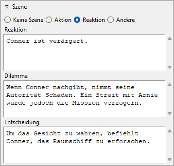

Abschnittseigenschaften
=======================

Die Ansicht der Abschnittseigenschaften öffnet sich im rechten Fenster,
wenn Sie im Baum einen Abschnitt wählen.

.. image:: _images/section_view01.png
   :alt: Screenshot

Titel und Beschreibung
----------------------

Titel und Beschreibung werden als beschreibbare "Karteikarte" dargestellt.

Die Bearbeitung des Titels können Sie mit der Eingabetaste beenden.
Änderungen an der Beschreibung werden übernommen, sobald mit der Maus
irgendwo außerhalb des Texteingabefelds geklickt wird.

Schlagwörter
------------

Schlagwörter sind ein frei benutzbares Werkzeug,
um Abschnitte in der Baumansicht zu kennzeichnen.
Schlagwörter müssen nicht anderswo definiert werden, sie werden einfach,
durch Semikolons getrennt, ins Eingabefeld eingetragen.
Die Bearbeitung können Sie mit der Eingabetaste beenden.

.. caution::
   Achten Sie auf eine einheitliche Schreibweise, 
   falls Sie Schlagwörter mehrmals verwenden wollen.

Perspektive
-----------

Der Kurzname der Perspektivfigur wird in der Baumansicht angezeigt.
Sie können ihn aus einer Drop-down-Liste auswählen, die alle
Figuren in der selben Reihenfolge wie in der Baumansicht enthält.

Unbenutzt
---------

Mit dem **Unbenutzt**-Auswahlfeld können Sie den
`Abschnittstyp <basic_concepts.html#teil-kapitel-abschnittstypen>`__
ändern.

An den vorherigen Abschnitt anhängen
------------------------------------

Wenn dieses Feld angekreuzt ist, erhalten exportierte
Dokumente keinen Abschnittstrenner vor dem ausgewählten
Abschnitt.
Der Abschnitt beginnt dann einfach mit einem neuen Absatz.

Plot
----

Dieses Fenster öffnen oder schließen Sie mit Klick auf den Titel.

.. image:: _images/section_view04.png
   :alt: Screenshot

Plotlinien
~~~~~~~~~~

Hier können Sie den ausgewählten Absatz den Plotlinien zuweisen,
zu denen er beiträgt.
Die zugewiesenen Plotlinien werden in einer Liste dargestellt,
in der Reihenfolge der Zuweisung zum Abschnitt.

.. tip::
   Einen bequemeren Weg, um Plotlinienzuweisungen zu verwalten und
   zu überblicken, bietet das 
   `nv_matrix-Plugin <https://github.com/peter88213/nv_matrix/>`__. 
   
   Sie können einen Abschnitt auch einer Plotlinie zuweisen, 
   indem Sie im `Handlungsraster <plotting.html#handlungsraster-plot-grid>`__
   Text ins entsprechende Plotliniennotizen-Feld eintragen.
   
Eine Plotlinienzuweisung hinzufügen
   Wenn Sie auf |Hinzufügen| klicken, wird der "Auswahlmodus"
   aktiviert, und der Cursor nimmt die Form eines "Plus"-Zeichens an.
   Indem Sie auf eine Plotlinie klicken, verbinden Sie sie mit dem Abschnitt.

   .. hint::
      Sie können den "Auswahlmodus" auch ohne Auswahl beenden, 
      indem Sie auf die eingefärbte Statusleiste klicken, 
      oder die ``Esc``-Taste drücken. 

Eine Plotlinienzuweisung entfernen
   Wenn Sie auf |Entfernen| klicken oder die ``Entf``-Taste drücken,
   wird die ausgewählte Plotlinie von der Liste entfernt.

Zur zugewiesenen Plotlinie springen
   Wenn Sie auf eine zugewiesene Plotlinie doppelklicken,
   oder wenn Sie auf |Goto| klicken, wird diese Plotlinie geöffnet,
   und ihre Eingenschaften werden angezeigt.

   .. hint::
      Mit |Go Back| gelangen Sie zurück zum ursprünglich gewählten Abschnitt. 
 
Plotliniennotizen
   Sie können abschnittsbezogene Notizen für die Plotlinie eingeben,
   die in der Liste der zugewiesenen Plotlinien ausgewählt ist.
   Diese Notizen erscheinen im
   `Handlungsraster <plotting.html#handlungsraster-plot-grid>`__,
   wo Sie sie ebenfalls bearbeiten können.

Plotpunkte
~~~~~~~~~~

Die Plotpunkte, die dem ausgewälten Abwschnitt zugewiesen sind,
werden zusammen mit ihren Plotlinien angezeigt.

.. hint::
   Um die Zuweisung eines Plotpunkts zu ändern oder zu löschen, 
   gehen Sie zu den  
   `Plotpunkt-Eigenschaften <point_view.html#zugeordneter-abschnitt>`__.

Szene
-----

Dieses Fenster öffnen oder schließen Sie mit Klick auf den Titel.

Hier ein Beispiel für eine "Aktionsszene":

.. image:: _images/section_view03.png
   :alt: Screenshot

Hier ein Beispiel für eine "Reaktionsszene" oder "Folge":

Es gibt eine verbreitete Theorie für "absatzstarke Autoren",
nach der Romane am besten in Szenen unterteilt werden,
wobei sich "Aktionsszenen" und "Reaktionsszenen", oder
"Szenen" und "Folgen" wechselseitig ablösen.
Falls Sie so etwas umsetzen wollen, können Sie das hier tun.

Falls das nichts für Sie ist, Sie aber eine andere Methode anwenden wollen,
um ihre Szenen dramaturgisch zu beschreiben,
können Sie den Abschnitt als **Andere** einstellen,
um `frei benannte <book_view.html#umbenennungen>`_
Textfelder zu erhalten.

Hier ein Beispiel für eine vom Standard abweichende Szenenkategorie:

.. image:: _images/section_view06.png
   :alt: Screenshot
   

Andererseits ist nicht jeder Abschnitt eine Szene, auf welche
die oben erwähnten Kategorien zutreffen.
Abschnitte können auch anderweitig charakterisiert werden,
zum Beispiel als narrative Zusammenfassung, Dialog, Beschreibung
oder Erklärung.
Wenn also ein Abschnitt nicht szenisch ist, können Sie ihn als
**Keine Szene** einstellen,
um `frei benannte <book_view.html#umbenennungen>`_
Textfelder zu erhalten.

Hier ein Beispiel für eine nicht-szenische Abschnittskategorie

.. image:: _images/section_view07.png
   :alt: Screenshot
   

Beziehungen
-----------

Dieses Fenster öffnen oder schließen Sie mit Klick auf den Titel.

.. image:: _images/section_view02.png
   :alt: Screenshot

Wenn Sie Figuren, Schauplätze und Gegenstände mit dem Abschnitt
verbinden wollen, können Sie das hier tun, indem
Sie das jeweilige Element einer Liste von Beziehungen hinzufügen.

Alter anzeigen
   Wenn ein Abschnitt ein Datum hat, können Sie das Alter der
   verbundenen Figuren abrufen, die ein
   `Geburtsdatum <character_view.html#biographie>`__ haben.

Beziehung hinzufügen
   Wenn Sie auf |Hinzufügen| klicken, wird der "Auswahlmodus"
   aktiviert, und der Cursor nimmt die Form eines "Plus"-Zeichens an.
   Indem Sie auf eine Figur, einen Schauplatz oder einen Gegenstand
   klicken, verbinden Sie dieses Element mit dem Abschnitt.

   .. hint::
      Sie können den "Auswahlmodus" auch ohne Auswahl beenden, 
      indem Sie auf die eingefärbte Statusleiste klicken, 
      oder die ``Esc``-Taste drücken. 

Beziehung entfernen
   Wenn Sie auf |Entfernen| klicken oder die ``Entf``-Taste drücken,
   wird die ausgewählte Beziehung von der Liste entfernt.

Zum verbundenen Element springen
   Wenn Sie auf ein verbundenes Element doppelklicken,
   oder wenn Sie auf |Goto| klicken, wird das ausgewählte Element geöffnet,
   und seine Eingenschaften werden angezeigt.

   .. hint::
      Mit |Go Back| gelangen Sie zurück zum ursprünglich gewählten Abschnitt. 

.. hint::
   Einen bequemeren Weg um Beziehungen zu verwalten und
   zu überblicken, bietet das 
   `nv_matrix-Plugin <https://github.com/peter88213/nv_matrix/>`__. 

.. |Hinzufügen| image:: _images/add.png
.. |Goto| image:: _images/goto.png
.. |Entfernen| image:: _images/remove.png
.. |Go back| image:: _images/goBack.png

Datum/Zeit
----------

Hier können Sie Informationen zur erzählten Zeit eingeben.
Die Bearbeitung können Sie mit der Eingabetaste beenden.

.. hint::
   Spezielle Zeitleistensoftware bietet Ihnen einen bequemeren Weg, 
   Datum, Zeit und Dauer einzugeben. 
   Falls Chronologie für Ihre Geschichte wichtig ist, sollten Sie 
   sich das `Timeline-Plugin 
   <https://github.com/peter88213/nv_timeline/>`__ oder das 
   `Aeon Timeline 2-Plugin <https://github.com/peter88213/nv_aeon2/>`__
   ansehen.

.. image:: _images/section_view05.png
   :alt: Screenshot

Beginn
~~~~~~

Die Handlung des ausgewählten Abschnitts beginnt hier:

Datum
   Format: *JJJJ-MM-TT*, entsprechend ISO 8601.

Zeit
   Format: *hh:mm*, entsprechend ISO 8601.

Tag
   Format: Jede Zahl. Tag "0" ist das
   `Bezugsdatum <book_view.html#erzahlzeit>`_, falls angegeben.

.. note::
   Alle Einträge sind optional. Sie können entweder ein Datum 
   oder einen Tag angeben. 

Mondphase
   Wenn die nötigen Datumsangaben vorliegen, können Sie die Mondphase dazu abrufen.

   .. image:: _images/section_view09.png
      :alt: Screenshot

   Die Mondphasenangabe setzt sich zusammen aus:

   - dem Phasentag (0 bis 29, wobei 0=Neumond, 15=voll etc.),
   - der sichtbaren Form,
   - dem beleuchteten Bruchteil.

   .. note::
      Die Berechnung der Mondphase beruht auf einem überschlägigen Verfahren
      von John Conway.
      In ihrer derzeitigen Ausführung ist sie nur für das 20. und 21. Jahrhundert
      gültig.

Datum/Zeit löschen
   Das setzt *Datum*, *Zeit* und *Tag* gleichzeitig zurück.

Erzeugen
   Das erzeugt Datum und Zeit aus Datum, Zeit und Dauer des
   `vorhergehenden Abschnitts <navigationsschaltflächen_>`_,
   so dass der ausgewählte Abschnitt unmittelbar auf den
   vorhergehenden folgt.

Datum/Tag umwandeln
   Falls ein `Bezugsdatum <book_view.html#erzahlzeit>`__ angegeben ist,
   kann der unspezifische *Tag* in ein spezifisches *Datum* umgewandelt
   werden, und umgekehrt.

   .. hint::
      Falls nötig, können Sie die Datumsangaben in der
      `Bucheigenschaften-Ansicht <book_view.html#erzahlzeit>`__
      auch für alle Abschnitte auf einmal umwandeln.  

Dauer
~~~~~

Tage
   Jede Zahl sollte akzeptiert weden.

Stunden
   Wenn Sie eine Zahl über 24 eingeben,
   wird die Anzahl der Tage automatisch erhöht.

Minuten
   Wenn Sie eine Zahl über 60 eingeben,
   wird die Anzahl der Stunden automatisch erhöht.

Dauer löschen
   Das setzt *Tage*, *Stunden* und *Minuten* gleichzeitig zurück.

Erzeugen
   Das erzeugt die Zeitdauer aus den Datum-Zeitangaben des
   `folgenden Abschnitts <navigationsschaltflächen_>`_,
   so dass dieser direkt auf den aktuell gewählten folgt.

Links
-----

Dieses Fenster öffnen oder schließen Sie mit Klick auf den Titel.

.. image:: _images/book_view13.png
   :alt: Screenshot

Das ist eine Liste für Links zu Bildern und Recherche-Dokumenten.

Obwohl *novelibre* Daten zu Figuren, Schauplätzen und Gegenständen
verwalten kann, ist es nicht die richtige Anwendung für
umfangreichen Weltenbau.
Dafür sollte man leistungsfähigere Softwareprogramme verwenden,
zum Beispiel `Zim Desktop Wiki
<https://zim-wiki.org/>`__.
Dazu kann *novelibre* Hyperlinks zu den Textdateien erzeugen,
welche Sie schnell zu den richtigen Stellen im Wiki führen.

Oder Sie haben einige Bilder gesammelt, die Sie beim Schreiben inspirieren.
Dann erzeugen Sie einfach Links zu diesen Bildern und lassen Sie
*novelibre* diese mit Ihrem System-Bildbetrachter öffnen.

.. tip::
   Wenn Sie mehrere Bilder z.B. zu einer Figur in einem Ordner
   gesammelt haben, den Ihr Standard-Bildbetrachter durchlaufen kann,
   ist ein einziger Link auf eines dieser Bilder ausreichend.
   
Die Links werden in einer Liste angezeigt, und zwar in der Reihenfolge
der Eingabe.

Link hinzufügen
   Wenn Sie auf |Hinzufügen| klicken, öffnet sich ein Dateiauswahldialog.
   Die ausgewählte Datei wird der Linkliste hinzugefügt.

   .. hint::
      Der Dialog zeigt zunächst nur Bilddateien.
      Für andere Dateitypen ändern Sie die Auswahl in der unteren 
      rechten Ecke. 
      
      .. image:: _images/filePicker01.png
         :alt: Screenshot
         

Link entfernen
   Wenn Sie auf |Entfernen| klicken oder die ``Entf``-Taste drücken,
   wird der ausgewählte Link von der Liste entfernt.

Link öffnen
   Wenn Sie auf einen Link doppelklicken, oder auf |Goto| klicken,
   wird die Datei, auf die der Link verweist, mit der Standardanwendung
   für ihren Typ geöffnet.

   .. hint::
      Falls Sie bestimmte verlinkte Dateien mit einer anderen Anwendung
      als der System-Standardanwendung öffnen wollen, 
      können Sie eine "Programmstarter"-Einstellung vornehmen. 
      Dafür erzeugen Sie einfach eine Textdatei namens **launchers.ini**
      im Verzeichnis ``.novx/config`` (wo alle Konfigurationsdateien liegen).
      Hier in können Sie Erweiterungen Anwendungsprogramme zuordnen.  

      Zim Desktop-Wiki-Seiten sind ein Sonderfall.
      Dafür ordnen Sie die `.zim`-Erweiterung dem Zim-Programm zu.

      Dieses Beispiel zeigt eine Einstellung, die *novelibre* Textdateien
      mit der *Zim Desktop Wiki*-anwendung öffnen lässt, 
      statt mit dem Standard-Texteditor:    
      
      ::
     
         [SETTINGS]
         .zim = C:/Program Dateis (x86)/Zim Desktop Wiki/zim.exe 
         
      .. image:: _images/launchers.png
         :alt: Screenshot
         

"Haftmerker"
------------

Der gelbe Texteingabebereich ist für Notizen.
Änderungen werden übernommen, wenn mit der Maus
irgendwo außerhalb des Texteingabefelds geklickt wird.

Wenn der "Haftmerker" eines Abschnitts Text enthält,
erscheint in the Baumansicht ein "N" als Hinweis.

Wenn ein Kapitelzweig mit Abschnitten, die Notizen enthalten,
eingeklappt wird, erscheint das "N" in der Kapitelzeile.

Navigationsschaltflächen
------------------------

- **Zurück** bewegt die Auswahl auf den vorhergehenden Abschnitt im Baum.
- **Vor** bewegt die Auswahl auf den nachfolgenden Abschnitt im Baum.
