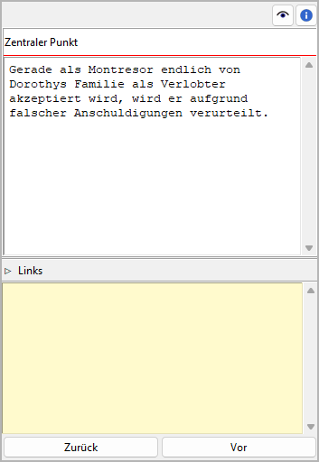

Stadium-Eigenschaften
=====================

The Stadium properties view öffnet sich im rechten Fenster when you
select a stage in the tree.

Titel und Beschreibung
----------------------

Titel und Beschreibung are displayed in an editable "Karteikarte".

The editing of the Titel can be completed by pressing the Eingabetaste.
Changes to the description are applied when the mouse is clicked
anywhere outside the text input field.

"Haftmerker"
------------

The yellow text area is for notes. Changes are applied
when the mouse is clicked anywhere outside the text input field.

When the "sticky note" of a stage contains text, an "N" is
displayed in the Baumansicht as a reminder.

.. note::
   The "sticky notes" are only for working with *novelibre*.
   They are not meant to be exported into a document.

Navigationsschaltflächen
------------------------

- **Zurück** moves the selection to the previous stage on the same level in the tree.
- **Vor** moves the selection to the next stage on the same level in the tree.
