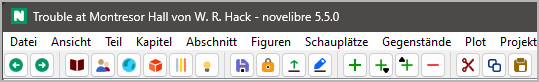

Die Werkzeugleiste
==================

Die Werkzeugleiste enthält Schaltflächen für häufig benutzte Vorgänge im vorgeschlagenen Arbeitsablauf.

|screenshot|

-----------------

|Go back| im Browserverlauf zurückgehen.

|Go forward| im Browserverlauf vorangehen.

-----------------

|Buch anzeigen| Gehe zum "Buch"-Zweig und klappe ihn auf.
Dasselbe wie **Ansicht > Buch anzeigen**.

|Figuren anzeigen| Gehe zum "Figuren"-Zweig und klappe ihn auf.
Dasselbe wie **Ansicht > Figuren anzeigen**.

|Schauplätze anzeigen| Gehe zum "Schauplätze"-Zweig und klappe ihn auf.
Dasselbe wie **Ansicht > Schauplätze anzeigen**.

|Gegenstände anzeigen| Gehe zum "Gegenstände"-Zweig und klappe ihn auf.
Dasselbe wie **Ansicht > Gegenstände anzeigen**.

|Plotlinien anzeigen| Gehe zum "Plotlinien"-Zweig und klappe ihn auf.
Dasselbe wie **Ansicht > Plotlinien anzeigen**.

|Projektnotizen anzeigen| Gehe zum "Projektnotizen"-Zweig und klappe ihn auf.
Dasselbe wie **Ansicht > Projektnotizen anzeigen**.

-----------------

|Speichern| Speichere das Projekt. Dasselbe wie **Datei > Speichern** or ``Strg``-``S``.

|Sperren/Entsperren| Ändere den Zustand der Projektsperre.

|Änderungen am Manuskript übernehmen| Importiere das aktuelle Manuskript.
Entspricht der Auswahl des Manuskripts unter **Importieren**.

|Exportieren Manuskript| Exportiere das Manuskript zum Bearbeiten.
Dasselbe wie **Exportieren > Manuskript zum Bearbeiten**,
das Dokument wird jedoch ohne Rückfrage geöffnet.

-----------------

|Hinzufügen| Element hinzufügen.
Dasselbe wie ``Strg``-``N``.

|Hinzufügen child| Kindelement hinzufügen.
Dasselbe wie ``Strg``-``Alt``-``N``.

|Hinzufügen parent| Element auf der Ebene der Eltern hinzufügen.
Dasselbe wie ``Strg``-``Alt``-``Umschalt``-``N``.

|Löschen| Ausgewählte Elemente löschen.
Dasselbe wie ``Entf``.

-----------------

|Cut| Das ausgewählte Element aus dem Baum in die Zwischenablage verschieben.
Dasselbe wie ``Strg``-``X``.

|Copy| Das ausgewählte Element in die Zwischenablage kopieren.
Dasselbe wie ``Strg``-``C``.

|Paste| Das Element aus der Zwischenablage in den Baum einfügen.
Dasselbe wie ``Strg``-``V``.

Sie können die folgenden Baumelemente über die Zwischenablage kopieren und einfügen:

- Teile und Kapitel,
- Abschnitte,
- Stadien,
- Plotlinien,
- Plotpunkte,
- Figuren,
- Schauplätze,
- Gegenstände,
- Projektnotizen.

.. hint::
   Falls mehrere Elemente markiert sind, wird nur das erste kopiert.
   Hat das Element jedoch "Kinder", werden diese auch kopiert und eingefügt. 

.. attention::
   Beziehungen werden beim Kopieren oder Verschieben in die Zwischenablage nicht mitgenommen.
   Das gilt auch für die Abschnitts-Perspektive und für Plotlinien/Plotpunkte.

-----------------

|Textbetrachter anzeigen/verbergen| Textbetrachter anzeigen/verbergen.
Dasselbe wie **Ansicht > Textbetrachter anzeigen/verbergen** or ``Strg``-``T``.

|Eigenschaften anzeigen/verbergen| Eigenschaften anzeigen/verbergen.
Dasselbe wie **Ansicht > Eigenschaften anzeigen/verbergen** or ``Strg``-``Alt``-``T``.

.. |Go back| image:: _images/goBack.png
.. |Go forward| image:: _images/goForward.png
.. |Buch anzeigen| image:: _images/viewBook.png
.. |Figuren anzeigen| image:: _images/viewCharacters.png
.. |Schauplätze anzeigen| image:: _images/viewLocations.png
.. |Gegenstände anzeigen| image:: _images/viewItems.png
.. |Plotlinien anzeigen| image:: _images/viewArcs.png
.. |Projektnotizen anzeigen| image:: _images/viewProjectnotes.png
.. |Speichern| image:: _images/save.png
.. |Sperren/Entsperren| image:: _images/lock.png
.. |Exportieren Manuskript| image:: _images/Manuscript.png
.. |Änderungen am Manuskript übernehmen| image:: _images/updateFromManuscript.png
.. |Hinzufügen| image:: _images/add.png

.. |Löschen| image:: _images/remove.png
.. |Textbetrachter anzeigen/verbergen| image:: _images/viewer.png
.. |Eigenschaften anzeigen/verbergen| image:: _images/properties.png
.. |Cut| image:: _images/cut.png

