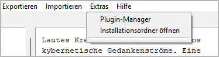
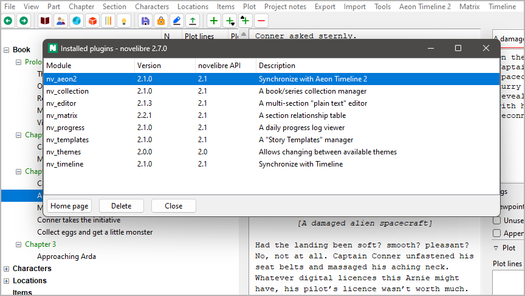

Extras-Menü
===========

**Vermischte Funktionen**

.. note:: 
   Das *Extras*-Menü kann durch Plugins um zusätzliche Funktionen erweitert werden.

Plugin manager
--------------

**Die installierten Plugins anzeigen und verwalten**

Mit **Extras > Plugin manager**
können Sie den *Installierte Plugins*-Dialog öffnen.

- Erfolgreich installierte Plugins werden standardmäßig schwarz auf weiß dargestellt.
- Veraltete Plugins werden ausgegraut.
- Plugins, die nicht funktionieren, werden zusammen mit einer Fehlermeldung in roter
  Schrift dargestellt.

Wie Sie ein Plugin aktualisieren
   1. Wählen Sie das Plugin aus, das Sie aktualisieren wollen.
      Falls die **Homepage**-Schaltfläche aktiviert ist,
      können Sie darauf klicken, und Ihr System-Webbrowser öffnet die Homepage.
      Andernfalls müssen Sie die Quelle des Plugins selbst kennen.
   2. Gehen Sie zur Plugin-Homepage und laden Sie die neueste Version herunter.
      Installieren Sie das Plugin gemäß Anleitung.

Wie Sie ein Plugin deinstallieren
   Wählen Sie das Plugin aus und klicken Sie auf die **Löschen**-Schaltfläche.

.. admonition:: Über die Kompatibilität von Versionen
    
   Auf dem Fensterrahmen sehen Sie die Version von *novelibre*, 
   die aus drei Zahlen besteht, die durch Punkte getrennt sind.
   
   ``<Hauptversionsnummer>.<Nebenversionsnummer>.<Patchlevel>``
   
   In the **novelibre API** column, you see the plugin’s compatibility
   information, consisting of two numbers that are separated by points.
   
   ``<major version number>.<minor version number>``
   
   The rule for compatibility
      -  The plugin’s *novelibre API* major version number must be the same as
         *novelibre’s* major version number.
      -  The plugin’s *novelibre API* minor version number must be less than
         or equal to *novelibre’s* minor version number.
   
   Fix incompatibilities
      -  If the plugin’s *novelibre API* major version number is greater than
         *novelibre’s* major version number, *novelibre* needs to be updated.
      -  If the plugin’s *novelibre API* major version number is less than
         *novelibre’s* major version number, the plugin needs to be updated.
      -  If the plugin’s *novelibre API* minor version number is greater than
         *novelibre’s* minor version number, *novelibre* needs to be updated.

Installationsordner öffnen
--------------------------

**Die Dateiverwaltung aufrufen**

Mit **Extras > Installationsordner öffnen**
können Sie den *novelibre*-Installationsordner im Dateimanager öffnen.
Das kann praktisch sein, wenn Sie Konfigurationsdateien bearbeiten
oder eigene Plugins installieren wollen.

