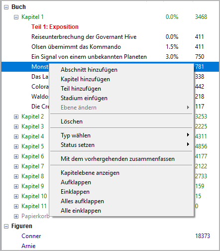
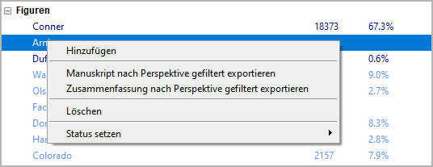
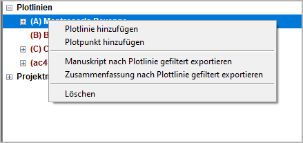

Baumansicht Kontextmenü
=======================

When right-clicking on a tree element in the left pane, a context
menu opens that belongs to the type of the selected element.

.. hint::
   Greyed-out entries are not available, e.g. due to "project lock".

Buch-Kontextmenüeinräge
-----------------------

Abschnitt hinzufügen
~~~~~~~~~~~~~~~~~~~~

Hinzufügens a new section.

-  The new section is placed at the next free position after the
   selection.
-  The new section has an auto-generated Titel. You can change it in the
   right pane.

Eigenschaften of a new section
   -  *Normal* type
   -  *Gliederung* completion status
   -  No viewpoint character assigned
   -  No Plotlinie or tag assigned
   -  No date/time set

Kapitel hinzufügen
~~~~~~~~~~~~~~~~~~

Hinzufügens a new chapter.

-  The new chapter is placed at the next free position after the
   selection.
-  The new chapter has an auto-generated Titel. You can change it in the
   right pane.

Teil hinzufügen
~~~~~~~~~~~~~~~

Hinzufügens a new part.

-  The new part is placed at the next free position after the selection.
-  In the tree, the part is at the same level as the chapters, so the
   chapters are not children of the part. This is to make it easier to
   move the part boundaries.
-  The new part has an auto-generated Titel. You can change it in the
   right pane.

Stadium einfügen
~~~~~~~~~~~~~~~~

Inserts a new stage at the next free position at stage level after the
selection.

-  The new stage has an auto-generated Titel. You can change it in the
   right pane.
-  The new stage is on the second level by default.

Ebene ändern
~~~~~~~~~~~~

Changes the level of a chapter or a stage.

-  **Erste Ebene** converts a selected part into a chapter.
-  **Zweite Ebene** converts a selected chapter into a part.

Löschen
~~~~~~~

Löschens the selected tree element and its children.

-  Teile und Kapitel werden gelöscht.
-  Abschnitte weerden als "unbenutzt" markiert und ins "Papierkorb"-Kapitel verschoben.
-  Deleting a part has no effect on its subordinate chapters.
-  Deleting a chapter moves its sections to the "Papierkorb" chapter.
-  The "Papierkorb" chapter is created automatically, if needed.
-  Löscht man das "Papierkorb"-Kapitel, werden auch die enthaltenen Abschnitte unwiederbringlich gelöscht.

Typ wählen
~~~~~~~~~~

Sets the `type <basic_concepts.html#teil-kapitel-abschnittstypen>`__
of the selected chapter or section.
This can be *Normal* or *Unbenutzt*.

.. note::
   Setting the type of a chapter to *Unbenutzt* will also make its sections *Unbenutzt*.

Status setzen
~~~~~~~~~~~~~

Sets the `completion status <basic_concepts.html#abschnitts-status>`__
of the selected section.

.. hint::
   Select a parent node to set the status for multiple sections.

Mit dem vorhergehenden zusammenfassen
~~~~~~~~~~~~~~~~~~~~~~~~~~~~~~~~~~~~~

Joins two sections, if within the same chapter, of the same type, and
with the same viewpoint.

-  Neu Titel = Titel of the prevoius section & Titel of the selected
   section
-  The section contents are concatenated, separated by a paragraph
   separator.
-  Beschreibungs are concatenated, separated by a paragraph separator.
-  Ziele are concatenated, separated by a paragraph separator.
-  Konflikts are concatenated, separated by a paragraph separator.
-  Ausgangs are concatenated, separated by a paragraph separator.
-  Notizen are concatenated, separated by a paragraph separator.
-  Figurenlistes are merged.
-  Schauplatzlistes are merged.
-  Gegenstandslistes are merged.
-  Plotlinie assignments are merged.
-  Plotpunkt associations are moved to the joined section,
   if any.
-  Abschnitt durations are added.

.. caution::
   Be aware, there is no "Undo" feature.

Kapitelebene anzeigen
~~~~~~~~~~~~~~~~~~~~~

Hides the sections by collapsing the tree, so that only parts and
chapters are visible.

Aufklappen
~~~~~~~~~~

Shows a whole branch by expanding the selected tree element.

Einklappen
~~~~~~~~~~

Hides the child elements of the selected tree element.

Alles aufklappen
~~~~~~~~~~~~~~~~

Shows the whole tree.

Alle einklappen
~~~~~~~~~~~~~~~

Hides all tree elements except the main categories.

Figuren/Schauplätze/Gegenstände-Kontextmenüeinträge
---------------------------------------------------

Hinzufügen
~~~~~~~~~~

Hinzufügens a new character/location/item.

-  The new element is placed after the selected one.
-  The new element has an auto-generated Titel. You can change it in the
   right pane.
-  The status of newly created characters is *minor*.

Manuskript nach Perspektive gefiltert exportieren
~~~~~~~~~~~~~~~~~~~~~~~~~~~~~~~~~~~~~~~~~~~~~~~~~

Exportierens a `Manuskript <export_menu.html#manuskript-zum-bearbeiten>`__
with the sections that have the selected character as viewpoint.

Zusammenfassung nach Perspektive gefiltert exportieren
~~~~~~~~~~~~~~~~~~~~~~~~~~~~~~~~~~~~~~~~~~~~~~~~~~~~~~

Exportierens the `descriptions of the sections
<section_menu.html#abschnittsbeschreibungen-zum-bearbeiten-exportieren>`__
that have the selected character
as viewpoint.

Löschen
~~~~~~~

Löschens the selected character/location/item.

.. caution::
   Be aware, there is no "Undo" feature.

Status setzen
~~~~~~~~~~~~~

Sets the selected character’s status. This can be *major* or *minor*.
Major characters are highlighted in the Baumansicht.

.. note::
   The character status is only for visual distinction. It has no
   influence on the program functions. Niemalstheless können Sie use it
   to mark viewpoint characters or characters with their own Plotlinien.

.. hint::
   Select the *Figuren* root node to set the status for all characters.

Plotlinien-Kontextmenüeinträge
------------------------------

Plotlinie hinzufügen
~~~~~~~~~~~~~~~~~~~~

Hinzufügens a new Plotlinie

-  If a Plotlinie is selected, the new item is placed after the selected one.
-  Otherwise, the new Plotlinie is placed at the last position.
-  The new Plotlinie has an auto-generated Titel. You can change it in the
   right pane.

Plotpunkt hinzufügen
~~~~~~~~~~~~~~~~~~~~

Hinzufügens a new Plotpunkt

- If a plot point is selected, the new plot point is placed after
  the selected one.
- If a Plotlinie is selected, the new plot point is placed at the last position.
- Otherwise, no new plot point is generated.
- The new plot point has an auto-generated Titel. You can change it in
  the right pane.

Manuskript nach Plotlinie gefiltert exportieren
~~~~~~~~~~~~~~~~~~~~~~~~~~~~~~~~~~~~~~~~~~~~~~~

Exportierens a `Manuskript <export_menu.html#manuskript-zum-bearbeiten>`__
with the sections that belong to the selected Plotlinie.

Zusammenfassung nach Plottlinie gefiltert exportieren
~~~~~~~~~~~~~~~~~~~~~~~~~~~~~~~~~~~~~~~~~~~~~~~~~~~~~

Exportierens the `descriptions of the sections
<section_menu.html#abschnittsbeschreibungen-zum-bearbeiten-exportieren>`__
that belong to the selected Plotlinie.

Löschen
~~~~~~~

Löschens the selected Plotlinie/plot point.

.. caution::
   Be aware, there is no "Undo" feature. If you delete a Plotlinie, all its
   plot points will be gelöscht, too.
   
   
Projektnotizen-Kontextmenüeinträge
----------------------------------

Projektnotiz hinzufügen
~~~~~~~~~~~~~~~~~~~~~~~

Hinzufügens a new Projektnotiz

- If a Projektnotiz is selected, the new Projektnotiz is placed after
  the selected one.
- Andernfalls, the new Projektnotiz is placed at the last position.
- The new Projektnotiz has an auto-generated Titel. You can change it in
  the right pane.

Löschen
~~~~~~~

Löschens the selected Projektnotiz.

