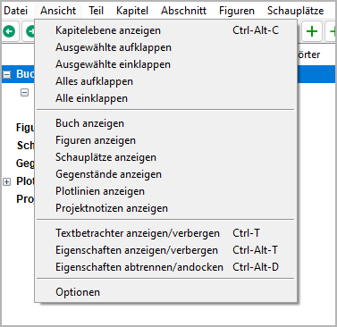
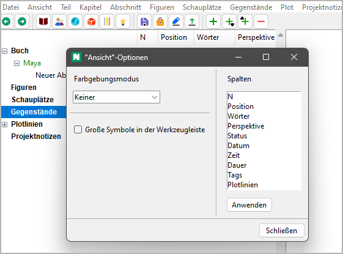

Ansicht-Menü
============

**Anzeige-Operationen**

Kapitelebene anzeigen
---------------------

**Die Abschnitte verbergen**

Mit **Ansicht > Kapitelebene anzeigen** oder ``Strg``-``Alt``-``C``
kann man den Baum so zusammenklappen,
dass nur Teile und Kapitel sichtbar sind.

Ausgewählte aufklappen
----------------------

**Einen ganzen Zweig anzeigen**

Mit **Ansicht > Ausgewählte aufklappen**
kann man einen ausgewählten Zweig aufklappen.

Ausgewählte einklappen
----------------------

**Kindelemente vebergen**

Mit **Ansicht > Ausgewählte einklappen**
kann man einen ausgewählten Zweig einklappen.

Alles aufklappen
----------------

**Den ganzen Baum anzeigen**

Mit **Ansicht > Alles aufklappen**
kann man den ganzen Baum aufklappen.

Alle einklappen
---------------

**Kindelemente verbergen**

Mit **Ansicht > Alle einklappen**
kann man alle Baumelemente außer den Hauptkategorien verbergen.

Buch anzeigen
-------------

**Zum "Buch"-Zweig gehen und ihn aufklappen**

Mit **Ansicht > Ansicht Buch**
kann man den "Buch"-Zweig anwählen und öffnen.

Figuren anzeigen
----------------

**Zum "Figuren"-Zweig gehen und ihn aufklappen**

Mit **Ansicht > Ansicht Figuren**
kann man den "Figuren"-Zweig anwählen und öffnen.

Schauplätze anzeigen
--------------------

**Zum "Schauplätze"-Zweig gehen und ihn aufklappen**

Mit **Ansicht > Ansicht Schauplätze**
kann man den "Schauplätze"-Zweig anwählen und öffnen.

Gegenstände anzeigen
--------------------

**Zum "Gegenstände"-Zweig gehen und ihn aufklappen**

Mit **Ansicht > Ansicht Gegenstände**
kann man den "Gegenstände"-Zweig anwählen und öffnen.

Plotlinien anzeigen
-------------------

**Zum "Plotlinien"-Zweig gehen und ihn aufklappen**

Mit **Ansicht > Plotlinien anzeigen**
kann man den "Plotlinien"-Zweig anwählen und öffnen.

Projektnotizen anzeigen
-----------------------

**Zum "Projektnotizen"-Zweig gehen und ihn aufklappen**

Mit **Ansicht > Ansicht Planning**
kann man den "Projektnotizen"-Zweig anwählen und öffnen.

Textbetrachter anzeigen/verbergen
---------------------------------

**Show/hide the novel text**

Mit **Ansicht > Textbetrachter anzeigen/verbergen** oder ``Strg``-``T``
kann man das `Textbetrachter-Fenster <desktop.html>`__
öffnen oder schließen.

.. hint::
   Wird das Fenster wieder geöffnet, zeigt es den Text an der
   Stelle des ausgewählten Abschnitts an.

Eigenschaften anzeigen/verbergen
--------------------------------

**Show/hide the selected element’s properties**

Mit **Ansicht > Eigenschaften anzeigen/verbergen** oder ``Strg``-``Alt``-``T``
kann man das Eigenschaftenfenster öffnen oder schließen.

.. hint::
   Wird das Fenster wieder geöffnet, zeigt es die Eigenschaften
   des aktuell gewählten Elements an. 

Eigenschaften abtrennen/andocken
--------------------------------

**Die Eigenschaften des ausgewählten Elements entweder im Arbeitsbereich
oder in einem abgetrennten Fenster anzeigen**

Mit **Ansicht > Eigenschaften abtrennen/andocken** oder ``Strg``-``Alt``-``D``
kann man das Fenster mit den Elementeigenschaften abtrennen oder andocken.

.. hint::
   Mit dem Schließen des abgetrennten Fensters werden 
   die Eigenschaften wieder angedockt. 

Optionen
--------

**Projektunabhängige Programmeinstellungen**

Mit **Ansicht >  Optionen**
kann man einen Dialog mit Einstellungen für die Anzeige öffnen.

Farbgebungsmodus
~~~~~~~~~~~~~~~~

**Die Kriterien bestimmen, nach denen normale Abschnitte
im Baum eingefärbt werden**

Keiner
   Normale Abschnitte sind per Vorsinstellung schwarz auf weiß.

Status
   Normale Abschnitte haben eine Farbe entsprechend ihres
   Fertigstellungsstatus
   (*Gliederung*, *Entwurf*, *1. Überarbeitung*, *2. Überarbeitung*
   oder *Fertiggestellt*).

Arbeitsphase
   Normale Abschnitte werden farblich hervorgehoben, wenn ihr
   Fertigstellungsstatus nicht der in den
   `Bucheigenschaften <book_view.html#schreibfortschritt>`__
   eingestellten Arbeitsphase entspricht.

Große Symbole in der Werkzeugleiste
~~~~~~~~~~~~~~~~~~~~~~~~~~~~~~~~~~~

Die Größe der Symbole ist mit 16x16 Pixeln voreingestellt.
Wenn das Auswahlfeld *Große Symbole in der Werkzeugleiste*
angekreuzt ist, werden nach dem nächsten Programmstart
Symbole mit 24x24 Pixeln benutzt.

.. note::
   Das glit nicht nur für die Werkzeugleiste, 
   sondern auch für alle anderen Symbole im Programm. 

Spalten
~~~~~~~

**Die Spaltenanordnung ändern**

-  Von oben nach unten in der Liste bedeutet
   von links nach rechts in der Baumansicht.
-  Einfach mit der Maus ziehen, um die Reihenfolge zu ändern.

Die Änderungen werden mit dem Anklicken der
**Anwenden**-Schaltfläche wirksam.

