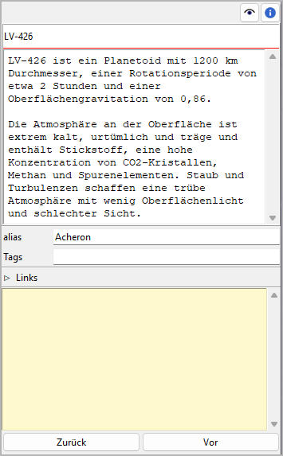

Schauplatz/Gegenstand-Eigenschaften
===================================

Die Ansicht der Schauplatz/Gegenstand-Eigenschaften öffnet sich im rechten Fenster,
wenn Sie einen Schauplatz oder Gegenstand auswählen.

Titel und Beschreibung
----------------------

Titel und Beschreibung werden als beschreibbare "Karteikarte" dargestellt.

Die Bearbeitung des Titels können Sie mit der Eingabetaste beenden.
Änderungen an der Beschreibung werden übernommen, sobald mit der Maus
irgendwo außerhalb des Texteingabefelds geklickt wird.

alias
-----

Dieses Eingabefeld ist für alternative Namen.
Die Bearbeitung können Sie mit der Eingabetaste beenden.

Schlagworte
-----------

Schlagworte sind ein frei benutzbares Werkzeug,
um Schauplätze und Gegenstände in der Baumansicht zu kennzeichnen.
Schlagworte müssen nicht anderswo definiert werden, sie werden einfach,
durch Semikolons getrennt, ins Eingabefeld eingetragen.
Die Bearbeitung können Sie mit der Eingabetaste beenden.

.. caution::
   Achten Sie auf eine einheitliche Schreibweise, 
   falls Sie Schlagworte mehrmals verwenden wollen.

Links
-----

Dieses Fenster öffnen oder schließen Sie mit Klick auf den Titel.

.. figure:: _images/book_view13.png
   :alt: Screenshot

Das ist eine Liste für Links zu Bildern und Recherche-Dokumenten.

Obwohl *novelibre* Daten zu Figuren, Schauplätzen und Gegenständen
verwalten kann, ist es nicht die richtige Anwendung für
umfangreichen Weltenbau.
Dafür sollte man leistungsfähigere Softwareprogramme verwenden,
zum Beispiel `Zim Desktop Wiki
<https://zim-wiki.org/>`__.
Dazu kann *novelibre* Hyperlinks zu den Textdateien erzeugen,
welche Sie schnell zu den richtigen Stellen im Wiki führen.

Oder Sie haben einige Bilder gesammelt, die Sie beim Schreiben inspirieren.
Dann erzeugen Sie einfach Links zu diesen Bildern und lassen Sie
*novelibre* diese mit Ihrem System-Bildbetrachter öffnen.

.. tip::
   Wenn Sie mehrere Bilder z.B. zu einer Figur in einem Ordner
   gesammelt haben, den Ihr Standard-Bildbetrachter durchsuchen kann,
   ist ein einziger Link auf eines dieser Bilder ausreichend.
   
Die Links werden in einer Liste angezeigt, und zwar in der Reihenfolge
der Eingabe.

Link hinzufügen
   Wenn Sie auf |Hinzufügen| klicken, öffnet sich ein Dateiauswahldialog.
   Die ausgewählte Datei wird der Linkliste hinzugefügt.

   .. hint::
      Der Dialog zeigt zunächst nur Bilddateien.
      Für andere Dateitypen ändern Sie die Auswahl in der unteren 
      rechten Ecke. 
      
      .. figure:: _images/filePicker01.png
         :alt: Screenshot
         
         Windows Explorer Screenshot

Link entfernen
   Wenn Sie auf |Entfernen| klicken oder die ``Entf``-Taste drücken,
   wird der ausgewählte Link von der Liste entfernt.

Link öffnen
   Wenn Sie auf einen Link doppelklicken, oder auf |Goto| klicken,
   Wird die Datei, auf die der Link verweist, mit der Standardanwendung
   für ihren Typ geöffnet.

   .. hint::
      Falls Sie bestimmte verlinkte Dateien mit einer anderen Anwendung
      als der System-Standardanwendung öffnen wollen, 
      können Sie eine "Programmstarter"-Einstellung vornehmen. 
      Dafür erzeugen Sie einfach eine Textdatei namens **launchers.ini**
      im Verzeichnis ``.novx/config`` (wo alle Konfigurationsdateien liegen).
      Hier in können Sie Erweiterungen Anwendungsprogramme zuordnen.  

      Zim Desktop-Wiki-Seiten sind ein Sonderfall.
      Dafür ordnen Sie die `.zim`-Erweiterung dem Zim-Programm zu.

      Dieses Beispiel zeigt eine Einstellung, die *novelibre* Textdateien
      mit der *Zim Desktop Wiki*-anwendung öffnen lässt, 
      statt mit dem Standard-Texteditor:    
      
      ::
     
         [SETTINGS]
         .zim = C:/Program Dateis (x86)/Zim Desktop Wiki/zim.exe 
         
      .. figure:: _images/launchers.png
         :alt: Screenshot
         
         Windows Explorer Screenshot

.. |Hinzufügen| image:: _images/add.png
.. |Goto| image:: _images/goto.png
.. |Entfernen| image:: _images/remove.png

"Haftmerker"
------------

Der gelbe Texteingabebereich ist für Notizen.
Änderungen werden übernommen, wenn mit der Maus
irgendwo außerhalb des Texteingabefelds geklickt wird.

Wenn der "Haftmerker" eines Plotpunkts Text enthält,
erscheint in the Baumansicht ein "N" als Hinweis.

.. note::
   Die "Haftmerker" sind nur für die Arbeit mit *novelibre* gedacht.
   Sie werden nicht beim Dokumentenexport berücksichtigt.

Navigationsschaltflächen
------------------------

Schauplatzansicht
~~~~~~~~~~~~~~~~~

- **Zurück** bewegt die Auswahl auf den vorhergehenden Schauplatz im Baum.
- **Vor** bewegt die Auswahl auf den nachfolgenden Schauplatz im Baum.

Gegenstandsansicht
~~~~~~~~~~~~~~~~~~

- **Zurück** bewegt die Auswahl auf den vorhergehenden Gegenstand im Baum.
- **Vor** bewegt die Auswahl auf den nachfolgenden Geganstand im Baum.
