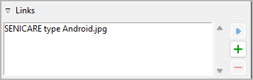

Schauplatz/Gegenstand-Eigenschaften
===================================

The Schauplatz/Gegenstand properties view opens in the right pane when you
select a location or an Gegenstand in the tree.

Titel und Beschreibung
----------------------

.. figure:: _images/world_view01.png
   :alt: Screenshot

Titel und Beschreibung are displayed in an editable "Karteikarte".

The editing of the Titel can be completed by pressing the ``Enter`` key.
Changes to the description are applied when the mouse is clicked
anywhere outside the text input field.

alias
-----

This entry field is for alias names. Editing can be completed
by pressing the ``Enter`` key.

Tags
----

Tags are a very freely usable tool for labeling locations and Gegenstands
in the Baumansicht. Tags do not have to be defined elsewhere, but
simply entered in the input field separated by semicolons.
Editing can be completed by pressing the ``Enter`` key.

.. caution::
   If you want to use a tag more than once, make sure you use 
   the same spelling in the different places. 

Links
-----

Aufklappen or collapse this frame by clicking on the label.

   
This is a list for image and research document links.

Although *novelibre* holds some character/location/Gegenstand data, it is
not the right application for extensive world building. For this,
you may want to use more powerful software, like `Zim Desktop Wiki
<https://zim-wiki.org/>`__. In this case, *novelibre* allows you to
create links to the text files that will take you quickly to the right
places in the wiki.

Or you have collected some images that could inspire you when writing.
Then simply create links to these images to open them with your
system's standard image viewer.

.. tip::
   If you have collected several images for a character in a folder 
   that your standard image viewer can browse through, a single link 
   to any image file is sufficient.  
   
The links are displayed in a list in the order they are entered.

Link hinzufügen
   When clicking on |Hinzufügen|, a file selection dialog opens. The selected
   file will be added to the link list.

   .. hint::
      By default, the dialog shows image files. For other file types, 
      change the selector in the lower right corner. 
      
      .. figure:: _images/filePicker01.png
         :alt: Screenshot
         
         Windows 10 Explorer screenshot

Link entfernen
   When clicking on |Entfernen| or pressing the ``Del`` key,
   the selected link is removed from the list.

Link öffnen
   When double-clicking on a link, or clicking on |Goto|,
   the link is opened with the standard application for the link's file type.

   .. hint::
      If you want to open certain linked files with another application than the 
      standard application, you can provide a *novelibre* "launcher" setting. 
      For this, just create a text file named **launchers.ini** in the 
      ``.novelibre.config``  directory (where all configuration files are stored). 
      
      This example shows a setting that makes *novelibre* open text files
      with the *Zim Desktop Wiki* application instead of the standard text 
      editor: 
      
      ::
     
         [SETTINGS]
         .txt = C:/Program Dateis (x86)/Zim Desktop Wiki/zim.exe 
         
      .. figure:: _images/launchers.png
         :alt: Screenshot
         
         Windows 10 Explorer screenshot

.. |Hinzufügen| image:: _images/add.png
.. |Goto| image:: _images/goto.png
.. |Entfernen| image:: _images/remove.png

Navigationsschaltflächen
------------------------

Schauplatzansicht
~~~~~~~~~~~~~~~~~

- **Zurück** moves the selection to the previous location in the tree.
- **Vor** moves the selection to the next location in the tree.

Gegenstandsansicht
~~~~~~~~~~~~~~~~~~

- **Zurück** moves the selection to the previous Gegenstand in the tree.
- **Vor** moves the selection to the next Gegenstand in the tree.
