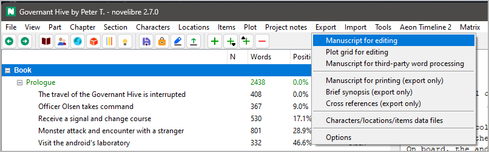
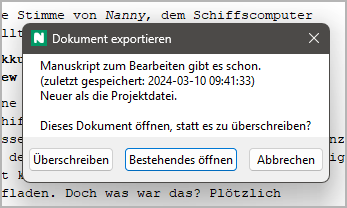
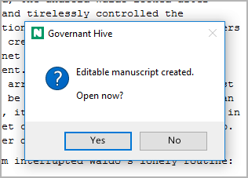
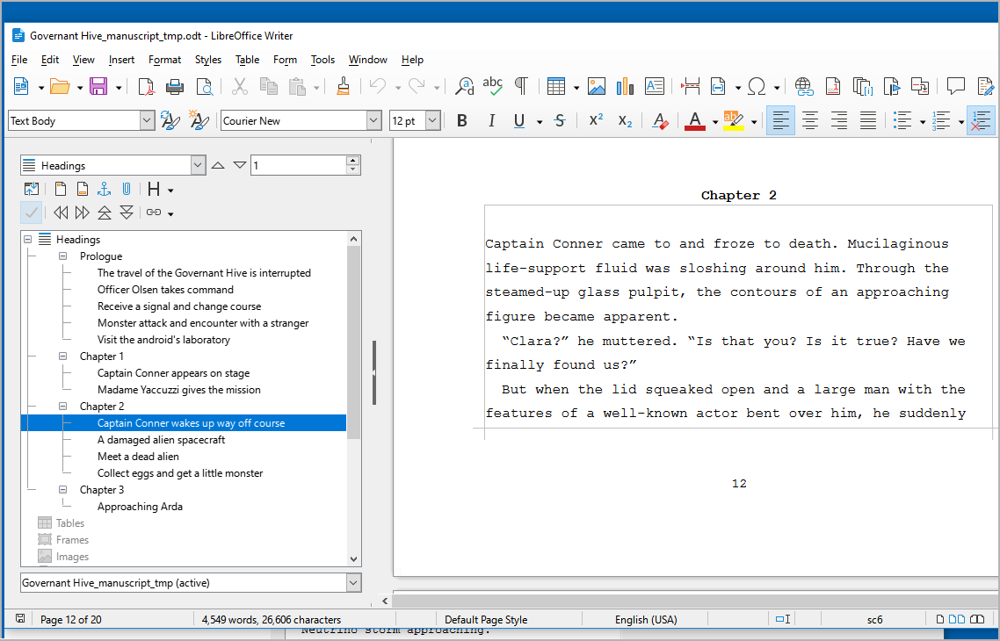
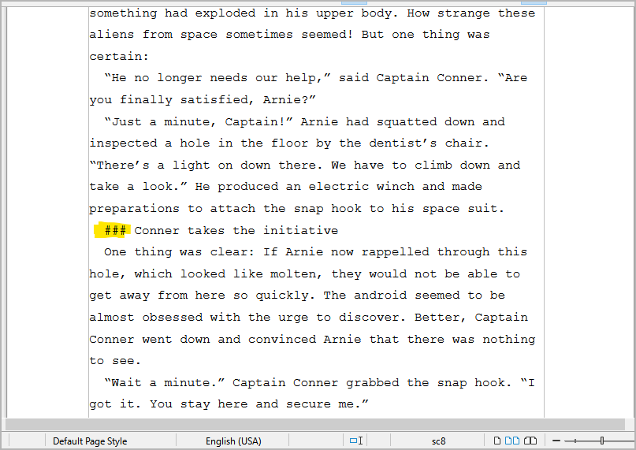
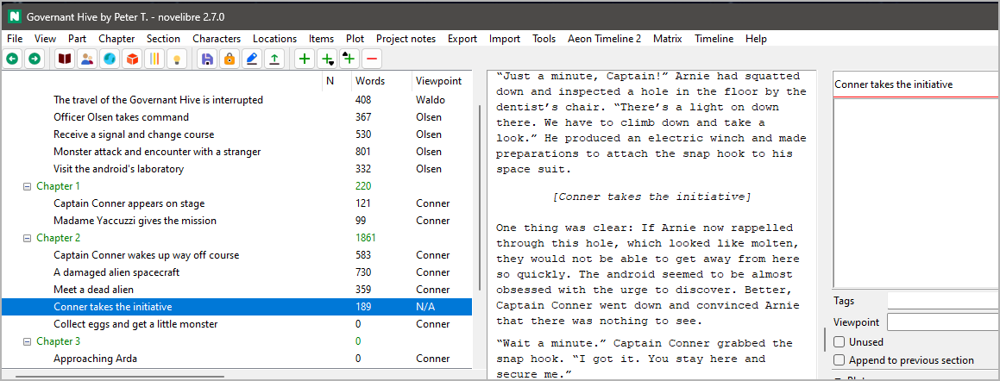
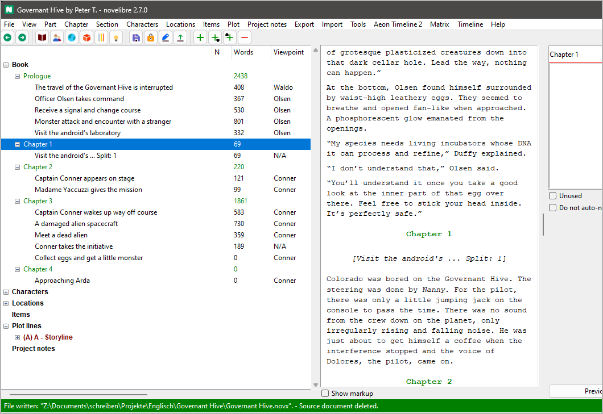

Writing the Manuskript
======================

Beginning Writer as text editor
-------------------------------

.. note::
   The following example describes the Manuskript editing workflow 
   with LibreOffice. The same applies to ÖffnenOffice.
   
   Other word processing programs that claim to support the *ODT* 
   file format are generally not recommended. 

As soon as your novel project has at least one section, you can start
writing. For this, you save your project and export your novel
to the *Writer* word processor either with **Exportieren > Manuskript zum Bearbeiten**,
or by clicking on the |Exportieren Manuskript| toolbar icon.

.. hint::
   - If you use the-Menü command, you can have *novelibre* create a
     Manuskript, and ask whether it should be opened with *Writer*.
   - If you click on the toolbar icon, *Writer* will be launched 
     immediately after export.

   
   novelibre screenshot

If you have done this before and there is still a Manuskript document from
the previous writing session, you will now be asked whether you want to
continue working on this document. If this is the case, answer "Yes".

   
   novelibre screenshot

If you answer "No", *novelibre* creates a new Manuskript document.
"Cancel" aborts the export process and lets you return to the main window.

If you started the export using the **Exportieren**-Menü command, you may
be asked whether you want to open the newly created document, depending
of your `Exportieren settings <export_menu.html#options>`__.

   
   novelibre screenshot
   
If you answer "yes", *Writer* will be launched with
the Manuskript document. Otherwise, the document is just
kept for future use.

Depending on your `Exportieren settings <export_menu.html#options>`__,
*novelibre* now may `lock the project <basic_concepts.html#project-lock>`__,
so that it can't be accidentally modified with *novelibre* while
worked on in *Writer*.

.. note::
   *novelibre* starts your standard application for files with the *.odt* 
   extension. Usually, the setting is made by LibreOffice or ÖffnenOffice
   during installation.

After you change to *Writer*, you see the whole novel in
a layout that is similar to the "standard Manuskript format". The
*Navigator* (open with ``F5``) shows the chapter and section Titels
in the *Headings* area. Double click on a heading to move the cursor
to that location. You can now write within the frames that define
the sections.

   
   LibreOffice Writer screenshot: Note that the text boundaries are 
   made visible here, which is `highly recommended 
   <preparations.html#setting-up-writer>`__.
   
.. note::
   The section Titels displayed in the Navigator are invisible 
   in the workspace so that they do not disrupt the flow of writing, 
   and the impression of an original Manuskript page is retained. 
 

Writing changes back to novelibre
---------------------------------

At the end of the writing session, save the changes, exit the *Writer*
word processor, and return to *novelibre*. Simply click on the
|Änderungen am Manuskript übernehmen| toolbar icon, and your latest changes will
appear.

.. note::
   The toolbar icon mentioned above is only for the Manuskript. If 
   you want to apply changes made in other documents like character
   sheets or synopses, use the `Importieren-Menü <import_menu.html>`__. 

   .. figure:: _images/writing09.png
      :alt: novelibre screenshot
      
      novelibre screenshot: The Manuskript entry is highlighted in 
      green, because the file is newer than the open project. 

Creating new sections with Writer
---------------------------------

If you need a new section while writing, you don't have to switch
to *novelibre*. Simply start a new line with a special marker
``###``. Optionally, you can add a section Titel, and, separated
by ``|``, a section description. Alle other metadata is intended
to be entered in *novelibre* later.

The following example shows how to split an existing section:

   
   LibreOffice Writer screenshot: Notice the highlighted section marker

Zurück in *novelibre*, you see the new section. It has got a Titel,
but no other metadata.

   
   *novelibre* screenshot: Notice the selected new section 

Creating new chapters with Writer
---------------------------------

If you need a new chapter while writing, you don't have to switch to
*novelibre*. Simply start a new line *within the edited section*
with a second-level heading.

.. important::
   *novelibre* only re-imports text within section defining frames. 
   Technically, it always splits sections when creating new chapters 
   or sections from the Manuskript.
   
   You also cannot move chapters within *Writer*. If you 
   want to rearrange chapters or sections, do it with *novelibre*.  
   

The following example shows how to add a chapter with *Writer*:

.. figure:: _images/writing07.png
   :alt: LibreOffice Writer screenshot
   
   LibreOffice Writer screenshot: It doesn't matter what the new
   chapter is Titeld

Zurück in *novelibre*, you see a new chapter and a new section. Since
the chapters are auto-numbered in this example project, the new
chapter Titel already fits, while the new section's Titel should
be adjusted manually.

   
   novelibre screenshot

.. |Exportieren Manuskript| image:: _images/Manuscript.png
.. |Änderungen am Manuskript übernehmen| image:: _images/updateFromManuscript.png
